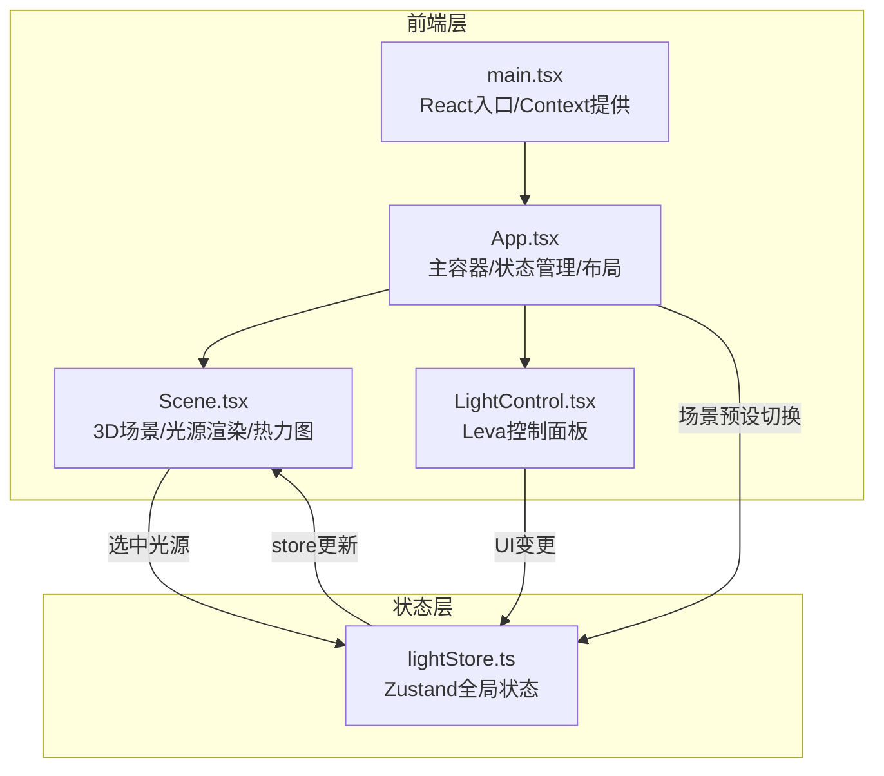

## 1. 架构设计



数据流向：UI变更 → store更新 → Scene重新渲染

## 2. 技术说明

- **前端框架**：React@18 + TypeScript（严格模式）
- **构建工具**：Vite + @vitejs/plugin-react
- **3D渲染**：Three.js + @react-three/fiber + @react-three/drei
- **参数面板**：Leva（实时参数调试）
- **状态管理**：Zustand
- **唯一ID**：uuid
- **样式方案**：CSS Modules + CSS Variables（科技感主题）
- **后端**：无（纯前端应用）

## 3. 路由定义

| 路由 | 用途 |
|------|------|
| / | 主场景页面，包含3D场景、控制面板、预设切换 |

## 4. 文件结构与调用关系

```
project/
├── package.json                  # 依赖与脚本
├── vite.config.ts                # Vite构建配置，路径别名@/→src
├── tsconfig.json                 # TypeScript严格模式配置
├── index.html                    # 入口HTML
└── src/
    ├── main.tsx                  # React入口，挂载App
    ├── App.tsx                   # 主容器，集成Canvas+面板+UI
    ├── components/
    │   ├── Scene.tsx             # 3D场景：家具/光源/辅助线/热力图
    │   └── LightControl.tsx      # Leva面板封装：参数调节
    ├── stores/
    │   └── lightStore.ts         # Zustand全局光照状态
    └── styles/
        └── global.css            # 全局样式+CSS变量
```

**调用关系**：
- `main.tsx` → 挂载 `App.tsx`
- `App.tsx` → 使用 `useLightStore` → 渲染 `Scene.tsx` + `LightControl.tsx`
- `LightControl.tsx` → 调用 `useLightStore` 的增删改方法
- `Scene.tsx` → 读取 `useLightStore` 的光源数据 → 渲染3D对象

## 5. 数据模型

### 5.1 光源数据模型

```typescript
type LightType = 'point' | 'spot' | 'directional'

interface LightData {
  id: string
  type: LightType
  position: [number, number, number]
  intensity: number
  color: string
  distance: number
  decay: number
  angle?: number
  penumbra?: number
  target?: [number, number, number]
}

interface ScenePreset {
  name: string
  description: string
  furniture: FurnitureItem[]
  lights: LightData[]
  wallColor: string
  floorColor: string
}

interface FurnitureItem {
  type: string
  position: [number, number, number]
  scale: [number, number, number]
  color: string
  rotation?: number
}
```

### 5.2 Store状态定义

```typescript
interface LightStore {
  lights: LightData[]
  selectedLightId: string | null
  currentPreset: string
  addLight: (type: LightType) => void
  removeLight: (id: string) => void
  updateLight: (id: string, updates: Partial<LightData>) => void
  selectLight: (id: string | null) => void
  setPreset: (presetName: string) => void
}
```
