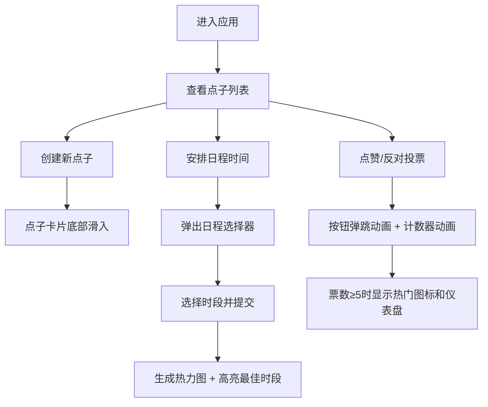

## 1. 产品概述

团队活动点子投票与日程协调器 - 一个轻量级Web应用，让团队成员可以匿名或实名地发起活动点子、投票表决，并通过日程协调功能自动推荐最佳活动时间。

- 主要用途：团队内部活动策划与决策协作
- 目标用户：团队成员、活动组织者
- 产品价值：简化团队活动决策流程，快速达成共识

## 2. 核心功能

### 2.1 用户角色
| 角色 | 注册方式 | 核心权限 |
|------|----------|----------|
| 团队成员 | 无需注册，输入昵称即可参与 | 发布点子、投票、选择日程时段 |

### 2.2 功能模块
1. **主页**：点子创建表单、点子列表、热门趋势侧边栏
2. **点子卡片**：展示信息、投票功能、日程安排入口、投票结果仪表盘
3. **日程选择器**：日期时段多选网格、热力图展示、最佳时间推荐

### 2.3 页面详情
| 页面名称 | 模块名称 | 功能描述 |
|-----------|-------------|---------------------|
| 主页 | 点子创建表单 | 输入标题和描述，浮层动画提交，底部滑入动画 |
| 主页 | 点子列表 | 按投票数降序排列，实时更新，虚拟滚动支持500+卡片 |
| 主页 | 热门趋势侧边栏 | 展示票数前3的点子小型卡片，响应式折叠 |
| 点子卡片 | 投票功能 | 点赞/反对按钮弹跳动画，计数器动画，匿名/实名切换 |
| 点子卡片 | 投票仪表盘 | 圆形进度条展示赞成率/反对率，热门火焰动画（≥5票时） |
| 点子卡片 | 日程热力图 | 迷你色块热力图，深浅表示受欢迎程度，最佳时段闪烁边框 |
| 日程选择器 | 日期网格 | 显示日期和时段的多选网格，提交后汇总统计 |

## 3. 核心流程

用户进入应用后可以创建新点子或对已有点子进行投票。对于感兴趣的点子，用户可以打开日程选择器选择可行的时间段。系统汇总所有投票和日程数据，自动推荐最佳活动时间。

## 4. 用户界面设计

### 4.1 设计风格
- **主背景色**：深蓝灰色 #1e293b
- **卡片背景**：白色 #ffffff，带极浅阴影
- **点赞按钮**：绿色 #22c55e
- **反对按钮**：红色 #ef4444
- **火焰图标**：橙红色 #f97316
- **按钮样式**：圆角按钮，悬停上移3px加深阴影，点击回弹动画
- **布局风格**：两栏布局（左70%列表，右30%侧边栏），卡片式设计
- **图标风格**：Emoji 图标（👍 👎 🔥）

### 4.2 页面设计概述
| 页面名称 | 模块名称 | UI元素 |
|-----------|-------------|-------------|
| 主页 | 顶部标题区 | 大号粗体标题，应用副标题，昵称输入框 |
| 主页 | 创建表单 | 浮层样式输入框，标题/描述字段，提交按钮 |
| 主页 | 点子列表 | 卡片网格布局，虚拟滚动，底部滑入动画 |
| 主页 | 热门侧边栏 | 悬浮卡片样式，Top 3排行，响应式折叠 |
| 点子卡片 | 主体内容 | 热门火焰图标，标题，描述，点赞/反对计数 |
| 点子卡片 | 投票仪表盘 | 圆形进度条（绿/红双色），赞成率百分比 |
| 点子卡片 | 操作区 | 👍点赞按钮，👎反对按钮，安排时间按钮 |
| 点子卡片 | 底部标签 | 实名投票者昵称标签，日程热力图 |
| 日程选择器 | 日期网格 | 7天x4时段多选网格，选中高亮，最佳时段闪烁 |

### 4.3 响应式设计
- Desktop-first 设计
- 屏幕宽度 < 768px 时：侧边栏折叠到底部，列表变为全宽
- 触控设备：按钮点击区域优化，支持触控反馈

## 5. 性能要求
- 投票提交后前端UI更新 ≤ 300ms
- 后端API响应时间 ≤ 200ms
- 500张卡片虚拟滚动保持 60fps
- 所有动画使用 CSS transform/opacity 确保流畅
