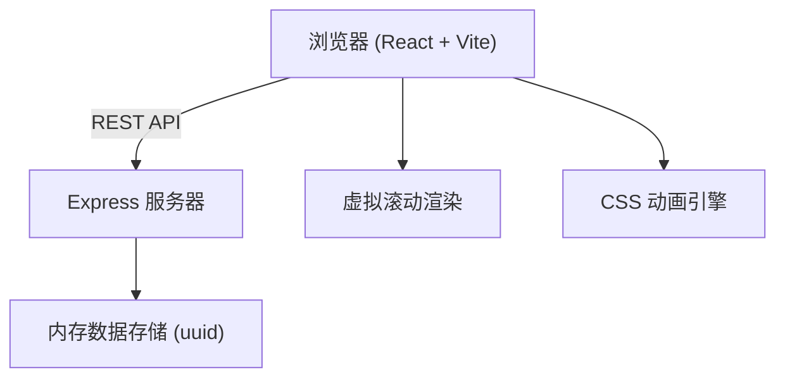
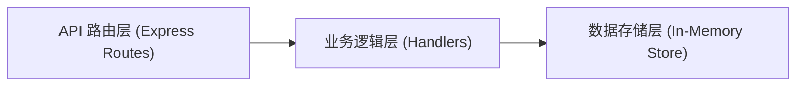

## 1. 架构设计



## 2. 技术描述
- **前端**：React@18 + TypeScript + Vite@5 + @vitejs/plugin-react
- **后端**：Express@4 + cors + uuid
- **状态管理**：React useState/useEffect（轻量级应用无需状态管理库）
- **样式方案**：原生 CSS（使用 CSS Variables 管理主题）
- **初始化工具**：vite-init（react-express-ts 模板）

## 3. 项目文件结构

| 文件/目录 | 用途 |
|-----------|------|
| package.json | 依赖管理与启动脚本 |
| vite.config.ts | Vite 构建配置 |
| tsconfig.json | TypeScript 严格模式配置 |
| index.html | 应用入口页面 |
| server/index.ts | Express 服务器，RESTful API |
| src/App.tsx | 主组件，状态管理与布局 |
| src/IdeaCard.tsx | 点子卡片组件 |
| src/CreateIdeaForm.tsx | 创建点子表单组件 |
| src/SchedulePicker.tsx | 日程选择器组件 |
| src/types.ts | 共享 TypeScript 类型定义 |
| src/styles.css | 全局样式与动画定义 |

## 4. API 定义

### 4.1 类型定义

```typescript
interface Vote {
  type: 'up' | 'down';
  voter: string | null; // null 表示匿名
  timestamp: number;
}

interface ScheduleSlot {
  date: string; // YYYY-MM-DD
  period: 'morning' | 'afternoon' | 'evening' | 'night';
  voters: string[];
}

interface Idea {
  id: string;
  title: string;
  description: string;
  author: string | null;
  votes: Vote[];
  schedule: ScheduleSlot[];
  createdAt: number;
}
```

### 4.2 RESTful API

| 方法 | 路径 | 描述 | 请求体 | 响应体 |
|------|------|------|--------|--------|
| GET | /ideas | 获取所有点子列表 | - | Idea[] |
| POST | /ideas | 创建新点子 | { title, description, author? } | Idea |
| POST | /ideas/:id/vote | 对点子投票 | { type: 'up'\|'down', voter? } | Idea |
| POST | /ideas/:id/schedule | 提交日程选择 | { slots: [{date, period}], voter } | Idea |

## 5. 服务端架构



- 无数据库依赖，使用内存数组存储数据
- 服务器重启数据会丢失（符合 Demo 场景）
- 使用 uuid 生成唯一 ID

## 6. 前端状态管理

- **App.tsx** 持有全局状态：ideas 数组、当前用户昵称、匿名模式开关
- 数据通过 props 下发给子组件
- 投票/创建操作通过回调函数更新 App 状态并同步调用后端 API
- 乐观更新模式：先更新UI再等待后端响应（确保300ms内UI反馈）

## 7. 性能优化方案

### 7.1 虚拟滚动
- 仅渲染可视区域内的卡片（约 8-12 张）
- 使用 IntersectionObserver 或滚动位置计算可见范围
- 卡片固定高度，使用 paddingTop 撑起滚动区域

### 7.2 动画优化
- 所有动画使用 CSS transform 和 opacity
- 使用 will-change 提示浏览器优化
- 避免在动画中触发 layout/paint

### 7.3 渲染优化
- React.memo 包裹子组件避免不必要重渲染
- 使用 useCallback 缓存事件处理函数
- 列表项使用稳定的 key（idea.id）
