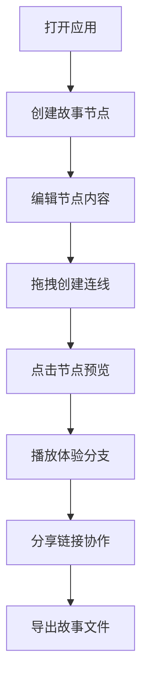

## 1. 产品概述
交互式故事分支创作工具，解决传统非线性叙事工具（如Twine）过于复杂、缺乏实时协作预览的痛点，让用户能够快速创建、预览和分享交互式故事。
- 目标用户：作家、游戏设计师、教育工作者、内容创作者
- 核心价值：轻量级、可视化、实时协作、即时预览

## 2. 核心功能

### 2.1 用户角色
无需复杂角色区分，所有用户享有同等权限
| 角色 | 注册方式 | 核心权限 |
|------|----------|----------|
| 创作者 | 无需注册，通过链接访问 | 创建/编辑/删除节点、连线、实时预览、导出、协作编辑 |

### 2.2 功能模块
1. **故事画布**：无限画布、节点创建、拖拽定位、贝塞尔曲线连线
2. **实时预览**：300px固定宽度面板、播放模式、平滑过渡动画、分支跳转
3. **协作系统**：WebSocket实时同步、在线用户显示、节点编辑状态高亮
4. **导出功能**：JSON格式导出、纯文本树状图导出

### 2.3 页面详情
| 页面名称 | 模块名称 | 功能描述 |
|---------|---------|----------|
| 主工作区 | 无限画布 | 深色背景(#1a1a2e)，支持节点拖拽、缩放、平移 |
| 主工作区 | 节点卡片 | 半透明磨砂玻璃风格，显示标题和Markdown内容预览 |
| 主工作区 | 连线系统 | 贝塞尔曲线带箭头动画，悬停显示分支类型标签 |
| 右侧面板 | 预览播放 | 300px固定宽度，浅灰背景，卡片式内容展示 |
| 顶部/右上角 | 协作状态 | 在线用户头像缩略图，当前编辑节点脉冲高亮 |
| 工具栏 | 导出功能 | JSON/纯文本树状图导出按钮 |

## 3. 核心流程

用户创建故事分支的主要流程：
1. 打开应用进入画布界面
2. 双击或点击按钮创建新节点
3. 编辑节点标题和内容（支持Markdown）
4. 从节点右侧拖拽到目标节点左侧创建连线
5. 点击节点进入预览模式
6. 通过预览面板的分支按钮体验故事流程
7. 分享链接邀请他人协作
8. 导出故事为JSON或文本格式

## 4. 用户界面设计

### 4.1 设计风格
- **主色调**：深色画布背景(#1a1a2e)，预览面板浅灰(#f5f5f5)
- **节点样式**：磨砂玻璃效果(background: rgba(255,255,255,0.1), backdrop-filter: blur(8px))，1px白色半透明边框
- **文字样式**：标题加粗白色，正文浅灰色(#ccc)
- **按钮样式**：渐变色(#667eea -> #764ba2)，悬浮放大效果
- **选中效果**：外发光box-shadow: 0 0 15px rgba(100,200,255,0.6)
- **动画效果**：连线箭头流动动画、节点脉冲高亮、页面淡入淡出过渡

### 4.2 页面设计概述
| 页面名称 | 模块名称 | UI元素 |
|---------|---------|--------|
| 主工作区 | 无限画布 | 深色网格背景、可平移缩放、节点自由定位 |
| 主工作区 | 节点卡片 | 正方形、磨砂玻璃、标题区、内容预览区、拖拽手柄 |
| 主工作区 | 连线层 | SVG贝塞尔曲线、流动箭头、悬停标签 |
| 右侧面板 | 预览播放 | 固定宽度300px、卡片布局、淡入淡出过渡、分支按钮 |
| 右上角 | 协作区 | 用户头像栈、在线状态指示 |

### 4.3 响应式设计
- 桌面端优先设计
- 画布自适应屏幕宽度
- 预览面板固定300px宽度，小屏幕可折叠
- 触摸设备支持拖拽和双指缩放

### 4.4 性能要求
- 拖拽和连线操作保持60FPS
- 50个节点以内无明显卡顿
- 使用requestAnimationFrame优化动画
- 虚拟渲染优化大量节点
