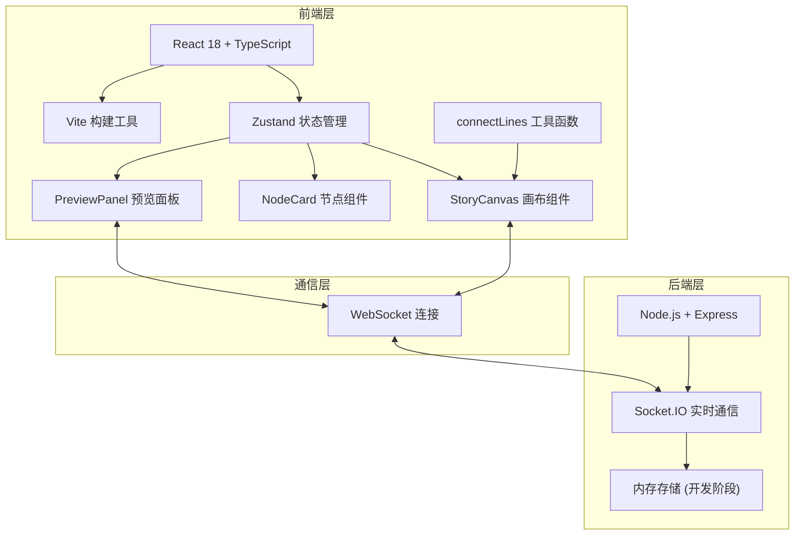
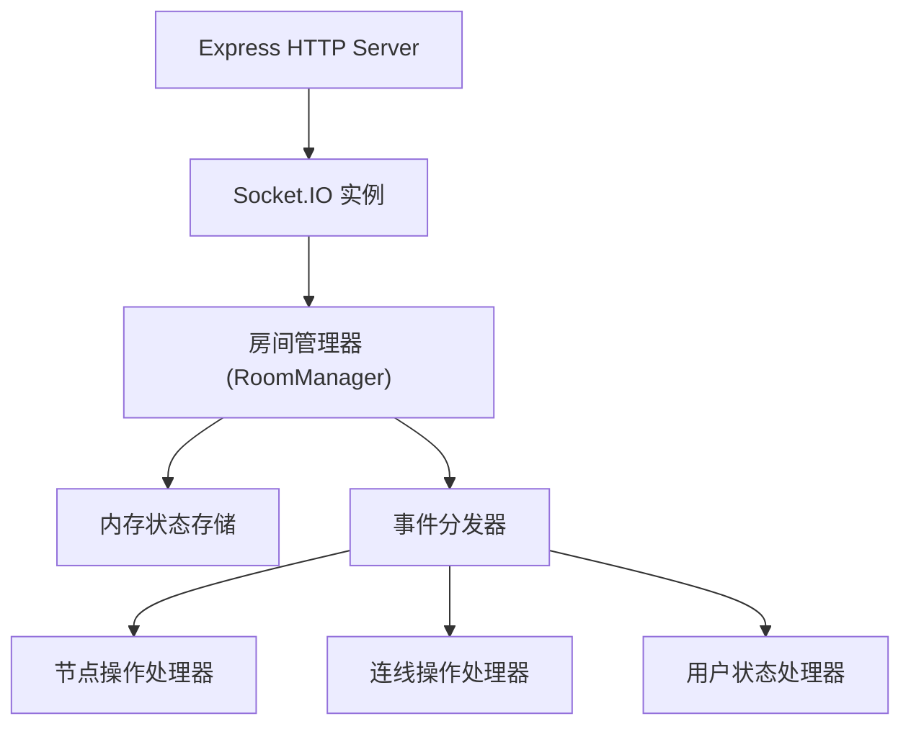
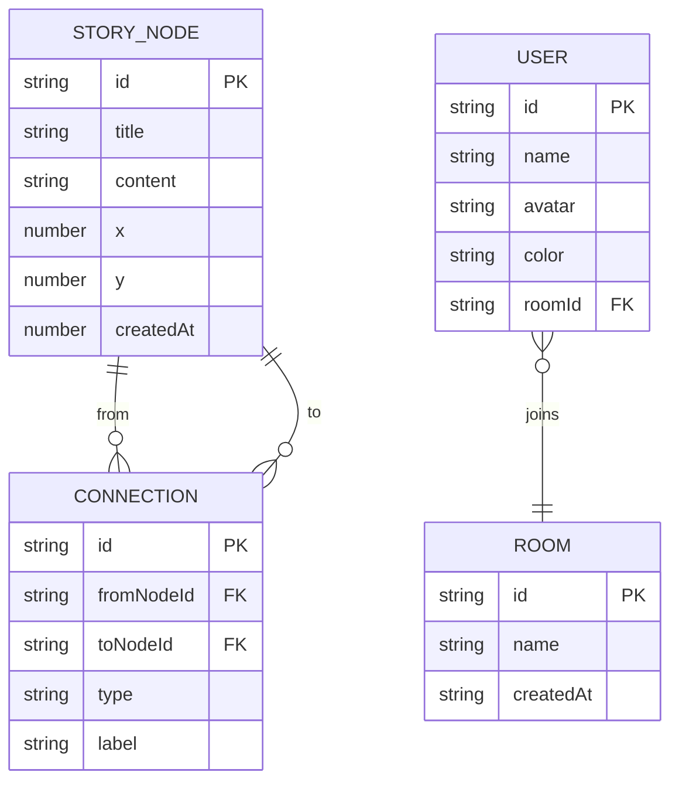

## 1. 架构设计



## 2. 技术描述

- **前端**: React@18 + TypeScript + Vite + Zustand + Socket.IO-Client
- **后端**: Node.js + Express@4 + Socket.IO + CORS
- **构建工具**: Vite@5
- **状态管理**: Zustand
- **实时通信**: Socket.IO (WebSocket)
- **唯一标识**: UUID
- **无路由需求**，单页应用

## 3. 文件结构定义

| 文件路径 | 用途 |
|---------|------|
| `/package.json` | 项目依赖和启动脚本 |
| `/vite.config.ts` | Vite构建配置 |
| `/tsconfig.json` | TypeScript严格模式配置 |
| `/index.html` | 入口HTML页面 |
| `/src/App.tsx` | 主应用组件，布局管理，WebSocket连接 |
| `/src/store/storyStore.ts` | Zustand状态管理，节点/连线/用户状态 |
| `/src/components/StoryCanvas.tsx` | 无限画布组件，节点/连线渲染，拖拽交互 |
| `/src/components/NodeCard.tsx` | 节点卡片组件，显示/编辑/选中/拖拽 |
| `/src/components/PreviewPanel.tsx` | 预览播放面板，内容展示，分支跳转 |
| `/src/utils/connectLines.ts` | 贝塞尔曲线计算，箭头动画工具函数 |
| `/api/server.ts` | Express后端服务，Socket.IO实时同步 |

## 4. API 和 WebSocket 事件定义

### WebSocket 事件

| 事件名称 | 方向 | 数据结构 | 描述 |
|---------|------|----------|------|
| `join` | 客户端→服务端 | `{ roomId: string, user: User }` | 用户加入协作房间 |
| `user-joined` | 服务端→客户端 | `{ user: User, users: User[] }` | 新用户加入通知 |
| `user-left` | 服务端→客户端 | `{ userId: string, users: User[] }` | 用户离开通知 |
| `node-add` | 双向 | `{ node: StoryNode }` | 新增节点 |
| `node-update` | 双向 | `{ node: StoryNode }` | 更新节点 |
| `node-delete` | 双向 | `{ nodeId: string }` | 删除节点 |
| `node-drag` | 双向 | `{ nodeId: string, x: number, y: number, userId: string }` | 节点拖拽位置同步 |
| `connection-add` | 双向 | `{ connection: Connection }` | 新增连线 |
| `connection-delete` | 双向 | `{ connectionId: string }` | 删除连线 |
| `node-editing` | 双向 | `{ nodeId: string, userId: string }` | 节点正在被编辑 |
| `sync-state` | 服务端→客户端 | `{ nodes: StoryNode[], connections: Connection[] }` | 初始同步完整状态 |

### 类型定义

```typescript
interface StoryNode {
  id: string;
  title: string;
  content: string;
  x: number;
  y: number;
  createdAt: number;
}

interface Connection {
  id: string;
  fromNodeId: string;
  toNodeId: string;
  type: 'default' | 'conditional';
  label?: string;
}

interface User {
  id: string;
  name: string;
  avatar: string;
  color: string;
}

interface StoryState {
  nodes: StoryNode[];
  connections: Connection[];
  selectedNodeId: string | null;
  editingNodeId: string | null;
  onlineUsers: User[];
  currentUserId: string;
  previewNodeId: string | null;
  isPreviewMode: boolean;
}
```

## 5. 服务器架构



## 6. 数据模型

### 6.1 数据模型定义



### 6.2 核心操作

1. **创建节点**: 生成UUID，设置初始位置，广播到房间
2. **更新节点**: 校验权限，更新存储，广播变更
3. **删除节点**: 级联删除相关连线，广播变更
4. **创建连线**: 校验节点存在性，防止重复连线，广播变更
5. **同步状态**: 新用户加入时发送完整节点和连线列表

## 7. 性能优化策略

1. **Canvas/SVG 分层**: 连线使用SVG，节点使用DOM元素，减少重绘
2. **requestAnimationFrame**: 拖拽和动画使用RAF优化，确保60FPS
3. **节流防抖**: 节点位置同步使用节流(16ms)，内容编辑使用防抖(300ms)
4. **事件委托**: 画布级事件处理，减少节点级事件监听器
5. **局部更新**: 状态变更时只更新受影响的组件，避免全量重渲染
