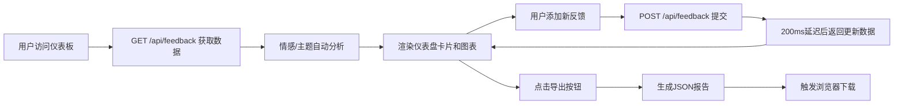

## 1. 产品概述

客户反馈智能分析仪表板，帮助团队快速收集、整理和分析多渠道客户反馈，通过情感分析和主题分类自动生成可视化洞察报告。

- 解决传统反馈收集方式信息分散、难以汇总和提炼洞察的痛点
- 面向产品经理、运营团队和客户成功部门，提供数据驱动的决策支持

## 2. 核心功能

### 2.1 用户角色

| 角色 | 注册方式 | 核心权限 |
|------|----------|----------|
| 团队成员 | 内部账号登录 | 查看仪表盘、添加反馈、导出报告 |

### 2.2 功能模块

1. **反馈管理面板**：手动添加反馈、批量导入CSV
2. **情感分析仪表盘**：正面/负面/中性情感率实时统计卡片
3. **可视化图表区**：主题分布环形图、30天趋势折线图
4. **反馈列表区**：可滚动表格、详情浮层查看
5. **报告导出**：一键导出JSON格式分析报告

### 2.3 页面详情

| 页面名称 | 模块名称 | 功能描述 |
|----------|----------|----------|
| 主仪表盘 | 情感统计卡片 | 三张动态卡片展示正面率、负面率、总反馈数，带数字滚动动画 |
| 主仪表盘 | 主题分布环形图 | 可交互环形图，按情感着色，悬停显示详情 |
| 主仪表盘 | 趋势折线图 | 30天反馈量趋势，可切换正面/负面/全部视图 |
| 主仪表盘 | 反馈列表表格 | 滚动表格展示摘要，点击查看完整详情浮层 |
| 主仪表盘 | 报告导出按钮 | 一键导出JSON报告，带进度条动画 |
| 管理面板 | 反馈添加表单 | 手动录入客户名、渠道、时间、描述 |
| 管理面板 | CSV批量导入 | 模拟API端点批量导入反馈数据 |

## 3. 核心流程

用户打开仪表板 → 系统从后端加载50条模拟反馈数据 → 情感分析和主题分类自动完成 → 实时渲染所有图表和卡片 → 用户可添加新反馈或导入CSV → 数据实时更新 → 点击导出按钮生成JSON报告下载

## 4. 用户界面设计

### 4.1 设计风格

- **主题色调**：深色主题（背景#1a1b23），蓝绿渐变（#00d4aa → #0099ff）主色，暖橙（#ff6b35）警示色
- **卡片样式**：半透明毛玻璃效果（背景rgba(255,255,255,0.08)，边框1px rgba(255,255,255,0.12)，圆角12px）
- **按钮风格**：渐变填充按钮，圆角8px，悬停有亮度提升动画
- **字体**：现代无衬线字体，数字使用等宽字体增强可读性
- **动画效果**：所有过渡使用0.3-0.6秒ease-out缓动，数字滚动、图表切换、浮层缩放淡入
- **图标风格**：表情符号用于情感标签，彩色圆片用于主题标签

### 4.2 页面设计概述

| 页面名称 | 模块名称 | UI元素 |
|----------|----------|--------|
| 主仪表盘 | 顶部导航栏 | 固定定位，标题+导出按钮，滚动时保持可见 |
| 主仪表盘 | 情感卡片区域 | 三栏等宽布局，圆弧进度条+动画数字 |
| 主仪表盘 | 图表区域 | 左60%环形图，右40%折线图，响应式堆叠 |
| 主仪表盘 | 反馈列表 | 斑马纹表格，悬停高亮，点击展开浮层 |
| 管理面板 | 表单区域 | 网格布局表单，输入框带聚焦动效 |

### 4.3 响应式设计

- **桌面端（1280px以上）**：两栏布局，左侧图表区占60%宽度
- **平板端（768px-1280px）**：单列堆叠布局，图表和表格垂直排列
- **导航栏**：固定顶部，适配不同屏幕宽度

### 4.4 性能指标

- 首次加载50条数据React渲染完成时间 ≤ 500ms
- 新反馈添加后仪表盘更新 ≤ 300ms
- 图表过渡动画时间 0.5s
- 数字滚动动画时间 0.5s
