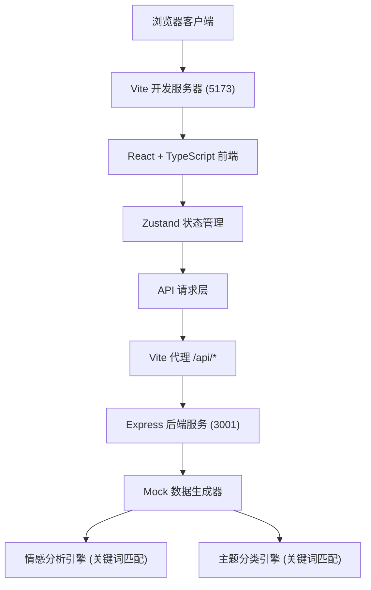
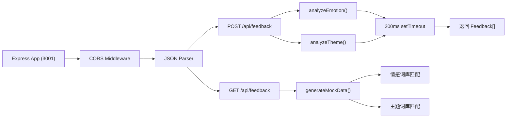

## 1. 架构设计



## 2. 技术描述

- **前端框架**: React 18 + TypeScript 5
- **构建工具**: Vite 5
- **状态管理**: Zustand 4
- **图表库**: Recharts 2
- **开发语言**: TypeScript（严格模式）
- **后端框架**: Express 4
- **跨域处理**: Vite 代理 + CORS
- **唯一标识**: UUID
- **CSS方案**: 内联样式 + CSS 变量
- **动画方案**: CSS transitions + React state-driven animations

## 3. 项目结构

```
project-root/
├── index.html                 # 入口HTML
├── package.json             # 项目依赖
├── vite.config.ts         # Vite 配置（含代理）
├── tsconfig.json        # TypeScript 配置
├── server/
│   └── mockApi.ts       # Express Mock API 服务器
└── src/
    ├── App.tsx           # 主应用组件
    ├── types.ts          # TypeScript 类型定义
    ├── stores/
    │   └── feedbackStore.ts   # Zustand 状态管理
    └── components/
        ├── EmotionCards.tsx       # 情感统计卡片
        ├── ChartsPanel.tsx      # 图表面板
        ├── FeedbackTable.tsx     # 反馈列表
        └── ReportExport.tsx      # 报告导出
```

## 4. API 定义

### 类型定义：

```typescript
type Emotion = 'positive' | 'negative' | 'neutral';
type Theme = 'performance' | 'feature' | 'experience' | 'price';

interface Feedback {
  id: string;
  customerName: string;
  channel: string;
  timestamp: string;
  description: string;
  emotion: Emotion;
  theme: Theme;
}

interface EmotionStats {
  positive: number;
  negative: number;
  neutral: number;
  total: number;
  positiveRate: number;
  negativeRate: number;
}

interface ThemeDistribution {
  theme: Theme;
  count: number;
  percentage: number;
  emotion: Emotion;
}

interface TrendDataPoint {
  date: string;
  total: number;
  positive: number;
  negative: number;
}
```

### API 端点：

| 方法 | 路径 | 请求 | 响应 |
|------|------|------|------|
| GET | `/api/feedback` | 无 | `Feedback[]` - 50条模拟反馈 |
| POST | `/api/feedback` | `{ customerName, channel, timestamp, description }` | `Feedback[]` - 200ms延迟后返回更新列表 |

## 5. 服务器架构



## 6. 状态管理架构

### Zustand Store 结构

```typescript
interface FeedbackStore {
  feedbackList: Feedback[];
  emotionStats: EmotionStats;
  themeDistribution: ThemeDistribution[];
  trendData: TrendDataPoint[];
  loading: boolean;
  fetchFeedback: () => Promise<void>;
  addFeedback: (data: NewFeedback) => Promise<void>;
  calculateStats: () => void;
}
```

### 数据派生规则：
- `emotionStats` - 从 feedbackList 计算情感统计
- `themeDistribution` - 从 feedbackList 计算主题分布
- `trendData` - 从 feedbackList 聚合30天趋势数据

## 7. 性能优化策略

1. **状态计算缓存**：使用 Zustand 的 selectors 避免不必要的重渲染
2. **数据派生**：统计数据在状态变更时一次性计算
3. **React.memo**：列表项使用 memo 优化重渲染
4. **CSS 动画**：优先使用 transform 和 opacity 动画
5. **批量更新**：状态更新批量处理减少重渲染
6. **数据去重**：基于 id 进行列表更新避免全量重渲染

## 8. 动画实现策略

- **数字滚动动画**：自定义 useCounter hook，requestAnimationFrame 驱动
- **圆弧进度条**：SVG stroke-dasharray + CSS transition
- **图表过渡**：Recharts isAnimationActive + animationDuration
- **浮层动画**：CSS transform: scale + opacity transition
- **进度条动画**：CSS @keyframes 模拟下载进度
