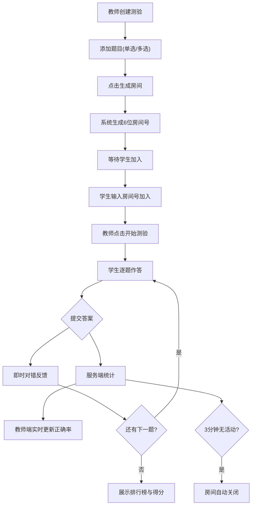

## 1. 产品概述

轻量级多人实时在线选择题测验协作应用，面向在线教育场景。教师可快速创建测验房间并设定题目，学生通过房间号加入并实时作答，系统通过 WebSocket 实时双向通信，实现答题进度追踪、正确率统计和个人得分排名动画展示。
- 解决现有测验工具配置笨重、缺乏实时协同反馈的问题
- 面向在线教育教师和学生用户，提供即时、轻量、互动的测验体验

## 2. 核心功能

### 2.1 用户角色

| 角色 | 进入方式 | 核心权限 |
|------|----------|----------|
| 教师 | 访问 /teacher 路由 | 创建房间、添加/删除题目、启动/结束测验、查看实时统计 |
| 学生 | 访问 /student 路由 | 输入房间号加入、逐题作答、查看个人反馈和排名 |

### 2.2 功能模块

1. **教师端页面**：题目编辑区（支持单选/多选题添加删除）、房间创建与房间号分享、等待学生列表展示、实时答题统计面板、测验结束排行榜
2. **学生端页面**：房间号加入入口、等待测验开始、逐题作答卡片、即时对错反馈、个人得分卡与排行榜动画

### 2.3 页面详情

| 页面名称 | 模块名称 | 功能描述 |
|----------|----------|----------|
| 教师端 | 题目编辑区 | 动态添加/删除单选题和多选题，每题4个选项，设定正确答案 |
| 教师端 | 房间管理 | 生成6位数字房间号，打字机动画展示，显示等待学生列表 |
| 教师端 | 实时统计面板 | 每题正确率百分比柱状图（蓝色渐变），学生答题用时排序 |
| 教师端 | 排行榜 | 测验结束后正确率排名，第一名金色奖杯动画弹出 |
| 学生端 | 加入房间 | 输入6位房间号加入测验房间 |
| 学生端 | 逐题作答 | 全屏居中卡片展示题目，单选圆形radio/多选方形checkbox样式 |
| 学生端 | 即时反馈 | 每题提交后弹出绿色对勾/红色叉叉半透明提示条，持续2秒 |
| 学生端 | 得分报告 | 分数从0滚动递增动画，半径渐变辐射圆环背景 |
| 学生端 | 排行榜动画 | 自己名字金色描边高亮，从底部平滑上移到对应名次 |

## 3. 核心流程

### 教师创建测验流程
1. 教师访问 /teacher，在题目编辑区添加题目（选择单选/多选，输入题干和4个选项，标记正确答案）
2. 点击"生成房间"按钮，系统生成6位房间号并以打字机动画展示
3. 教师将房间号分享给学生，等待学生加入（学生头像圆环叠加动画展示）
4. 点击"开始测验"按钮，房间进入active状态，所有学生端自动显示第一题

### 学生答题流程
1. 学生访问 /student，输入房间号加入
2. 等待教师开始测验
3. 测验开始后逐题作答，选中选项后提交锁定
4. 每题提交后立即看到对错反馈（2秒后消失）
5. 全部答完后展示个人得分卡和排行榜

### 实时统计流程
1. 学生提交答案 → socket事件发送至服务端
2. 服务端更新内存数据 → 判断是否全班完成该题
3. 全班完成 → 服务端广播该题正确率统计至教师端
4. 教师端实时更新正确率柱状图和学生用时排序

### 超时机制
1. 教师可随时点击"结束测验"强制进入结束状态
2. 若3分钟内无作答活动，房间自动关闭并通知所有成员

## 4. 用户界面设计

### 4.1 设计风格

- **主色调**：深蓝灰渐变背景（#1a1a2e → #16213e），青蓝主色（#0f3460），浅青强调色（#53d8fb）
- **卡片风格**：半透明磨砂玻璃效果（backdrop-filter: blur(10px)），圆角12px
- **按钮风格**：默认深色，选中后青蓝渐变，悬停上浮3px并加深阴影，点击涟漪波纹效果
- **字体**：标题使用 Outfit（粗体600-700），正文使用 DM Sans（常规400-500）
- **布局**：桌面端教师双栏（左编辑右统计），学生全屏居中
- **动画**：CSS transitions + keyframes，过渡300ms内完成，排行榜60fps

### 4.2 页面设计概览

| 页面名称 | 模块名称 | UI 元素 |
|----------|----------|---------|
| 教师端 | 题目编辑区 | 滚动列表，每题卡片式布局，添加/删除按钮，单选/多选切换 |
| 教师端 | 房间号展示 | 顶部居中，6位数字打字机动画，青蓝色大号字体 |
| 教师端 | 等待学生列表 | 头像圆环叠加动画，显示已加入学生名称 |
| 教师端 | 实时统计面板 | 右侧固定40%宽度，蓝色渐变柱状图，百分比数值，学生用时列表 |
| 教师端 | 排行榜 | 全屏弹层，第一名金色奖杯弹出动画，排名列表 |
| 学生端 | 加入房间 | 居中输入框，6位数字，加入按钮 |
| 学生端 | 作答卡片 | 全屏居中，题干+4选项圆角按钮，单选圆形/多选方形样式，选中缩放+颜色填充 |
| 学生端 | 对错反馈 | 半透明圆角提示条，绿色对勾/红色叉叉，弹跳动画，2秒消失 |
| 学生端 | 进度条 | 底部圆角进度条，颜色渐变随进度变化 |
| 学生端 | 得分卡 | 分数0→最终分数滚动动画，辐射渐变圆环背景 |
| 学生端 | 排行榜 | 自己金色描边高亮，从底部平滑上移到名次位置 |

### 4.3 响应式适配

- **桌面端（≥1024px）**：教师端双栏布局（左编辑区+右统计面板40%），学生端全屏居中卡片
- **平板端（768-1023px）**：教师端单栏折叠，统计面板变为底部可切换标签，学生端卡片自适应
- **手机端（<768px）**：教师端全宽单栏，学生端卡片自适应宽度，字号略缩，选项两列网格排列

### 4.4 性能要求

- 教师端实时统计更新延迟 ≤ 500ms（从所有学生提交到教师端显示正确率）
- 页面过渡动画 ≤ 300ms
- 排行榜排名动画帧率保持 60fps
