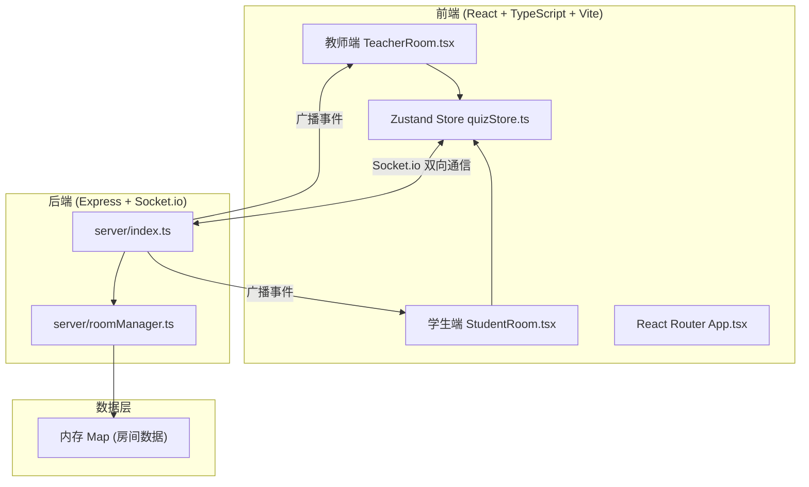
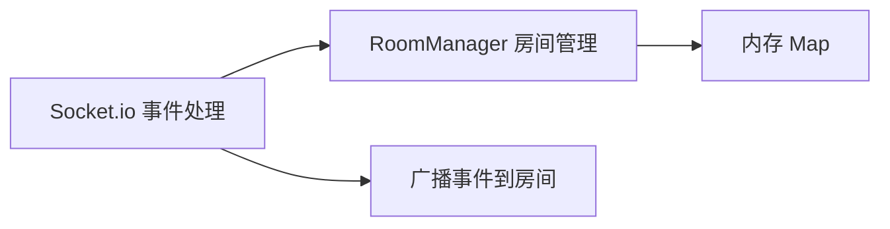
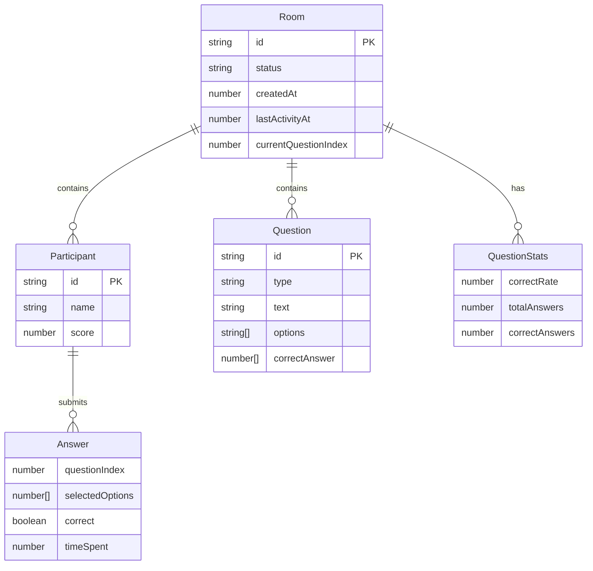

## 1. 架构设计



## 2. 技术说明

- **前端**：React 18 + TypeScript + Vite + Tailwind CSS 3 + Zustand + Socket.io-client + React Router DOM
- **初始化工具**：vite-init (react-express-ts 模板)
- **后端**：Express 4 + Socket.io + CORS + UUID
- **数据库**：无持久化数据库，使用内存 Map 存储房间数据
- **实时通信**：Socket.io 处理双向实时通信

## 3. 路由定义

| 路由 | 用途 |
|------|------|
| / | 首页，提供教师端和学生端入口选择 |
| /teacher | 教师端页面，创建和管理测验 |
| /student | 学生端页面，加入房间和作答 |

## 4. API 定义

### 4.1 Socket.io 事件定义

#### 客户端 → 服务端

| 事件名 | 参数类型 | 说明 |
|--------|----------|------|
| createRoom | `{ questions: Question[] }` | 教师创建测验房间 |
| joinRoom | `{ roomId: string; name: string }` | 学生加入房间 |
| startQuiz | `{ roomId: string }` | 教师开始测验 |
| submitAnswer | `{ roomId: string; questionIndex: number; answer: number[]; timeSpent: number }` | 学生提交答案 |
| endQuiz | `{ roomId: string }` | 教师强制结束测验 |

#### 服务端 → 客户端

| 事件名 | 参数类型 | 说明 |
|--------|----------|------|
| roomCreated | `{ roomId: string }` | 房间创建成功，返回6位房间号 |
| studentJoined | `{ participants: Participant[] }` | 新学生加入，广播更新参与者列表 |
| quizStarted | `{ questions: Question[] }` | 测验开始，广播题目列表 |
| answerResult | `{ questionIndex: number; correct: boolean; correctAnswer: number[] }` | 个人答题结果反馈 |
| questionStats | `{ questionIndex: number; correctRate: number; answers: AnswerDetail[] }` | 题目统计（教师端） |
| quizEnded | `{ results: QuizResult[] }` | 测验结束，广播排行榜结果 |
| roomClosed | `{ reason: string }` | 房间关闭通知 |

### 4.2 TypeScript 类型定义

```typescript
interface Question {
  id: string;
  type: 'single' | 'multiple';
  text: string;
  options: string[];
  correctAnswer: number[];
}

interface Participant {
  id: string;
  name: string;
  score: number;
  answers: Map<number, number[]>;
  timeSpent: Map<number, number>;
}

interface Room {
  id: string;
  questions: Question[];
  participants: Participant[];
  status: 'waiting' | 'active' | 'ended';
  createdAt: number;
  lastActivityAt: number;
  currentQuestionIndex: number;
  questionStats: Map<number, QuestionStats>;
}

interface QuestionStats {
  correctRate: number;
  totalAnswers: number;
  correctAnswers: number;
  answerDetails: AnswerDetail[];
}

interface AnswerDetail {
  participantId: string;
  participantName: string;
  answer: number[];
  correct: boolean;
  timeSpent: number;
}

interface QuizResult {
  participantId: string;
  participantName: string;
  score: number;
  totalQuestions: number;
  correctCount: number;
  rank: number;
}
```

## 5. 服务端架构图



### 数据流向

1. **创建房间**：教师 createRoom → RoomManager.createRoom() → 内存Map存储 → 返回roomId
2. **加入房间**：学生 joinRoom → RoomManager.joinRoom() → 更新participants → 广播studentJoined
3. **提交答案**：学生 submitAnswer → RoomManager.addParticipantAnswer() → 判断是否全班完成 → 广播questionStats(教师) + answerResult(学生)
4. **结束测验**：教师 endQuiz / 超时 → RoomManager.calculateResults() → 广播quizEnded

## 6. 数据模型

### 6.1 数据模型定义



### 6.2 数据存储

所有数据存储在服务端内存中，使用 `Map<string, Room>` 结构管理，无需数据库。房间超时自动清理。
