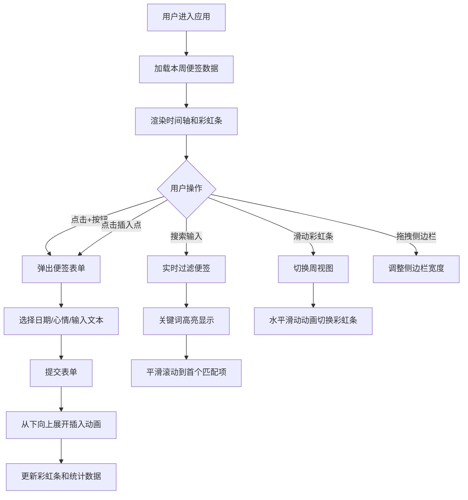

## 1. 产品概述

时光便签是一款以时间轴形式记录日常碎片化想法和短日记的应用，通过心情色块可视化用户情绪变化，帮助用户直观感受一周心情起伏。

- **核心价值**：将抽象的心情转化为可视的彩虹色条，让情绪记录变得有趣且富有美感
- **目标用户**：喜欢记录生活、关注情绪健康的年轻用户群体
- **市场定位**：轻量级、高颜值的心情日记应用

## 2. 核心功能

### 2.1 用户角色

| 角色 | 注册方式 | 核心权限 |
|------|----------|----------|
| 普通用户 | 无需注册（本地存储） | 创建/查看/搜索便签、查看心情统计 |

### 2.2 功能模块

1. **时间轴主页面**：竖版时间轴展示便签、交错布局、插入新便签
2. **便签表单**：底部滑入卡片、日期时间选择、心情色块选择、文本输入
3. **彩虹条**：周心情聚合展示、历史周切换、色块点击跳转
4. **侧边栏统计**：心情统计环形图、本周心情排行、便签总数、拖拽调整宽度
5. **搜索功能**：实时模糊搜索、关键词高亮、自动滚动定位

### 2.3 页面详情

| 页面名称 | 模块名称 | 功能描述 |
|----------|----------|----------|
| 主页面 | 时间轴区域 | 居中垂直线条、左右交错便签卡片、虚拟滚动优化、点击插入点添加便签 |
| 主页面 | 彩虹条区域 | 顶部渐变色条、周切换滑动动画、色块显示天数/数量、点击跳转 |
| 主页面 | 侧边栏区域 | 环形图展示心情占比、本周最常心情、拖拽调整宽度、渐变背景 |
| 便签表单 | 表单组件 | 底部滑入动画、弹簧回弹效果、12色心情选择、140字限制 |
| 搜索功能 | 搜索框 | 实时搜索、黄色高亮关键词、平滑滚动到第一个匹配项 |

## 3. 核心流程

## 4. 用户界面设计

### 4.1 设计风格
- **主色调**：12种柔色心情色块（粉、橙、黄、绿、青、蓝、紫等柔和色调）
- **背景色**：浅灰白色系，营造清新舒适感
- **卡片风格**：圆角矩形（12px圆角）、左侧5px心情色块边框、极淡投影
- **字体**：使用优雅的无衬线字体，标题加粗，正文清晰易读
- **动效风格**：流畅自然，弹簧效果增强交互愉悦感

### 4.2 页面设计概述

| 页面名称 | 模块名称 | UI元素 |
|----------|----------|----------|
| 主页面 | 时间轴区域 | 居中1px淡灰垂直线、左右交错卡片、悬停上移5px加深阴影、虚拟滚动 |
| 主页面 | 彩虹条区域 | 渐变色块拼接、圆角分割、hover显示详情、左右滑动切换 |
| 主页面 | 侧边栏区域 | 半透明毛玻璃背景、环形图带圆角分割线、渐变色跟随主心情 |
| 便签表单 | 表单组件 | 毛玻璃半透明背景、底部滑入+弹簧回弹、圆形色块选择器 |

### 4.3 响应式
- 桌面端优先设计，侧边栏可拖拽
- 移动端侧边栏自动收起为抽屉
- 时间轴卡片在小屏幕下单列显示

### 4.4 动画细节
- 卡片插入：从下向上展开翻页动画（≤300ms）
- 表单弹出：底部滑入 + 弹簧回弹效果
- 彩虹条切换：水平滑动过渡动画
- 悬停效果：卡片上移5px + 阴影加深
- 搜索滚动：平滑滚动动画
