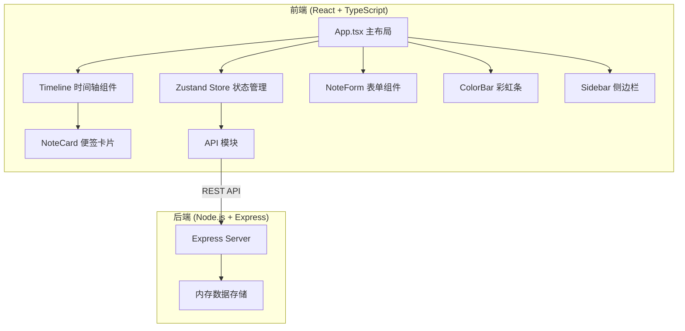
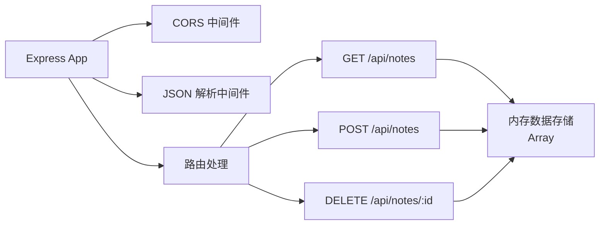

## 1. 架构设计



## 2. 技术描述

- **前端**：React 18 + TypeScript + Vite + Zustand
- **构建工具**：Vite 5
- **状态管理**：Zustand 4
- **后端**：Express 4 + Node.js
- **数据存储**：内存数组（模拟）
- **HTTP客户端**：原生 Fetch API
- **样式方案**：CSS Modules + CSS Variables
- **唯一ID生成**：uuid

## 3. 项目结构

```
├── package.json
├── vite.config.ts
├── tsconfig.json
├── index.html
├── server/
│   └── index.js          # Express服务器
└── src/
    ├── main.tsx          # React入口
    ├── App.tsx           # 主布局组件
    ├── store.ts          # Zustand状态管理
    ├── api/
    │   └── notes.ts      # API请求封装
    └── components/
        ├── Timeline.tsx    # 时间轴组件
        ├── NoteCard.tsx    # 便签卡片
        ├── NoteForm.tsx    # 表单组件
        ├── ColorBar.tsx    # 彩虹条组件
        └── Sidebar.tsx     # 侧边栏组件
```

## 4. API 定义

### 4.1 类型定义

```typescript
interface Note {
  id: string;
  content: string;
  mood: string;      // 心情色块标识
  createdAt: string; // ISO日期字符串
}

interface ColorBarData {
  mood: string;
  days: number;
  count: number;
  startDate: string;
  endDate: string;
}

interface WeeklyStats {
  mostCommonMood: string;
  moodPercentages: Record<string, number>;
  totalNotes: number;
}
```

### 4.2 接口定义

| 方法 | 路径 | 参数 | 返回 | 描述 |
|------|------|------|------|------|
| GET | /api/notes | week: string (YYYY-MM-DD) | Note[] | 获取指定周的便签列表 |
| POST | /api/notes | body: { content, mood, createdAt } | Note | 创建新便签 |
| DELETE | /api/notes/:id | - | { success: boolean } | 删除便签 |

### 4.3 请求响应示例

**POST /api/notes**
```json
// Request
{
  "content": "今天天气真好，心情很愉快！",
  "mood": "sunny-yellow",
  "createdAt": "2026-06-18T10:30:00.000Z"
}

// Response
{
  "id": "a1b2c3d4",
  "content": "今天天气真好，心情很愉快！",
  "mood": "sunny-yellow",
  "createdAt": "2026-06-18T10:30:00.000Z"
}
```

**GET /api/notes?week=2026-06-16**
```json
// Response
[
  {
    "id": "a1b2c3d4",
    "content": "今天天气真好，心情很愉快！",
    "mood": "sunny-yellow",
    "createdAt": "2026-06-18T10:30:00.000Z"
  }
]
```

## 5. 服务器架构



## 6. 数据模型

### 6.1 心情色块定义 (12种柔色)

```typescript
const MOOD_COLORS: Record<string, { hex: string; name: string; icon: string }> = {
  'soft-pink': { hex: '#FFB6C1', name: '温柔粉', icon: '🌸' },
  'peach': { hex: '#FFDAB9', name: '蜜桃橙', icon: '🍑' },
  'sunny-yellow': { hex: '#FFFACD', name: '晴日黄', icon: '☀️' },
  'mint-green': { hex: '#98FB98', name: '薄荷绿', icon: '🌿' },
  'sage': { hex: '#B5EAD7', name: '鼠尾草', icon: '🍃' },
  'sky-blue': { hex: '#87CEEB', name: '天空蓝', icon: '☁️' },
  'lavender': { hex: '#E6E6FA', name: '薰衣草', icon: '💜' },
  'lilac': { hex: '#C8A2C8', name: '丁香紫', icon: '🔮' },
  'coral': { hex: '#FF7F7F', name: '珊瑚红', icon: '🪸' },
  'sand': { hex: '#F5DEB3', name: '沙地棕', icon: '🏜️' },
  'aqua': { hex: '#AFEEEE', name: '水绿色', icon: '💎' },
  'rose': { hex: '#FFC0CB', name: '玫瑰色', icon: '🌹' }
};
```

### 6.2 核心计算属性

**getWeeklyColorBars** - 彩虹条聚合算法
- 输入：一周的便签列表
- 处理：按日期排序，合并相邻时段相同色块的记录
- 输出：ColorBarData 数组，包含色块、持续天数、便签数量

## 7. 性能优化策略

1. **虚拟滚动**：时间轴只渲染可视区域附近的30条便签
2. **CSS 硬件加速**：使用 transform 而非 top/left 实现动画
3. **节流防抖**：搜索输入防抖，滚动事件节流
4. **CSS 变量**：统一管理颜色和动画参数
5. **React.memo**：避免不必要的组件重渲染
6. **will-change**：对动画元素提升合成层
7. **requestAnimationFrame**：确保动画帧率稳定
