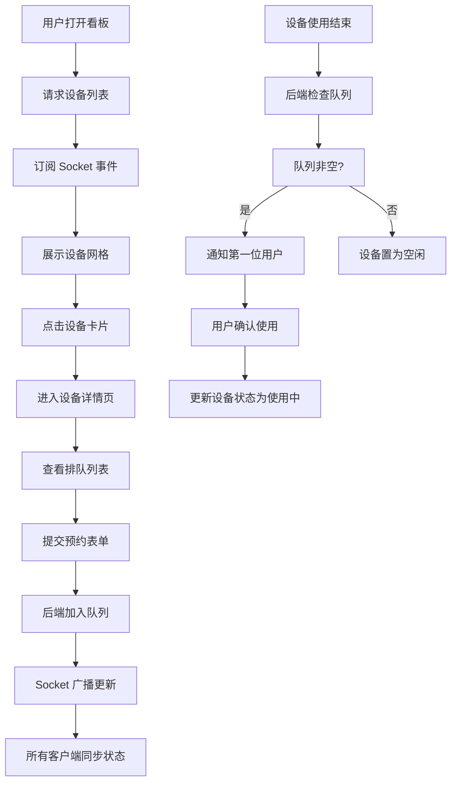

## 1. 产品概述

智能排队与设备状态协同应用，面向社区共享厨房和小型创客空间，解决多用户同时使用烤箱、电磁炉等设备时的时间冲突和状态不明问题，减少等待和资源浪费。

- 核心目标：实现设备实时状态可视化、预约排队自动化、消息提醒即时化
- 目标用户：共享空间使用者（普通用户）、空间管理员
- 产品价值：提升设备利用率，减少排队等待时间，优化共享资源管理

## 2. 核心功能

### 2.1 用户角色

| 角色 | 注册方式 | 核心权限 |
|------|----------|----------|
| 普通用户 | 无需注册，输入昵称即可使用 | 查看设备状态、预约排队、取消预约、接收空闲通知 |
| 管理员 | 固定 admin 账号模拟 | 所有普通用户权限 + 切换设备维护模式 |

### 2.2 功能模块

1. **设备看板页**：设备状态网格展示、在线人数显示、设备卡片交互
2. **设备详情页**：排队列表展示、预约表单、取消预约、预计等待时间计算
3. **消息通知系统**：设备空闲通知、状态变更实时推送
4. **维护模式管理**：设备状态切换（空闲/使用中/维护中）

### 2.3 页面详情

| 页面名称 | 模块名称 | 功能描述 |
|-----------|-------------|---------------------|
| 设备看板页 | 顶部标题栏 | 显示应用名称、在线人数徽标（数字动画更新） |
| 设备看板页 | 设备卡片网格 | 3列布局展示所有设备，显示设备名、状态、剩余时间，点击进入详情 |
| 设备看板页 | 管理员操作 | 齿轮按钮切换设备模式（仅 admin 可见） |
| 设备详情页 | 排队列表 | 纵向时间轴布局，显示排队用户昵称、预计开始时间 |
| 设备详情页 | 预约表单 | 输入昵称和使用时长（5-60分钟），提交加入排队 |
| 设备详情页 | 取消排队 | 点击自己排队项的取消按钮移除排队 |
| 全局 | 通知弹窗 | 设备空闲时右上角淡入弹窗，3秒自动消失 |

## 3. 核心流程

### 3.1 用户预约排队流程

用户打开看板 → 查看设备状态 → 点击使用中设备 → 进入详情页查看排队列表 → 填写昵称和使用时长 → 提交预约 → 排队项滑入列表 → 实时等待 → 设备空闲收到通知

### 3.2 管理员设备管理流程

管理员登录（固定 admin） → 点击设备齿轮按钮 → 弹出模式切换浮层 → 选择目标模式（空闲/使用中/维护中） → 确认切换 → 所有客户端实时同步状态

### 3.3 流程图

## 4. 用户界面设计

### 4.1 设计风格

- **主色调**：深蓝 #1A365D（标题栏）、浅蓝灰 #F0F4F8（背景）
- **状态色**：浅绿色（空闲）、浅橙色（使用中）、浅灰色（维护中）
- **卡片风格**：微卡片阴影 `box-shadow: 0 2px 8px rgba(0,0,0,0.08)`，圆角 12px
- **动画风格**：平滑过渡 0.5 秒、淡入淡出、滑入滑出、呼吸动画
- **字体**：正文使用系统无衬线字体，时间数字使用等宽字体

### 4.2 页面设计概览

| 页面名称 | 模块名称 | UI 元素 |
|-----------|-------------|----------|
| 设备看板页 | 顶部标题栏 | 深蓝背景、白色粗体标题、右上角在线人数徽标 |
| 设备看板页 | 设备卡片 | 圆角卡片、状态指示圆点（闪烁）、剩余时间进度条（倒计时动画） |
| 设备看板页 | 模式切换浮层 | 底部滑入、毛玻璃背景、三个选项按钮 |
| 设备详情页 | 排队列表 | 纵向时间轴、圆形头像（首字母渐变）、等宽时间数字 |
| 设备详情页 | 预约表单 | 底部固定表单、昵称输入、时长滑块/输入框 |
| 全局 | 通知弹窗 | 右上角淡入、3秒倒计时、确认按钮 |

### 4.3 响应式

- 桌面端：3列设备网格
- 平板端：2列设备网格
- 手机端：单列全宽设备卡片
- 触摸优化：增大点击区域，适配移动端手势

### 4.4 动效设计

- 状态变化：背景色 0.5 秒平滑过渡
- 新排队项：从底部滑入动画
- 取消排队：向左滑出动画
- 空闲通知：右上角淡入 + 绿色呼吸动画
- 在线人数：数字滚动动画
- 模式浮层：底部滑入 + 毛玻璃背景淡入
