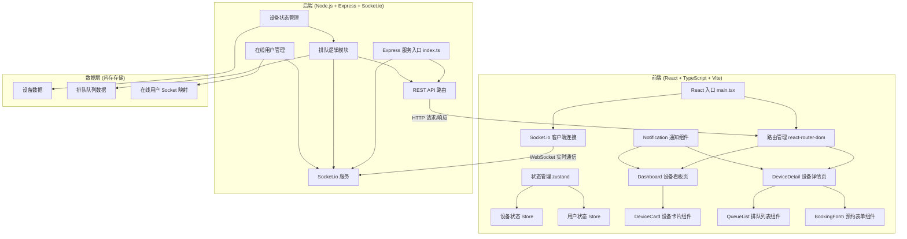

## 1. 架构设计



## 2. 技术描述

- **前端框架**：React 18 + TypeScript 5
- **构建工具**：Vite 5 + @vitejs/plugin-react
- **路由管理**：react-router-dom 6
- **状态管理**：zustand 4
- **UI 样式**：CSS Modules / 内联样式（轻量级，减少打包体积）
- **实时通信**：socket.io-client 4
- **后端框架**：Express 4
- **实时服务**：socket.io 4
- **跨域处理**：cors
- **唯一ID生成**：uuid
- **数据存储**：内存存储（演示用途）

## 3. 路由定义

### 前端路由

| 路由路径 | 页面组件 | 功能描述 |
|-----------|----------|----------|
| `/` | Dashboard | 设备看板首页，展示所有设备状态网格 |
| `/device/:id` | DeviceDetail | 设备详情页，展示排队列表和预约表单 |

### 后端 API 路由

| 方法 | 路径 | 功能描述 |
|------|------|----------|
| GET | `/api/devices` | 获取所有设备列表及状态 |
| GET | `/api/devices/:id` | 获取单个设备详情及排队信息 |
| POST | `/api/devices/:id/queue` | 提交预约，加入排队队列 |
| DELETE | `/api/devices/:id/queue/:queueId` | 取消排队，从队列中移除 |
| PUT | `/api/devices/:id/status` | 管理员切换设备状态（空闲/使用中/维护中） |

## 4. Socket.io 事件定义

### 服务端 → 客户端

| 事件名 | 数据结构 | 触发时机 |
|--------|----------|----------|
| `device:status` | `{ deviceId, status, remainingMinutes?, currentUser?, maintenanceReason? }` | 设备状态变更时广播 |
| `queue:update` | `{ deviceId, queue: QueueItem[] }` | 排队队列变化时广播 |
| `device:free` | `{ deviceId, deviceName }` | 设备变为空闲，通知排队第一位用户 |
| `users:count` | `{ count: number }` | 在线人数变化时广播 |

### 客户端 → 服务端

| 事件名 | 数据结构 | 触发时机 |
|--------|----------|----------|
| `join` | `{ nickname?, isAdmin?: boolean }` | 用户连接后加入，注册身份 |
| `subscribe:device` | `{ deviceId }` | 订阅特定设备的状态更新 |

## 5. 数据模型

### 5.1 设备 (Device)

```typescript
interface Device {
  id: string;
  name: string;
  status: 'idle' | 'in-use' | 'maintenance';
  remainingMinutes: number; // 使用中时的剩余分钟数
  currentUser?: string; // 当前使用者昵称
  maintenanceReason?: string; // 维护原因
  totalDuration?: number; // 当前使用总时长（用于进度条）
  startTime?: number; // 使用开始时间戳
}
```

### 5.2 排队项 (QueueItem)

```typescript
interface QueueItem {
  id: string;
  nickname: string;
  duration: number; // 预计使用时长（分钟）
  estimatedStartTime: number; // 预计开始时间戳
  socketId?: string; // 用户 Socket ID，用于通知
}
```

### 5.3 在线用户 (OnlineUser)

```typescript
interface OnlineUser {
  socketId: string;
  nickname?: string;
  isAdmin: boolean;
}
```

## 6. 项目文件结构

```
.
├── package.json              # 项目依赖和脚本
├── vite.config.ts            # Vite 构建配置（代理到 3001 端口）
├── tsconfig.json             # TypeScript 严格模式配置
├── index.html                # HTML 入口
├── server/
│   └── index.ts              # Express + Socket.io 服务端入口
└── src/
    ├── main.tsx              # React 入口，挂载 Router 和 Socket
    ├── pages/
    │   ├── Dashboard.tsx     # 设备看板页面
    │   └── DeviceDetail.tsx  # 设备详情排队页面
    ├── components/
    │   ├── DeviceCard.tsx    # 设备卡片组件
    │   ├── QueueList.tsx     # 排队列表组件
    │   ├── BookingForm.tsx   # 预约表单组件
    │   ├── Notification.tsx  # 通知弹窗组件
    │   └── ModeModal.tsx     # 模式切换浮层组件
    ├── store/
    │   └── useStore.ts       # zustand 全局状态管理
    ├── hooks/
    │   └── useSocket.ts      # Socket 连接 Hook
    ├── types/
    │   └── index.ts          # TypeScript 类型定义
    └── utils/
        └── time.ts           # 时间格式化工具
```

## 7. 性能约束

- API 响应时间：≤ 300ms
- Socket 事件广播延迟：≤ 200ms
- 首屏加载资源总大小：≤ 500KB（无缓存）
- 状态更新动画：GPU 加速，60fps
- 内存使用：单个设备队列 ≤ 100 项
