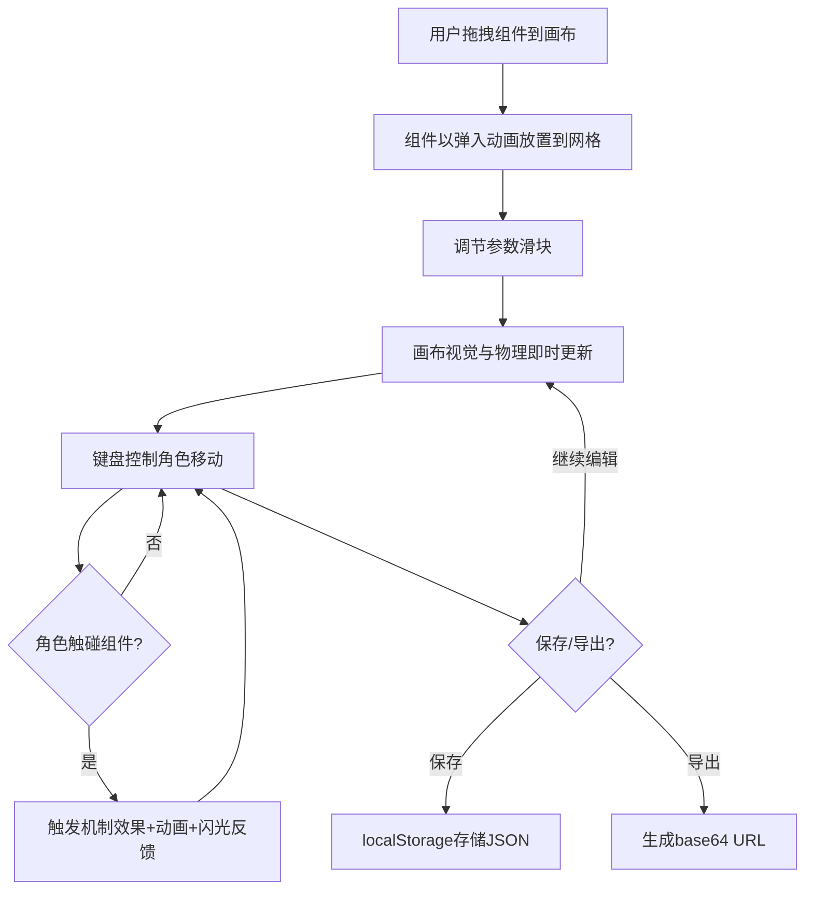

## 1. 产品概述

可视化原型沙盒（Prototype Sandbox）是一款面向独立游戏开发者的2D平台游戏原型快速搭建工具。用户可从预设组件库（移动速度修改器、弹跳板、传送门、重力反转器）拖拽到场景画布上组合游戏原型，实时调整参数并即时预览效果，无需编写代码即可验证创意机制的可行性。

## 2. 核心功能

### 2.1 用户角色

| 角色 | 注册方式 | 核心权限 |
|------|----------|----------|
| 游戏开发者 | 无需注册 | 拖拽组件、调节参数、控制角色、保存/加载/导出/导入原型 |

### 2.2 功能模块

1. **主页面**：组件面板 + 游戏预览画布 + 工具栏，单页应用无路由跳转

### 2.3 页面详情

| 页面名称 | 模块名称 | 功能描述 |
|----------|----------|----------|
| 主页面 | 工具栏 | 保存原型（localStorage）、加载原型（下拉菜单）、导出（base64 URL）、导入（粘贴URL校验加载） |
| 主页面 | 组件面板 | 渲染4种预设组件卡片（移动/弹跳/传送/重力切换），每个组件有图标、名称、参数滑块，支持拖拽生成配置对象 |
| 主页面 | 游戏画布 | 800×600 Canvas画布，渲染玩家角色和已放置组件，处理键盘输入（A/D移动，W跳跃，空格激活组件效果），requestAnimationFrame游戏循环 |
| 主页面 | 物理引擎 | 自定义物理模拟，每帧更新玩家速度/位置，处理碰撞检测、组件激活逻辑 |

## 3. 核心流程

用户从左侧面板拖拽组件到画布 → 组件以缩放弹入动画出现在网格位置 → 通过面板滑块调节组件参数 → 画布中视觉特效和物理行为即时更新 → 键盘控制角色在画布中移动并触发组件机制 → 保存/导出原型供后续使用或分享

## 4. 用户界面设计

### 4.1 设计风格

- **主色调**：深色主题，深灰蓝(#1a1a2e) + 深蓝紫渐变(#0f0c29→#302b63)
- **组件色系**：霓虹色系 - 弹跳板青色#00f5d4、传送门品红#f15bb5、重力反转器亮黄#fee440、速度修改器淡紫#9b5de5
- **按钮风格**：圆形按钮(36×36px)，悬停放大到40px并轻微旋转
- **字体**：像素/赛博朋克风格字体
- **布局**：左侧面板250px + 右侧画布800×600px
- **卡片风格**：磨砂玻璃效果，rgba(255,255,255,0.05)背景，1px rgba(255,255,255,0.1)边框

### 4.2 页面设计概览

| 页面名称 | 模块名称 | UI元素 |
|----------|----------|--------|
| 主页面 | 工具栏 | 固定在画布顶部，高度50px，背景半透明#00000080，4个圆形按钮（保存蓝#4cc9f0、加载绿#06d6a0、导出黄#ffd166、导入粉#ef476f） |
| 主页面 | 组件面板 | 左侧250px宽，深灰蓝背景，4张磨砂玻璃卡片，每张含图标+名称+参数滑块，悬停上移2px+阴影扩大 |
| 主页面 | 游戏画布 | 800×600 Canvas，深蓝紫渐变背景，白色圆形角色(16px)，霓虹色组件图标带外发光 |
| 主页面 | 拖拽预览 | 半透明组件预览跟随鼠标，放置时缩放弹入动画，CSS过渡0.3s ease-out |

### 4.3 响应式

桌面优先设计，固定布局尺寸，不支持移动端适配（游戏原型工具主要面向桌面开发者）

### 4.4 3D场景指引

不适用，本项目为2D Canvas渲染
