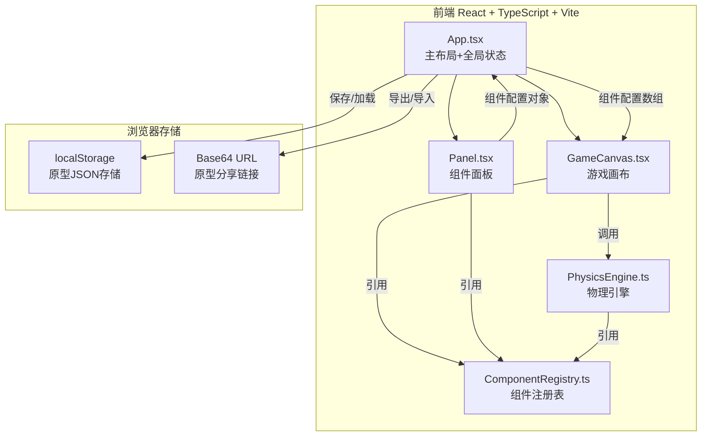
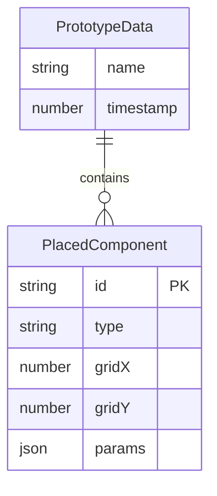

## 1. 架构设计



## 2. 技术说明

- **前端框架**：React@18 + TypeScript（严格模式）
- **构建工具**：Vite + @vitejs/plugin-react
- **状态管理**：React useState/useCallback（应用状态在App层管理，通过props传递）
- **渲染引擎**：Canvas 2D + requestAnimationFrame（自定义游戏循环，不依赖第三方游戏引擎）
- **物理引擎**：自定义PhysicsEngine模块（速度/位置更新、碰撞检测）
- **唯一ID**：uuid库
- **持久化**：浏览器localStorage + Base64编码URL分享
- **样式方案**：CSS模块/内联样式（霓虹赛博朋克主题）

## 3. 路由定义

本项目为单页应用，无路由跳转。所有功能在同一页面内完成。

## 4. API定义

无后端API，所有数据存储在浏览器端。

### 4.1 数据流接口

**组件配置对象（PlacedComponent）**：
```typescript
interface PlacedComponent {
  id: string;
  type: 'speed' | 'bounce' | 'teleport' | 'gravity';
  gridX: number;
  gridY: number;
  params: Record<string, number>;
}
```

**玩家状态（PlayerState）**：
```typescript
interface PlayerState {
  x: number;
  y: number;
  vx: number;
  vy: number;
  width: number;
  height: number;
  onGround: boolean;
  gravityReversed: boolean;
  scaleX: number;
  scaleY: number;
}
```

**原型数据（PrototypeData）**：
```typescript
interface PrototypeData {
  name: string;
  timestamp: number;
  components: PlacedComponent[];
}
```

## 5. 服务器架构图

不适用，无后端服务。

## 6. 数据模型

### 6.1 数据模型定义



### 6.2 数据定义

- **localStorage key格式**：`prototype_${timestamp}_${name}`
- **导出URL格式**：`#prototype=${base64EncodedJSON}`
- **网格系统**：画布800×600，网格单元40×40px，共20×15格

### 6.3 文件结构

```
├── package.json          # 依赖: react, react-dom, typescript, vite, @vitejs/plugin-react, uuid
├── vite.config.ts        # 构建配置，含React插件
├── tsconfig.json         # 严格模式，esModuleInterop启用
├── index.html            # 入口页面
├── src/
│   ├── App.tsx           # 主布局组件（调用Panel、GameCanvas）
│   ├── main.tsx          # React入口
│   ├── components/
│   │   ├── Panel.tsx     # 组件面板（引用ComponentRegistry，传递配置给App）
│   │   └── GameCanvas.tsx # 游戏画布（调用PhysicsEngine，引用ComponentRegistry）
│   └── modules/
│       ├── PhysicsEngine.ts # 物理引擎（被GameCanvas调用）
│       └── ComponentRegistry.ts # 组件注册表（被Panel/GameCanvas/PhysicsEngine引用）
```
