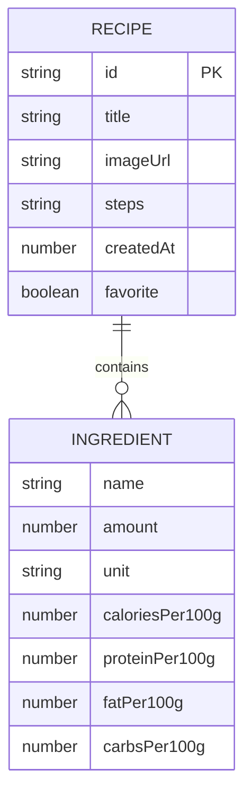

## 1. 架构设计

```mermaid
graph TD
    "Browser" --> "Vite Dev Server (:5173)"
    "Vite Dev Server" --> "API Proxy"
    "API Proxy" --> "Express Server (:3001)"
    "Express Server" --> "Mock Recipe Data"
    "Browser" --> "React App"
    "React App" --> "Zustand Store"
    "React App" --> "React Router"
    "React Router" --> "HomePage"
    "React Router" --> "RecipeDetailPage"
    "HomePage" --> "RecipeCard"
    "HomePage" --> "SearchBox"
    "HomePage" --> "CreateRecipeModal"
    "RecipeDetailPage" --> "NutritionBar"
    "RecipeDetailPage" --> "PortionController"
    "RecipeDetailPage" --> "IngredientList"
```

## 2. 技术说明

- **前端框架**：React 18 + TypeScript
- **构建工具**：Vite 5 + @vitejs/plugin-react
- **状态管理**：Zustand 4
- **路由管理**：React Router DOM 6
- **后端框架**：Express 4 + CORS
- **唯一ID生成**：UUID
- **启动方式**：`npm run dev` 同时启动前端开发服务器（Vite）和后端API（Express）

## 3. 路由定义

| 路由 | 页面 | 说明 |
|------|------|------|
| `/` | HomePage | 首页：食谱列表、搜索、创建食谱 |
| `/recipe/:id` | RecipeDetailPage | 食谱详情页：完整配方、营养计算器 |

## 4. API 定义

### 4.1 GET /api/recipes

获取所有食谱列表。

**响应：**
```typescript
interface Recipe {
  id: string;
  title: string;
  imageUrl?: string;
  ingredients: Ingredient[];
  steps: string;
  createdAt: number;
  favorite: boolean;
}

interface Ingredient {
  name: string;
  amount: number;
  unit: string;
  caloriesPer100g: number;
  proteinPer100g: number;
  fatPer100g: number;
  carbsPer100g: number;
}

type RecipesResponse = Recipe[];
```

### 4.2 GET /api/recipes/:id

根据ID获取单个食谱详情。

**响应：**
```typescript
type RecipeResponse = Recipe | { error: string };
```

### 4.3 POST /api/recipes

创建新食谱（内存存储）。

**请求体：**
```typescript
interface CreateRecipeRequest {
  title: string;
  imageUrl?: string;
  ingredients: Ingredient[];
  steps: string;
}
```

## 5. 服务器架构

```mermaid
graph LR
    "Client" --> "Express App"
    "Express App" --> "CORS Middleware"
    "CORS Middleware" --> "JSON Parser"
    "JSON Parser" --> "Recipe Routes"
    "Recipe Routes" --> "In-Memory Data Store"
    "In-Memory Data Store" --> "Mock Recipes Seed"
```

## 6. 数据模型

### 6.1 数据模型定义



### 6.2 Zustand Store

```typescript
interface RecipeState {
  recipes: Recipe[];
  searchQuery: string;
  selectedRecipe: Recipe | null;
  portions: Record<string, number>; // recipeId -> portion count
  fetchRecipes: () => Promise<void>;
  fetchRecipeById: (id: string) => Promise<void>;
  createRecipe: (data: CreateRecipeRequest) => Promise<void>;
  toggleFavorite: (id: string) => void;
  setSearchQuery: (q: string) => void;
  setPortions: (recipeId: string, portions: number) => void;
  getFilteredRecipes: () => Recipe[];
  calculateNutrition: (recipe: Recipe, portions: number) => NutritionTotal;
}

interface NutritionTotal {
  calories: number;
  protein: number;
  fat: number;
  carbs: number;
}
```

## 7. 项目文件结构

```
├── package.json
├── vite.config.ts
├── tsconfig.json
├── index.html
├── server/
│   └── index.ts
└── src/
    ├── App.tsx
    ├── main.tsx
    ├── store/
    │   └── recipeStore.ts
    ├── types/
    │   └── index.ts
    ├── utils/
    │   └── nutrition.ts
    ├── styles/
    │   └── global.css
    ├── components/
    │   ├── RecipeCard.tsx
    │   ├── NutritionBar.tsx
    │   ├── Toast.tsx
    │   └── CreateRecipeModal.tsx
    └── pages/
        ├── HomePage.tsx
        └── RecipeDetailPage.tsx
```

## 8. 性能优化策略

- **CSS动画**：所有过渡使用 `transform` 和 `opacity`，触发GPU加速
- **动画帧率**：目标60FPS，使用 `requestAnimationFrame` 式的数值过渡
- **组件渲染优化**：React.memo 包裹 RecipeCard 等频繁渲染组件
- **状态分片**：Zustand 使用 selector 避免不必要的重渲染
- **API响应**：内存数据存储，响应时间 < 50ms
- **营养计算**：纯函数计算，结果可派生，不存入store
