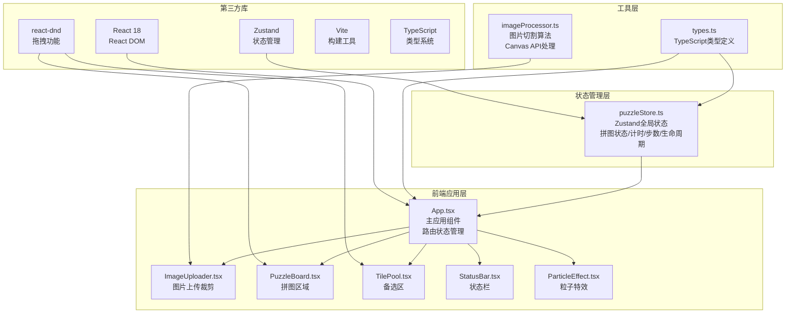

## 1. 架构设计



## 2. 技术描述

- **前端框架**: React 18 + TypeScript 5.x
- **构建工具**: Vite 5.x + @vitejs/plugin-react
- **状态管理**: Zustand 4.x（轻量级，无需Provider）
- **拖拽功能**: react-dnd 16.x + react-dnd-html5-backend
- **图片处理**: 原生Canvas API（无需额外库）
- **唯一标识**: uuid
- **CSS方案**: 内联样式 + CSS变量（无需CSS框架）
- **初始化方式**: 手动创建配置文件，npm install安装依赖

## 3. 目录结构

```
pixel-puzzle/
├── package.json
├── vite.config.ts
├── tsconfig.json
├── index.html
└── src/
    ├── types.ts              # 类型定义
    ├── App.tsx               # 主应用组件
    ├── store/
    │   └── puzzleStore.ts    # Zustand状态管理
    ├── components/
    │   ├── ImageUploader.tsx # 图片上传裁剪
    │   ├── PuzzleBoard.tsx   # 拼图区域
    │   ├── TilePool.tsx      # 备选区
    │   ├── StatusBar.tsx     # 状态栏
    │   └── ParticleEffect.tsx# 粒子特效
    └── utils/
        └── imageProcessor.ts # 图片切割算法
```

## 4. 路由与页面状态

| 状态 | 触发条件 | 显示内容 |
|-------|---------|---------|
| 'upload' | 初始状态 | 图片上传与裁剪界面 |
| 'playing' | 确认裁剪后 | 拼图主界面（状态栏+拼图区+备选区） |
| 'completed' | 拼图完成或时间耗尽 | 粒子特效+评级结果卡 |

## 5. 核心数据模型

### 5.1 类型定义 (types.ts)

```typescript
export interface Tile {
  id: string;
  originalIndex: number;
  currentPosition: number | null;
  imageData: string;
  row: number;
  col: number;
}

export interface CropArea {
  x: number;
  y: number;
  size: number;
}

export type GamePhase = 'upload' | 'playing' | 'completed';

export type GridSize = 3 | 4;

export type Rating = 'S' | 'A' | 'B' | 'C';

export interface PuzzleState {
  phase: GamePhase;
  gridSize: GridSize;
  tiles: Tile[];
  placedTiles: Map<number, Tile>;
  timeElapsed: number;
  moves: number;
  maxTime: number;
  lifePercent: number;
  isTimeUp: boolean;
  rating: Rating | null;
  completionRatio: number;
}
```

### 5.2 状态管理 (puzzleStore.ts)

核心动作：
- `setPhase(phase: GamePhase)`: 切换游戏阶段
- `setGridSize(size: GridSize)`: 设置网格大小
- `initPuzzle(tiles: Tile[], maxTime: number)`: 初始化拼图
- `placeTile(tile: Tile, position: number): boolean`: 放置方块，返回是否正确
- `removeTile(position: number)`: 移除方块
- `incrementMoves()`: 增加步数
- `tick()`: 计时器每秒调用
- `calculateRating()`: 计算评级
- `reset()`: 重置游戏

## 6. 核心技术实现要点

### 6.1 图片处理 (imageProcessor.ts)
- 使用 `HTMLCanvasElement` 和 `CanvasRenderingContext2D`
- `drawImage` 裁剪指定区域
- `getImageData` 获取像素数据
- `toDataURL` 生成base64图片
- Fisher-Yates 算法打乱方块顺序
- 处理时间目标：≤2秒

### 6.2 拖拽实现 (react-dnd)
- 拖拽类型：`'PUZZLE_TILE'`
- 拖拽项：`{ id, tile }`
- 放置目标：棋盘格位置
- `useDrag` hook 在 Tile 组件
- `useDrop` hook 在 BoardCell 组件
- 拖拽预览：自定义半透明预览

### 6.3 性能优化
- 拖拽响应目标：≤50ms
- 渲染帧率目标：≥30fps
- 使用 `React.memo` 优化方块组件重渲染
- `requestAnimationFrame` 处理动画
- `useCallback` 缓存事件处理函数
- 避免在拖拽过程中触发重排

### 6.4 动画实现
- CSS transitions 处理悬停、淡入淡出
- CSS @keyframes 处理抖动、闪烁
- `requestAnimationFrame` 处理粒子动画
- CSS variables 统一动画时长和缓动函数

### 6.5 生命周期机制
- 初始最大时间：3×3=120秒，4×4=240秒
- 每秒 `tick()` 更新 `timeElapsed` 和 `lifePercent`
- `lifePercent = 100 - (timeElapsed / maxTime) * 100`
- 方块亮度：`brightness(${40 + lifePercent * 0.6}%)`
- 进度条颜色：green(100%) → yellow(50%) → red(0%)

### 6.6 评级算法
```typescript
// 基于完成时间和步数计算
const timeScore = Math.max(0, 100 - (timeElapsed / maxTime) * 100);
const moveScore = Math.max(0, 100 - ((moves - totalTiles) / totalTiles) * 50);
const totalScore = timeScore * 0.6 + moveScore * 0.4;

// 评级阈值
S: totalScore >= 90
A: totalScore >= 75
B: totalScore >= 50
C: totalScore < 50
```
