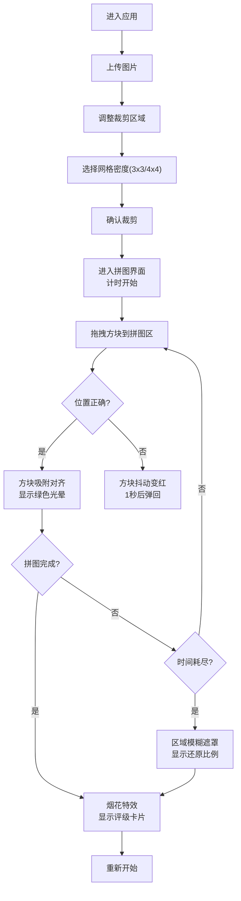

## 1. 产品概述

像素记忆拼图是一款结合图片记忆与拼图玩法的休闲益智Web应用。用户上传自定义图片，系统将其切割打乱，用户通过拖拽还原图片，在时间压力下挑战记忆力与动手能力。

- 核心价值：将普通拼图游戏升级为带时间紧迫感的记忆挑战，支持用户自定义图片内容
- 目标用户：喜欢休闲益智游戏、希望自定义拼图内容的玩家

## 2. 核心功能

### 2.1 功能模块
1. **图片上传与裁剪页**：虚线边框上传区、拖拽/点击上传、缩放裁剪预览、3x3/4x4网格辅助线、淡入动画过渡
2. **拼图主界面**：左侧拼图区域（自适应正方形）、右侧备选区（滚动列表）、顶部状态栏、方块拖拽与吸附
3. **结果展示**：烟花粒子特效、S/A/B/C评级卡片、缩放动画、完成数据统计

### 2.2 页面详情
| 页面名称 | 模块名称 | 功能描述 |
|-----------|-------------|---------------------|
| 图片上传与裁剪页 | 上传区域 | 虚线边框矩形，支持点击选择文件或拖拽文件，文件类型校验 |
| 图片上传与裁剪页 | 裁剪预览 | 图片缩放拖动、3x3/4x4网格辅助线切换、裁剪框固定比例 |
| 图片上传与裁剪页 | 确认按钮 | 确认裁剪后图片以淡入动画过渡到拼图界面 |
| 拼图主界面 | 拼图区域 | 正方形网格，边长自适应≤600px，放置正确显示绿色光晕，错误显示红色抖动 |
| 拼图主界面 | 备选区 | 固定宽度200px，带滚动条，方块阴影圆角，悬停上浮效果 |
| 拼图主界面 | 状态栏 | 计时器（秒级）、操作步数、生命周期进度条（绿→黄→红渐变） |
| 拼图主界面 | 时间耗尽 | 拼图区域模糊、半透明黑色遮罩、显示还原比例、进度条闪烁 |
| 结果页面 | 粒子特效 | 全屏烟花粒子绽放效果 |
| 结果页面 | 评级卡片 | 居中显示S/A/B/C评级，缩放动画从中心展开，显示用时和步数 |

## 3. 核心流程

用户进入应用 → 上传图片（点击或拖拽）→ 调整裁剪区域和网格密度 → 确认裁剪 → 进入拼图界面，计时开始 → 从备选区拖拽方块到拼图区域 → 正确放置吸附，错误抖动弹回 → 完成拼图或时间耗尽 → 显示评级结果和烟花特效 → 可重新开始

## 4. 用户界面设计

### 4.1 设计风格
- **主色调**：深蓝色到灰蓝色渐变背景（#1a2a4a → #2d3d5c）
- **强调色**：柔和的蓝色到紫色渐变（#4a90e2 → #8b5cf6）用于按钮和状态提示
- **成功色**：柔和绿色光晕（#4ade80，低透明度）
- **错误色**：红色边框抖动（#ef4444）
- **按钮风格**：圆角设计，蓝紫渐变填充，悬停时轻微上浮和阴影加深
- **字体**：无衬线字体（'Segoe UI', system-ui, sans-serif），标题加粗，正文清晰易读
- **布局风格**：卡片式布局，所有组件统一圆角（8px-12px），柔和阴影
- **动效风格**：平滑的CSS过渡动画，物理感拖拽（惯性滑动+弹性吸附）

### 4.2 页面设计概述
| 页面名称 | 模块名称 | UI元素 |
|-----------|-------------|-------------|
| 图片上传页 | 上传区域 | 虚线边框（2px dashed #6b7280），圆角12px，悬停边框变色，居中上传图标和提示文字 |
| 图片上传页 | 裁剪预览 | 图片居中显示，可拖动缩放，裁剪框固定正方形，网格辅助线（半透明白色虚线） |
| 拼图主界面 | 拼图区域 | 正方形背景（#1e293b），细网格线（#334155），方块带阴影圆角，正确放置绿色光晕 |
| 拼图主界面 | 备选区 | 固定宽度200px，背景（#1e293b），内边距12px，垂直滚动条，方块间距8px |
| 拼图主界面 | 状态栏 | 横向排列，计时器和步数左对齐，进度条右对齐，文字白色，进度条带渐变 |
| 结果页面 | 评级卡片 | 白色背景，圆角16px，阴影-xl，居中缩放动画，评级文字大号加粗 |

### 4.3 响应式设计
- 桌面端优先，拼图区域最大600px
- 窗口宽度小于900px时，备选区改为底部横向排列（宽度自适应，高度200px）
- 触摸设备优化：方块最小尺寸40px，拖拽区域足够大
- 所有文字大小使用rem单位，支持系统字体缩放

### 4.4 动效设计要点
- 页面切换：淡入淡出（opacity 0→1，300ms ease-out）
- 方块悬停：translateY(-2px)，box-shadow加深，200ms ease
- 正确放置：scale(1.05)→scale(1)弹性动画，绿色光晕fade-in
- 错误放置：translateX抖动动画（±5px），红色边框1秒后fade-out
- 评级卡片：scale(0)→scale(1.1)→scale(1)弹性动画，500ms
- 进度条闪烁：opacity 1→0.5→1循环，300ms间隔
- 方块变暗：filter: brightness()随时间从100%降到40%
