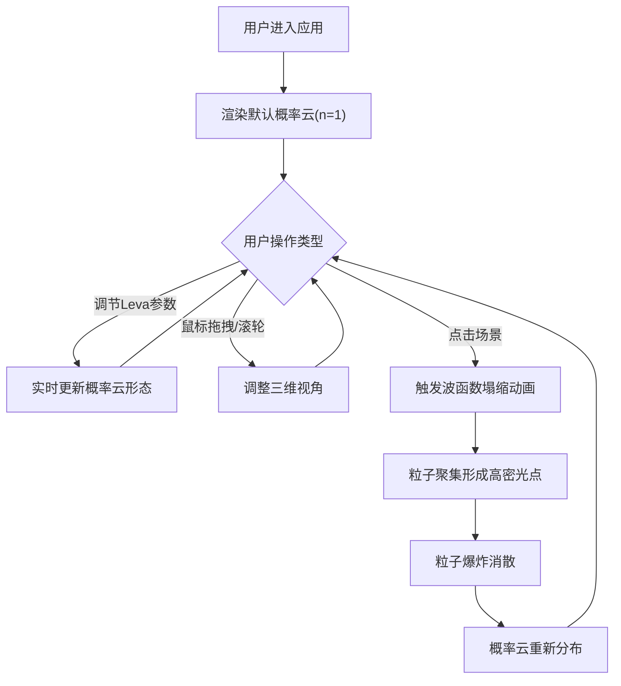

## 1. 产品概述
基于三维量子概率云与波函数可视化的互动教学工具，帮助学生直观理解量子力学中波函数叠加与塌缩的抽象概念，提供沉浸式三维交互体验。

- **核心目标**：通过可交互的三维可视化方式，降低量子力学概念的学习门槛
- **目标用户**：物理专业学生、量子力学教师、科研工作者
- **市场价值**：填补现有量子力学教学中三维可视化交互工具的空白

## 2. 核心功能

### 2.1 功能模块
1. **三维概率云渲染**：实时生成并渲染量子概率云粒子系统
2. **参数调节面板**：通过Leva控制面板调节能量级数、叠加系数、视角等参数
3. **波函数塌缩动画**：模拟观测事件导致的波函数塌缩过程
4. **视角交互控制**：鼠标拖拽旋转、滚轮缩放、自动旋转模式
5. **状态信息展示**：叠加态表达式、观测位置、FPS计数器等信息显示

### 2.2 页面详情
| 页面名称 | 模块名称 | 功能描述 |
|-----------|-------------|---------------------|
| 主界面 | 顶部导航栏 | 显示应用名称、FPS计数器 |
| 主界面 | 三维场景区域 | 量子概率云渲染、塌缩动画、OrbitControls交互 |
| 主界面 | Leva控制面板 | 能量级数滑块、轨道叠加系数滑块、自动旋转开关、观测位置显示 |
| 主界面 | 叠加态表达式 | 场景左上角显示当前量子态表达式 |
| 主界面 | 观测信息面板 | 场景右下角显示观测位置和时间戳 |

## 3. 核心流程
用户进入应用 → 查看默认球对称概率云 → 通过Leva调节参数观察概率云形态变化 → 点击场景任意位置触发波函数塌缩 → 塌缩动画完成后概率云重新分布 → 继续探索和学习。

## 4. 用户界面设计

### 4.1 设计风格
- **主色调**：深空蓝(#0a0a2e)到深紫(#1a0030)的径向渐变背景
- **粒子颜色**：蓝色 → 紫色 → 红色的概率密度映射渐变
- **视觉特效**：粒子自发光(emissive强度0.3)、半透明光晕、塌缩闪烁效果
- **字体**：白色无衬线字体，标签文字14px(不透明度0.85)
- **面板风格**：半透明毛玻璃效果(backdrop-filter: blur(10px))

### 4.2 页面设计概述
| 页面名称 | 模块名称 | UI元素 |
|-----------|-------------|-------------|
| 主界面 | 顶部导航栏 | 60px高、半透明黑底、左侧应用名称、右侧FPS计数器(绿色/红色) |
| 主界面 | 三维场景 | 100%宽度，calc(100vh - 60px)高度，深空渐变背景 |
| 主界面 | Leva面板 | 右侧折叠栏(默认展开，可折叠至50px)，毛玻璃效果 |
| 主界面 | 状态文字 | 左上角白色发光叠加态表达式，右下角观测信息 |

### 4.3 响应式设计
- **桌面端(≥768px)**：Leva面板位于右侧，场景高度calc(100vh - 60px)
- **移动端(<768px)**：Leva面板切换至底部(高度150px，可缩放)，场景高度calc(100vh - 210px)
- **触摸优化**：支持触摸手势旋转和缩放

### 4.4 3D场景指导
- **环境**：深空渐变背景，无外部HDRI，营造宇宙空间感
- **光照**：环境光(AmbientLight)强度0.5，点光源跟随粒子中心
- **相机**：PerspectiveCamera，默认距离8，fov 60度
- **视角控制**：OrbitControls，支持阻尼效果，自动旋转速度0.005rad/frame
- **后处理**：粒子自发光效果，塌缩时场景短暂闪烁(0.3s)
- **性能**：粒子数500-5000，nLevel≤6时稳定30FPS以上
