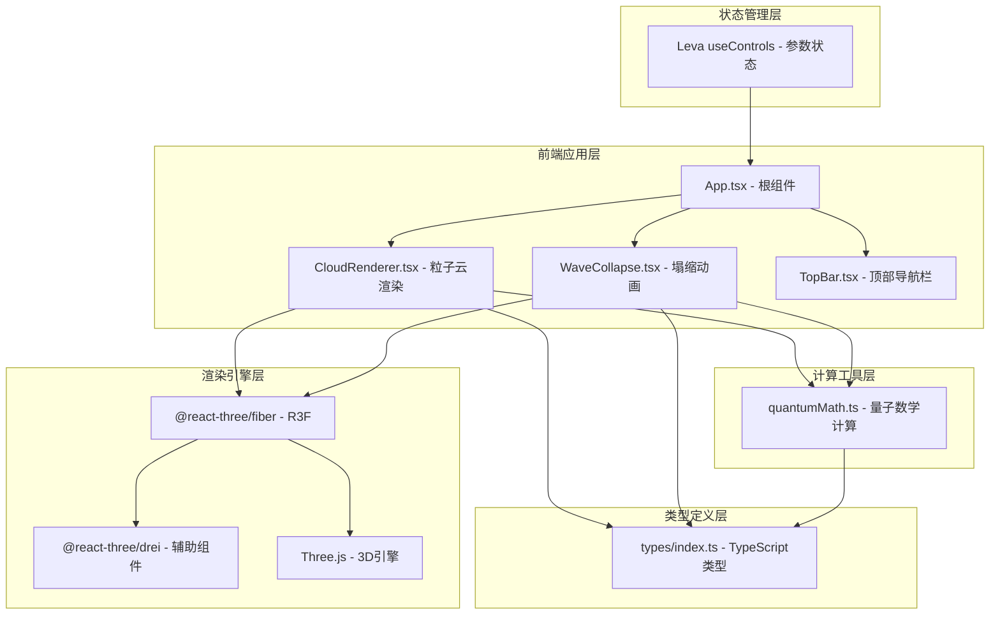

## 1. 架构设计



**数据流向说明**：
1. 用户通过Leva控制面板调节参数 → Leva内部状态更新
2. App.tsx接收Leva状态 → 传递给CloudRenderer和WaveCollapse组件
3. CloudRenderer接收参数 → 调用quantumMath计算概率云 → Three.js渲染粒子
4. 用户点击场景 → 射线检测获取坐标 → WaveCollapse触发塌缩动画
5. 塌缩完成 → CloudRenderer重新渲染新形态概率云

## 2. 技术描述

- **前端框架**：React 18 + TypeScript 5
- **构建工具**：Vite 5 + @vitejs/plugin-react
- **本地HTTPS**：vite-plugin-mkcert
- **3D渲染**：Three.js + @react-three/fiber + @react-three/drei
- **参数面板**：Leva
- **工具库**：uuid, turntable
- **状态管理**：Leva useControls (轻量级，无需额外状态管理库)
- **项目初始化**：vite-init react-ts模板

## 3. 目录结构

```
auto59/
├── .trae/documents/
│   ├── PRD.md
│   └── Technical-Architecture.md
├── src/
│   ├── components/
│   │   ├── CloudRenderer.tsx    # 三维概率云渲染组件
│   │   └── WaveCollapse.tsx     # 波函数塌缩动画组件
│   ├── utils/
│   │   └── quantumMath.ts       # 量子计算纯函数模块
│   ├── types/
│   │   └── index.ts             # TypeScript类型定义
│   ├── App.tsx                  # 根组件，布局与状态整合
│   └── main.tsx                 # React入口
├── index.html
├── package.json
├── vite.config.ts
└── tsconfig.json
```

## 4. 类型定义 (types/index.ts)

```typescript
export interface ParticleData {
  id: string;
  position: [number, number, number];
  probability: number;
  color: string;
}

export interface CloudParams {
  nLevel: number;
  position: [number, number, number];
  coefficient: {
    s: number;
    p: number;
    d: number;
  };
}

export interface CollapseEvent {
  position: [number, number, number];
  timestamp: number;
  active: boolean;
}

export interface AnimationFrame {
  particleId: string;
  position: [number, number, number];
  opacity: number;
}
```

## 5. 核心模块说明

### 5.1 quantumMath.ts - 量子数学计算
- `generateProbabilityCloud(params: CloudParams): ParticleData[]`：
  根据主量子数nLevel、观测位置和轨道叠加系数，生成三维概率密度粒子数据。粒子数量随nLevel指数增加(500 → 5000)。
  
- `getCollapseAnimation(targetPos, particles, progress): AnimationFrame[]`：
  生成粒子塌缩路径插值点，progress范围[0,1]。前50%时间粒子聚集，后50%时间爆炸消散。
  
- `normalizeCoefficients(coef)`：归一化叠加系数
- `superpositionWavefunction(n, pos, coef)`：计算叠加态波函数值
- `probabilityDensityToColor(density)`：概率密度映射到蓝→紫→红颜色

### 5.2 CloudRenderer.tsx - 粒子云渲染
- 接收CloudParams参数
- 使用useFrame实现粒子脉冲动画
- 使用@react-three/drei的Points组件渲染粒子
- 渐变过渡效果：参数变化时粒子位置平滑插值
- 粒子emissive强度0.3的自发光效果
- 支持OrbitControls鼠标交互

### 5.3 WaveCollapse.tsx - 塌缩动画
- 接收CollapseEvent参数
- 动画总时长2000ms
- 0-1000ms：粒子向观测点高速聚集
- 1000-2000ms：粒子向外爆炸消散，带拖尾光晕
- 使用requestAnimationFrame，每帧最多计算500个粒子
- 完成后回调通知父组件重新渲染概率云

### 5.4 App.tsx - 根组件
- 使用Leva的useControls创建控制面板
- 整合CloudRenderer和WaveCollapse
- 管理塌缩事件状态
- 布局：顶部导航栏 + Canvas主区域 + Leva面板
- 响应式适配：768px断点切换面板位置
- FPS计数器实现

## 6. 性能优化策略

1. **粒子数量控制**：nLevel=1~10对应500~5000粒子，指数增长
2. **动画分帧计算**：塌缩动画每帧最多计算500个粒子的插值
3. **粒子池复用**：避免频繁创建销毁粒子对象，更新位置和颜色属性
4. **平滑过渡**：参数变化时粒子位置使用线性插值，避免跳变
5. **Three.js优化**：使用BufferGeometry、PointsMaterial，单个draw call渲染所有粒子
6. **nLevel≤6性能目标**：稳定30FPS以上
