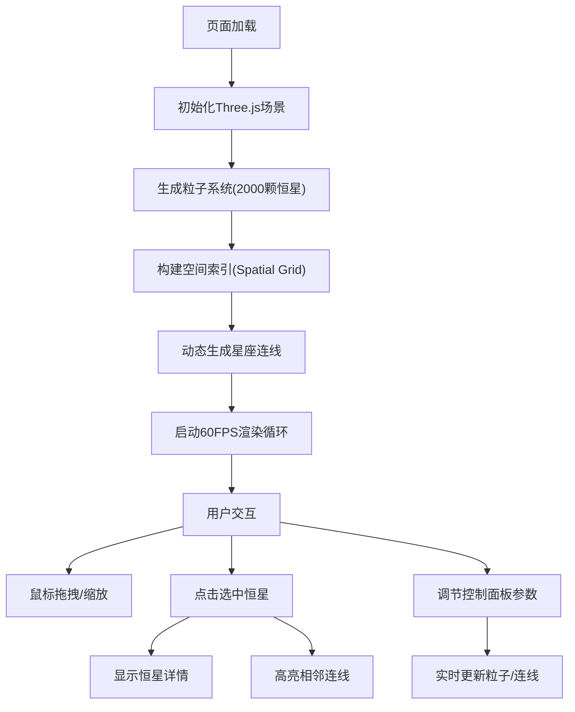

## 1. 产品概述

星云粒子与星座连线交互可视化工具，基于Three.js构建的3D宇宙可视化体验，通过高性能粒子系统模拟动态星云与恒星分布，支持用户自由探索、交互查询恒星属性。

- **核心价值**：将抽象的天文数据转化为沉浸式3D可视化体验，兼具教育性与观赏性
- **目标用户**：天文爱好者、教育工作者、数据可视化从业者
- **核心体验**：流畅的60FPS粒子渲染、直观的交互操作、精美的深空视觉效果

## 2. 核心功能

### 2.1 功能模块

1. **3D星云粒子系统**：高性能恒星粒子渲染，支持2000+粒子实时更新
2. **星座连线系统**：基于距离阈值动态生成发光连线，支持交互高亮
3. **用户交互系统**：鼠标拖拽旋转、滚轮缩放、点击选中查看恒星详情
4. **控制面板**：实时调节粒子数量、连线阈值、旋转速度、颜色模式等参数
5. **响应式UI**：桌面端左侧面板，移动端底部弹出式菜单

### 2.2 页面详情

| 页面名称 | 模块名称 | 功能描述 |
|-----------|-------------|---------------------|
| 主场景 | 3D渲染区 | 全屏深空背景、动态星云粒子、星座连线、OrbitControls交互 |
| 主场景 | 控制面板 | 粒子数量滑块、连线阈值滑块、旋转速度滑块、颜色模式开关、参数重置 |
| 主场景 | 恒星详情弹窗 | 显示选中恒星的名称、光谱类型、温度、距离、大小等属性 |
| 主场景 | 性能监控 | 实时FPS显示、粒子数量统计 |

## 3. 核心流程

用户进入页面 → 自动加载并渲染2000颗恒星粒子 → 星座连线根据默认阈值自动生成 → 用户可以：
- 拖拽鼠标旋转视角，滚轮缩放
- 点击恒星粒子查看详情，连线自动高亮
- 通过左侧面板调节各项参数，实时预览效果
- 移动端点击底部按钮展开控制面板

## 4. 用户界面设计

### 4.1 设计风格
- **主色调**：深空蓝(#0a0e27) → 宇宙紫(#1a1040) 渐变背景
- **点缀色**：恒星色温(蓝白#8ab4ff → 黄白#fff8e7 → 橙红#ff8a5b)
- **高亮色**：霓虹青(#00f0ff) 用于选中状态和连线高亮
- **UI风格**：玻璃毛玻璃(backdrop-filter: blur(20px))，半透明冷色系面板
- **按钮效果**：悬停时渐变光晕(box-shadow) + 轻微上浮(translateY(-2px))
- **字体**：Orbitron(标题) + Inter(正文)，营造科技感

### 4.2 页面设计概述

| 页面名称 | 模块名称 | UI元素 |
|-----------|-------------|-------------|
| 主场景 | 3D渲染区 | 全屏Canvas、深空渐变背景、远距离星光颗粒、发光粒子、半透明连线 |
| 主场景 | 控制面板 | 左侧固定320px宽、玻璃毛玻璃面板、圆角16px、内边距24px、冷色调滑块和开关 |
| 主场景 | 恒星详情弹窗 | 右上角弹出、带箭头指示、显示星名/光谱/温度/距离/大小图标 |
| 主场景 | 性能监控 | 左上角小字体、实时FPS计数器、粒子数量 |

### 4.3 响应式设计
- **桌面端(>1024px)**：左侧固定320px控制面板，主区域自适应
- **平板端(768-1024px)**：左侧面板压缩至280px，字体尺寸微调
- **移动端(<768px)**：控制面板折叠为底部56px高的按钮栏，点击后从底部滑出全屏菜单，触控优化拖拽区域

### 4.4 3D场景指导
- **环境**：深空渐变背景(FogExp2，密度0.015)，添加500颗远距离背景星光点
- **光照**：AmbientLight(0x404080, 0.3) + PointLight跟随相机位置，粒子自发光为主
- **相机**：PerspectiveCamera(75, aspect, 0.1, 1000)，初始位置(0, 0, 30)
- **后处理**：EffectComposer + UnrealBloomPass(强度0.8, 半径0.5, 阈值0.1) 实现发光效果
- **交互**：OrbitControls(enableDamping=true, dampingFactor=0.05)，禁用平移
- **动画**：粒子位置微浮动(Perlin noise)、亮度呼吸闪烁(正弦波0.8-1.2倍)、选中粒子光晕脉冲(缩放1.5-2.0倍循环)
- **性能**：SpatialGrid空间索引(网格大小5)优化邻近查询，BufferGeometry批量渲染粒子和连线
