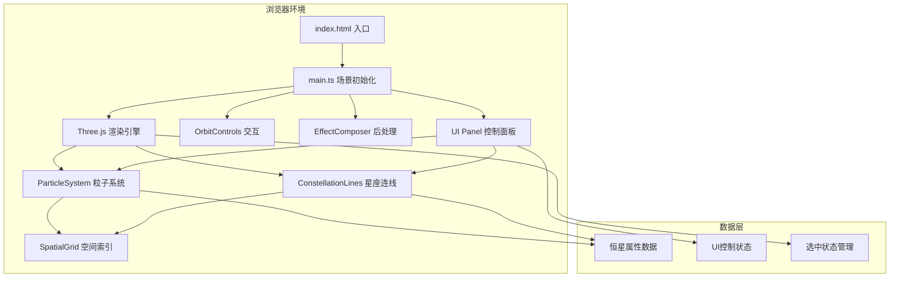

## 1. 架构设计



## 2. 技术描述
- **前端框架**：TypeScript 5.x + Three.js 0.160.x
- **构建工具**：Vite 5.x
- **核心依赖**：three、@types/three
- **后处理**：three/addons/postprocessing/EffectComposer、UnrealBloomPass
- **交互控制**：three/addons/controls/OrbitControls
- **性能优化**：BufferGeometry、PointsMaterial、LineBasicMaterial、Spatial Grid空间索引

## 3. 项目结构

```
├── index.html              # 入口HTML
├── package.json            # 项目依赖
├── tsconfig.json           # TypeScript配置
├── vite.config.js          # Vite配置
└── src/
    ├── main.ts             # 场景初始化、动画循环
    ├── particleSystem.ts   # 粒子系统管理
    ├── constellationLines.ts  # 星座连线管理
    └── uiPanel.ts          # UI控制面板
```

## 4. 核心类定义

### 4.1 ParticleSystem 粒子系统类

```typescript
interface StarData {
  id: number;
  position: THREE.Vector3;
  velocity: THREE.Vector3;
  size: number;
  baseColor: THREE.Color;
  temperature: number;  // 3000K-40000K
  brightness: number;
  spectralType: string; // O, B, A, F, G, K, M
  name: string;
  distance: number;     // 光年
  twinkleOffset: number;
}

class ParticleSystem {
  stars: StarData[];
  points: THREE.Points;
  geometry: THREE.BufferGeometry;
  material: THREE.PointsMaterial;
  spatialGrid: SpatialGrid;
  
  constructor(count: number, bounds: number);
  update(deltaTime: number, selectedId: number | null): void;
  queryNearby(position: THREE.Vector3, radius: number): StarData[];
  getStarById(id: number): StarData | undefined;
  resize(count: number): void;
  setColorMode(mode: 'temperature' | 'random'): void;
}
```

### 4.2 ConstellationLines 星座连线类

```typescript
class ConstellationLines {
  lines: THREE.LineSegments;
  geometry: THREE.BufferGeometry;
  material: THREE.LineBasicMaterial;
  threshold: number;
  maxConnections: number;
  
  constructor(particleSystem: ParticleSystem, threshold: number);
  update(selectedId: number | null): void;
  setThreshold(threshold: number): void;
  rebuild(): void;
}
```

### 4.3 SpatialGrid 空间索引类

```typescript
class SpatialGrid {
  cellSize: number;
  grid: Map<string, StarData[]>;
  
  constructor(cellSize: number);
  rebuild(stars: StarData[]): void;
  queryNearby(position: THREE.Vector3, radius: number): StarData[];
}
```

### 4.4 UIPanel UI控制面板类

```typescript
interface UIControls {
  particleCount: number;
  lineThreshold: number;
  rotationSpeed: number;
  colorMode: 'temperature' | 'random';
  showDetails: boolean;
  autoRotate: boolean;
}

class UIPanel {
  container: HTMLElement;
  controls: UIControls;
  onParticleCountChange: (count: number) => void;
  onThresholdChange: (threshold: number) => void;
  onRotationSpeedChange: (speed: number) => void;
  onColorModeChange: (mode: 'temperature' | 'random') => void;
  onAutoRotateChange: (enabled: boolean) => void;
  onReset: () => void;
  
  constructor();
  showStarDetail(star: StarData, screenX: number, screenY: number): void;
  hideStarDetail(): void;
  updateFPS(fps: number): void;
}
```

## 5. 性能优化策略

### 5.1 渲染优化
- 使用 `BufferGeometry` 批量渲染所有粒子和连线，单次draw call
- 粒子使用 `PointsMaterial` 开启 `transparent` 和 `sizeAttenuation`
- 连线使用 `LineBasicMaterial` 开启 `transparent`，避免深度写入冲突
- 后处理 `UnrealBloomPass` 阈值设为0.1，只高亮发光部分

### 5.2 计算优化
- `SpatialGrid` 空间索引将邻近查询从 O(n²) 优化到 O(k)，k为网格内粒子数
- 连线计算每10帧执行一次，避免每帧全量计算
- 粒子位置更新使用简单的正弦波动，避免复杂物理计算
- 选中粒子的邻近查询限制最多20个结果

### 5.3 内存优化
- 复用 `BufferAttribute` 数组，resize时只扩容不重建
- 粒子数据与渲染数据分离，避免不必要的GPU数据传输
- 背景星光使用独立的低多边形Points，复用材质

## 6. 配置文件说明

### 6.1 package.json
```json
{
  "name": "nebula-constellation-visualizer",
  "private": true,
  "version": "1.0.0",
  "type": "module",
  "scripts": {
    "dev": "vite",
    "build": "tsc && vite build",
    "preview": "vite preview"
  },
  "dependencies": {
    "three": "^0.160.0"
  },
  "devDependencies": {
    "@types/three": "^0.160.0",
    "typescript": "^5.3.0",
    "vite": "^5.0.0"
  }
}
```

### 6.2 tsconfig.json
```json
{
  "compilerOptions": {
    "target": "ES2020",
    "useDefineForClassFields": true,
    "module": "ESNext",
    "lib": ["ES2020", "DOM", "DOM.Iterable"],
    "skipLibCheck": true,
    "moduleResolution": "bundler",
    "allowImportingTsExtensions": true,
    "resolveJsonModule": true,
    "isolatedModules": true,
    "noEmit": true,
    "strict": true,
    "noUnusedLocals": true,
    "noUnusedParameters": true,
    "noFallthroughCasesInSwitch": true
  },
  "include": ["src"]
}
```
