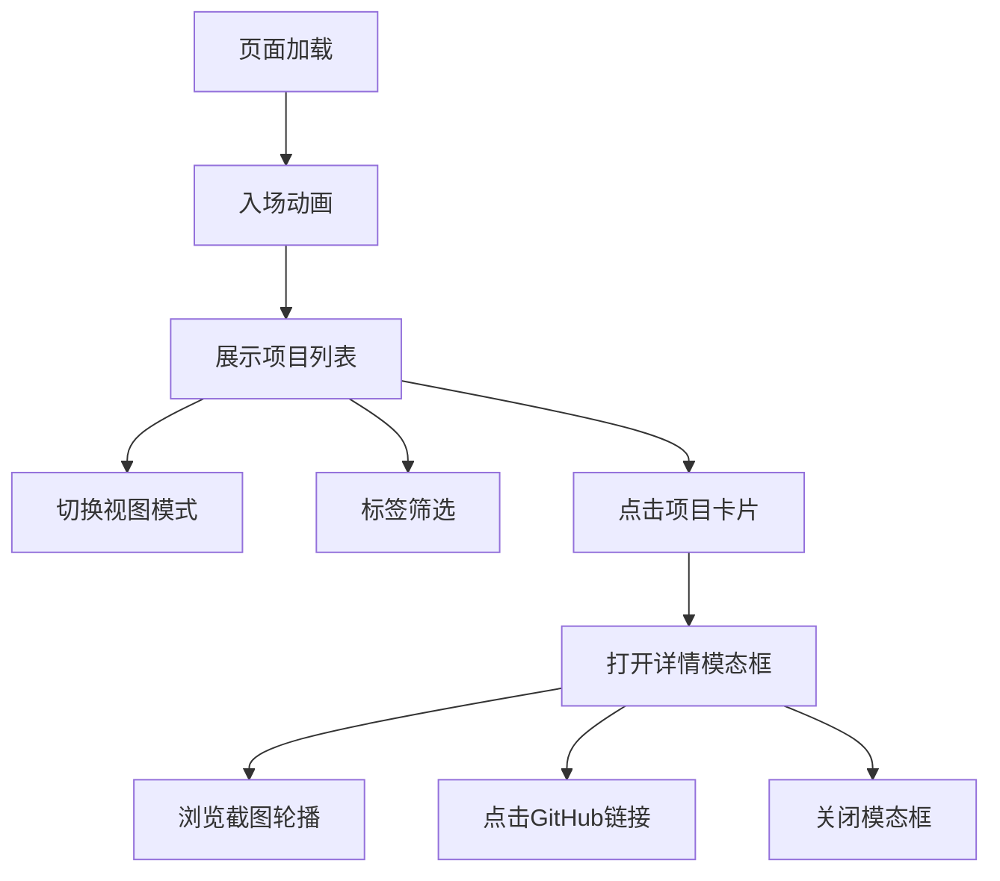

## 1. 产品概述

个人项目作品集展示网站，用于以优雅的卡片式布局展示开发者的多个项目作品，支持多种视图模式、标签筛选和详情查看功能。

- 主要用途：展示个人项目作品，突出技术栈和项目亮点，供潜在雇主或客户浏览
- 目标用户：开发者、设计师、创意工作者以及需要展示作品的专业人士
- 产品价值：提供专业、美观、交互流畅的作品展示平台，提升个人品牌形象

## 2. 核心功能

### 2.1 用户角色

| 角色 | 注册方式 | 核心权限 |
|------|----------|----------|
| 访客 | 无需注册 | 浏览项目、切换视图、筛选标签、查看详情 |

### 2.2 功能模块

1. **项目展示页**：项目卡片列表、视图切换工具栏、标签筛选栏、详情模态框
2. **视图模式切换**：网格视图（3列等大卡片）、瀑布流视图（宽度固定高度自适应）
3. **标签筛选系统**：按技术栈标签筛选项目，带动画过渡效果
4. **详情模态框**：项目完整信息展示、截图轮播、GitHub链接跳转

### 2.3 页面详情

| 页面名称 | 模块名称 | 功能描述 |
|----------|----------|----------|
| 项目展示页 | 顶部工具栏 | 视图模式切换按钮（网格/瀑布流图标） |
| 项目展示页 | 标签筛选栏 | 标签按钮横向排列，点击筛选对应项目 |
| 项目展示页 | 项目卡片容器 | 根据视图模式渲染网格或瀑布流布局 |
| 项目展示页 | 项目卡片 | 显示缩略图、标题、标签，悬停动效，点击打开详情 |
| 项目展示页 | 详情模态框 | 全屏遮罩，展示项目详情、截图轮播、外部链接 |

## 3. 核心流程

用户进入网站后，首先看到页面加载动画（卡片从底部弹入、工具栏从顶部滑入），然后可以：
1. 切换网格/瀑布流视图模式
2. 点击标签按钮筛选特定技术栈的项目
3. 悬停在卡片上查看预览效果
4. 点击卡片打开详情模态框
5. 在模态框中浏览截图轮播，点击GitHub链接查看源码
6. 按ESC或点击遮罩关闭模态框



## 4. 用户界面设计

### 4.1 设计风格

- **主题**：GitHub深色模式风格
- **主背景色**：#0d1117（深灰蓝）
- **卡片背景色**：#161b22（稍浅的灰蓝）
- **文字颜色**：标题白色粗体，描述#8b949e（浅灰色）
- **标签颜色**：React #61dafb, CSS #1572b6, TypeScript #3178c6, Three.js #9b59b6, Node.js #68a063
- **卡片圆角**：12px
- **阴影过渡**：悬停时从浅灰到深灰平滑过渡0.2s
- **字体**：Google Fonts 引入现代无衬线字体

### 4.2 页面设计概述

| 页面名称 | 模块名称 | UI元素 |
|----------|----------|--------|
| 项目展示页 | 顶部工具栏 | 固定在顶部，半透明背景，左右图标按钮，下滑入场动画0.5s |
| 项目展示页 | 标签筛选栏 | 横向排列，圆角胶囊按钮，选中状态高亮，过渡动画0.2s |
| 项目展示页 | 项目卡片 | 缩略图懒加载+骨架屏，标题粗体，标签彩色，悬停上浮4px+阴影加深 |
| 项目展示页 | 详情模态框 | 全屏半透明遮罩，居中卡片max-width:800px，轮播带淡入动画，关闭缩放消失动画0.3s |

### 4.3 响应式设计

- **桌面端（≥1200px）**：网格3列，瀑布流自动计算列数（每列最小280px）
- **平板端（768px-1199px）**：网格2列，瀑布流2列
- **移动端（<768px）**：单列布局，标签栏横向滚动，卡片文字缩小14px，工具栏按钮padding:12px
- **动画优化**：移动端所有动画持续时间缩短40%

### 4.4 性能要求

- 首屏渲染时间≤1.5秒（Lighthouse模拟测试）
- 滚动保持60fps流畅
- 支持20+卡片无卡顿
- 图片懒加载（IntersectionObserver）
```