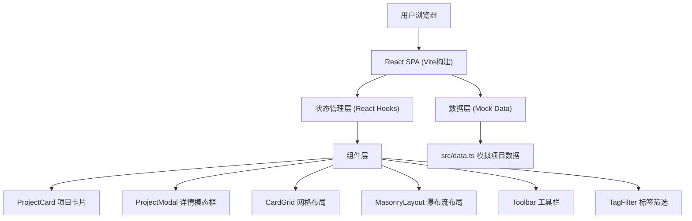
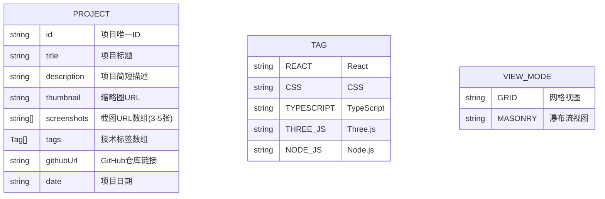

## 1. 架构设计



## 2. 技术描述

- **前端框架**：React 18 + TypeScript
- **构建工具**：Vite 5.x
- **路由**：React Router DOM 6.x
- **唯一ID生成**：uuid
- **样式方案**：原生CSS + CSS变量 + CSS动画
- **状态管理**：React Hooks (useState, useEffect, useCallback)
- **图片懒加载**：IntersectionObserver API
- **图标库**：lucide-react

### 依赖清单
- react
- react-dom
- typescript
- vite
- @vitejs/plugin-react
- react-router-dom
- uuid
- lucide-react

## 3. 路由定义

| 路由 | 用途 |
|------|------|
| / | 项目展示主页（唯一页面） |

## 4. 数据模型

### 4.1 数据模型定义



### 4.2 TypeScript 类型定义

```typescript
// src/types.ts
export enum Tag {
  REACT = 'React',
  CSS = 'CSS',
  TYPESCRIPT = 'TypeScript',
  THREE_JS = 'Three.js',
  NODE_JS = 'Node.js',
  TAILWIND = 'Tailwind',
  VITE = 'Vite',
  GRAPHQL = 'GraphQL',
  MONGODB = 'MongoDB',
  EXPRESS = 'Express',
}

export enum ViewMode {
  GRID = 'grid',
  MASONRY = 'masonry',
}

export interface Project {
  id: string;
  title: string;
  description: string;
  thumbnail: string;
  screenshots: string[];
  tags: Tag[];
  githubUrl: string;
  date: string;
}
```

## 5. 文件结构

```
项目根目录/
├── package.json              # 项目依赖和脚本
├── vite.config.ts            # Vite构建配置
├── tsconfig.json             # TypeScript配置
├── index.html                # 入口HTML
└── src/
    ├── types.ts              # 类型定义（Project, Tag, ViewMode）
    ├── data.ts               # 模拟项目数据（10个项目）
    ├── App.tsx               # 主应用组件
    ├── main.tsx              # 应用入口
    ├── index.css             # 全局样式和动画
    └── components/
        ├── ProjectCard.tsx   # 项目卡片组件
        ├── ProjectModal.tsx  # 详情模态框组件
        ├── CardGrid.tsx      # 网格布局组件
        ├── MasonryLayout.tsx # 瀑布流布局组件
        ├── Toolbar.tsx       # 顶部工具栏组件
        └── TagFilter.tsx     # 标签筛选组件
```

## 6. 核心组件职责

### App.tsx
- 管理视图模式状态（grid/masonry）
- 管理选中项目状态（用于模态框）
- 管理标签筛选状态
- 从data.ts导入模拟数据
- 根据视图模式渲染不同布局

### ProjectCard.tsx
- 接收project数据和onSelect回调
- 实现缩略图懒加载（IntersectionObserver）
- 实现悬停效果（上浮+阴影加深）
- 显示缩略图、标题、前两个标签
- 骨架屏加载状态

### ProjectModal.tsx
- 全屏半透明遮罩
- 项目详情展示（完整描述、日期、所有标签）
- 截图轮播器（左右箭头、缩略图导航、自动轮播、淡入动画）
- GitHub链接按钮
- ESC键和点击遮罩关闭
- 关闭动画（向两侧缩放消失）

### CardGrid.tsx
- 3列等大网格布局
- 响应式适配（移动端单列）

### MasonryLayout.tsx
- 宽度固定，高度自适应
- 列数随窗口宽度变化（每列最小280px）
- 使用CSS columns实现

### Toolbar.tsx
- 网格/瀑布流切换图标按钮
- 选中状态高亮

### TagFilter.tsx
- 横向排列的标签按钮
- 点击筛选，带动画过渡
- 移动端横向滚动

## 7. 性能优化策略

1. **图片懒加载**：使用IntersectionObserver实现，首屏只加载可视区域图片
2. **CSS硬件加速**：transform和opacity动画使用GPU加速
3. **防抖/节流**：窗口resize事件使用防抖
4. **React.memo**：卡片组件使用memo避免不必要重渲染
5. **骨架屏**：图片加载前显示骨架屏提升感知性能
6. **will-change**：对动画元素使用will-change优化
7. **CSS变量**：主题色和动画时长使用CSS变量，便于响应式调整
```