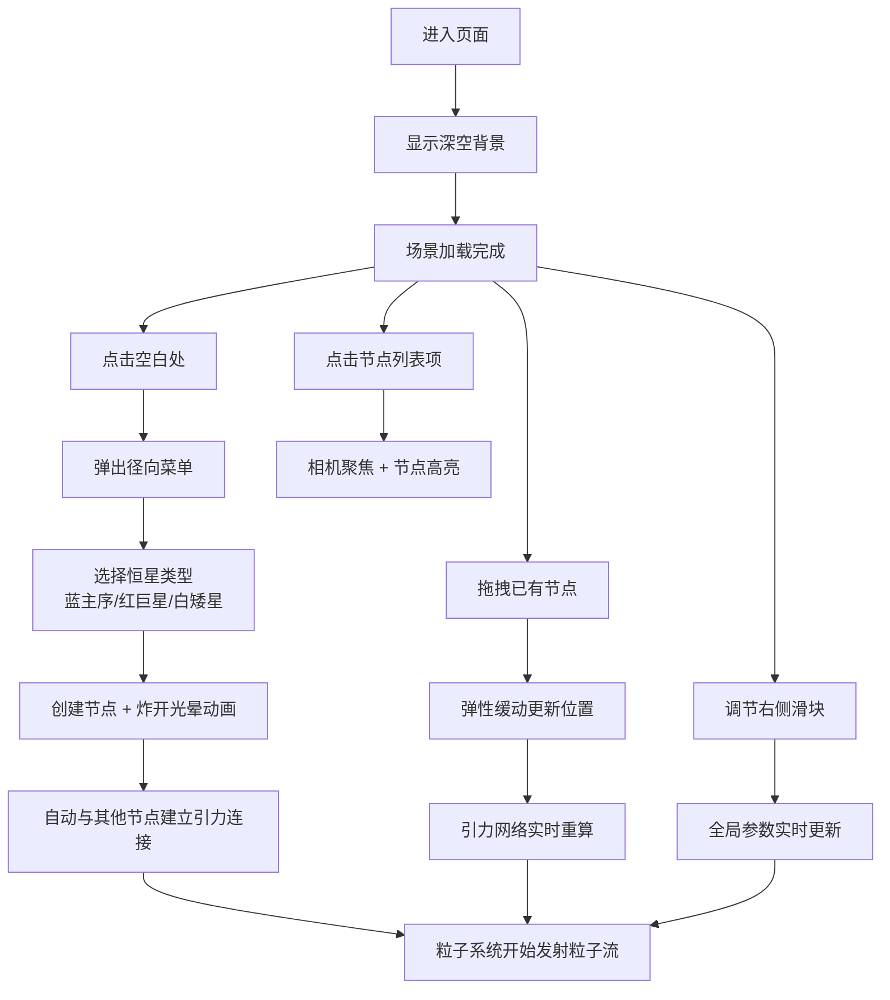

## 1. 产品概述

星轨编织者是一款基于 WebGL 的交互式 3D 太空可视化工具，用户可以在深邃的太空场景中放置和拖拽多种类型的恒星节点，通过调节物理与粒子参数，实时观察节点间的引力网络与粒子流动态，创造出独一无二的星轨艺术作品。

- 面向用户：创意设计师、天文爱好者、交互艺术探索者
- 产品价值：将抽象的物理引力系统转化为直观可操作的视觉艺术工具

## 2. 核心功能

### 2.1 用户角色

无角色区分，所有用户可直接使用全部功能。

### 2.2 功能模块

1. **3D 场景主视图**：深空渐变背景 + 旋转星点背景 + 恒星节点 + 粒子网络
2. **径向菜单交互**：点击空白处弹出创建菜单，选择三种恒星类型
3. **节点管理面板**：右侧节点列表 + 全局参数滑块
4. **粒子系统**：引力计算 + 粒子流渲染 + 拖尾光效
5. **实时参数面板**：Leva 提供的参数调优界面

### 2.3 页面详情

| 页面名称 | 模块名称 | 功能描述 |
|-----------|-------------|---------------------|
| 主场景页 | 3D 场景背景 | 深蓝紫渐变 + 多层旋转星点，营造深空氛围 |
| 主场景页 | 恒星节点 | 球体 + 光晕 + 环绕粒子，支持拖拽移动，不可重叠 |
| 主场景页 | 径向菜单 | 点击空白处出现，三种恒星类型选项，取消点击消失 |
| 主场景页 | 节点列表面板 | 显示名称/质量/颜色/坐标，点击高亮聚焦 |
| 主场景页 | 全局参数滑块 | 引力强度 / 斥力阈值 / 粒子速度 |
| 主场景页 | 粒子网络 | 节点间引力方向射出粒子，颜色渐变混合，带拖尾 |

## 3. 核心流程

## 4. 用户界面设计

### 4.1 设计风格

- **主色调**：深空蓝紫暗色主题 `#0a0a1e` → `#1a1a3e` → `#2d1b4e` 径向渐变
- **辅助色**：蓝色主序星 `#4db8ff`，红色巨星 `#ff5e5e`，白色矮星 `#f0f0ff`
- **UI 卡片**：毛玻璃效果 `rgba(255,255,255,0.06)` + `backdrop-filter: blur(16px)` + `border: 1px solid rgba(255,255,255,0.12)`
- **字体**：主标题使用 Orbitron（未来科技感），正文使用 JetBrains Mono（等宽精致）
- **布局**：桌面端固定右侧面板（320px 宽），主场景占满剩余空间
- **图标风格**：极简线条矢量图标，微光发光效果

### 4.2 页面设计概述

| 页面名称 | 模块名称 | UI 元素 |
|-----------|-------------|-------------|
| 主场景页 | 深空背景 | 多层径向渐变 + 3000 颗随机星点缓慢自转 |
| 主场景页 | 恒星节点 | 自发光球体（MeshStandardMaterial + emissive），外层辉光光晕（ShaderMaterial），12 颗环绕光点 |
| 主场景页 | 径向菜单 | 3 个圆形按钮 120° 分布，半透明发光，悬停放大 |
| 主场景页 | 右侧面板 | 圆角 16px 毛玻璃卡片，节点列表可滚动，滑块使用 Leva 样式 |
| 主场景页 | 粒子流 | Points + BufferGeometry，AdditiveBlending，拖尾使用位置历史缓冲 |

### 4.3 响应式

桌面端优先（≥1280px），右侧面板固定 320px；平板端（768-1280px）面板缩小为 260px；移动端（<768px）面板改为底部抽屉。触屏设备支持双指缩放和单指拖拽。

### 4.4 3D 场景指引

- **环境光**：AmbientLight(0x404060, 0.4) + PointLight 跟随每个节点发光
- **相机**：PerspectiveCamera，fov 60，初始位置 (0, 0, 25)，OrbitControls 支持缩放平移
- **后期处理**：Bloom 效果（阈值 0.6，强度 1.2）营造辉光氛围
- **交互**：节点拖拽使用 TransformControls 或自定义 raycaster + 平面投影
- **性能预算**：节点数 ≤ 20，粒子总数 ≤ 8000，保持 60fps
