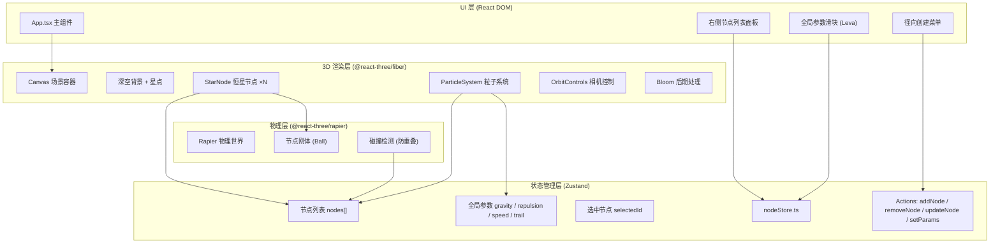
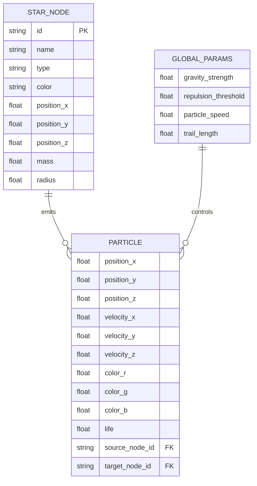

## 1. 架构设计



## 2. 技术描述

- **前端框架**：React@18 + TypeScript@5（严格模式 strict: true）
- **构建工具**：Vite@5 + @vitejs/plugin-react@4
- **3D 渲染**：three@0.160 + @react-three/fiber@8 + @react-three/drei@9
- **物理引擎**：@react-three/rapier@1（节点碰撞检测，防止重叠）
- **状态管理**：zustand@4（轻量无 Provider 模式，subscribe selector 优化重渲染）
- **实时参数面板**：leva@0.9（自动生成 GUI 控件，与 store 双向绑定）
- **样式方案**：原生 CSS + CSS 变量（无 UI 库，手动实现毛玻璃卡片）

## 3. 路由定义

| 路由 | 用途 |
|-------|---------|
| / | 主场景页面（单页应用，无路由切换） |

单页应用无需路由库，直接挂载 App 组件。

## 4. API 定义

纯前端项目，无后端 API。所有数据通过 zustand store 管理，类型定义如下：

```typescript
// 恒星类型枚举
type StarType = 'blue_main_sequence' | 'red_giant' | 'white_dwarf';

// 节点数据结构
interface StarNode {
  id: string;                    // uuid
  name: string;                  // 显示名称
  type: StarType;
  color: string;                 // hex color
  position: [number, number, number];  // x, y, z
  mass: number;                  // 质量 (影响引力、发射频率)
  radius: number;                // 视觉半径
}

// 全局参数
interface GlobalParams {
  gravityStrength: number;       // 0.1 - 5.0
  repulsionThreshold: number;    // 20 - 100
  particleSpeed: number;         // 1 - 10
  trailLength: number;           // 5 - 30
}

// Store 完整接口
interface NodeStore {
  nodes: StarNode[];
  selectedNodeId: string | null;
  params: GlobalParams;
  addNode: (type: StarType, position: [number, number, number]) => void;
  removeNode: (id: string) => void;
  updateNodePosition: (id: string, pos: [number, number, number]) => void;
  updateNodeMass: (id: string, mass: number) => void;
  selectNode: (id: string | null) => void;
  setParams: (partial: Partial<GlobalParams>) => void;
}
```

## 5. 数据模型

### 5.1 核心数据结构关系



### 5.2 恒星类型预设

| type | name 模板 | color | mass 范围 | radius |
|------|-----------|-------|-----------|--------|
| blue_main_sequence | 主序星-{n} | #4db8ff | 1.0 - 2.0 | 0.6 |
| red_giant | 巨星-{n} | #ff5e5e | 3.0 - 5.0 | 1.4 |
| white_dwarf | 矮星-{n} | #f0f0ff | 0.5 - 0.8 | 0.35 |

## 6. 性能优化策略

| 问题 | 解决方案 |
|------|---------|
| 粒子数量过多卡顿 | 总粒子数上限 8000，对象池复用 BufferGeometry attribute |
| 引力计算 O(n²) | 节点数 ≤ 20 时直接计算，超过则用空间哈希；计算放在 requestAnimationFrame 中每帧节流 |
| 拖拽节点掉帧 | 拖拽时临时暂停引力解算，位置更新走 rapier 刚体直接 setTranslation |
| 重复渲染 | zustand 使用 shallow selector 订阅局部数据；StarNode memo 化；ParticleSystem useRef 保存 position array |
| 毛玻璃性能差 | backdrop-filter 仅在右侧面板使用，面积控制在 320px 内；移动端降级为纯色背景 |
