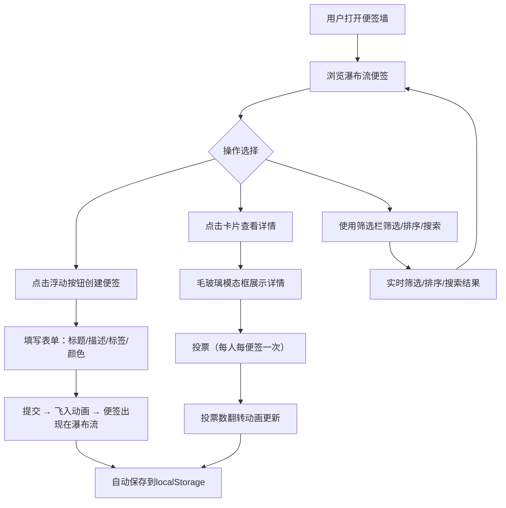

## 1. 产品概述

创意团队灵感便签墙是一个面向创意团队的数字便签墙应用，支持灵感的快速记录、分类标签管理、投票排序和协作筛选。解决团队头脑风暴中灵感碎片化、难以归类和排序的问题。

- 目标用户：产品经理、UI设计师、开发工程师等创意团队成员
- 核心价值：将分散的灵感集中展示，通过投票机制让优质想法脱颖而出

## 2. 核心功能

### 2.1 用户角色

| 角色 | 注册方式 | 核心权限 |
|------|----------|----------|
| 团队成员 | 设备识别 | 创建便签、投票、筛选排序 |

### 2.2 功能模块

1. **便签墙首页**：瀑布流网格展示所有灵感便签，支持筛选、排序和搜索
2. **便签详情模态框**：毛玻璃全屏展示便签详情，支持投票操作

### 2.3 页面详情

| 页面名称 | 模块名称 | 功能描述 |
|----------|----------|----------|
| 便签墙首页 | 筛选栏 | 标签多选过滤、投票数升序/降序排序、标题/描述模糊搜索 |
| 便签墙首页 | 瀑布流网格 | 3列瀑布流展示便签卡片，虚拟列表渲染优化 |
| 便签墙首页 | 便签卡片 | 展示标题、描述、投票数、标签色块，悬停上浮动画 |
| 便签墙首页 | 浮动新建按钮 | 脉冲光晕动画，点击打开新建表单 |
| 便签墙首页 | 新建便签表单 | 标题(20字限制)、描述(500字限制)、标签选择器(6种)、颜色选择器(12色) |
| 便签详情 | 模态框 | 毛玻璃全屏，展示标题、完整描述、创建时间、投票按钮 |
| 便签墙首页 | 保存提示条 | 顶部灰色半透明条，显示最后保存时间，5秒自动消失 |

## 3. 核心流程

1. 用户通过浮动按钮创建灵感便签，填写标题、描述、选择标签和颜色
2. 便签以飞入动画出现在瀑布流中
3. 其他用户浏览便签墙，点击卡片查看详情
4. 用户对喜欢的便签投票（每人每便签仅一次）
5. 通过筛选栏按标签过滤、按投票数排序、搜索关键词
6. 所有数据自动保存到localStorage

## 4. 用户界面设计

### 4.1 设计风格

- 主色调：深蓝到深紫渐变背景（#0a0a1a → #1a0a2a）
- 强调色：金色渐变（投票按钮）、饱和色标签色块
- 按钮风格：圆形圆角（border-radius: 16px），浮动按钮带脉冲光晕
- 字体：使用独特显示字体搭配简洁正文字体
- 布局风格：3列瀑布流网格（响应式：<768px 变1列）
- 图标：使用react-icons库

### 4.2 页面设计概览

| 页面名称 | 模块名称 | UI元素 |
|----------|----------|--------|
| 便签墙首页 | 筛选栏 | 固定顶部，半透明模糊背景，标签多选按钮（高亮样式），排序下拉，搜索输入框 |
| 便签墙首页 | 瀑布流 | 3列网格，卡片圆角16px，柔和长阴影，半透明毛玻璃卡片（backdrop-filter: blur(10px)） |
| 便签墙首页 | 便签卡片 | 左上角标签色块，右下角投票徽章（0-3灰/4-7蓝/8+金），悬停上浮translateY(-4px) |
| 便签墙首页 | 浮动按钮 | 圆形，脉冲光晕动画，位于页面底部 |
| 便签墙首页 | 新建表单 | 居中弹出，标题输入20字限制，描述500字限制，6标签选择器，12色色板 |
| 便签详情 | 模态框 | 全屏毛玻璃，标题、描述、创建时间，金色渐变投票按钮，点击缩放0.9微动效 |

### 4.3 响应式

- 桌面端（≥768px）：3列瀑布流
- 移动端（<768px）：1列瀑布流
- 触摸优化：卡片点击区域适当放大

### 4.4 动画规范

- 卡片进入：从底部上移并渐显（0.4s, ease-out）
- 卡片悬停：上浮4px + 阴影加深
- 新建便签飞入：从按钮位置飞入瀑布流，弹性缓动曲线
- 投票按钮：点击缩放0.9再恢复
- 投票数：计数器翻转动画
- 浮动按钮：脉冲光晕动画
- 保存提示条：5秒后自动消失
