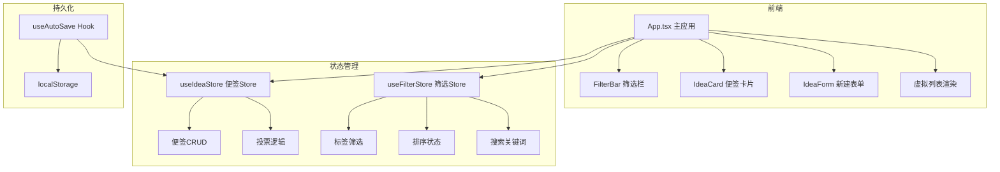
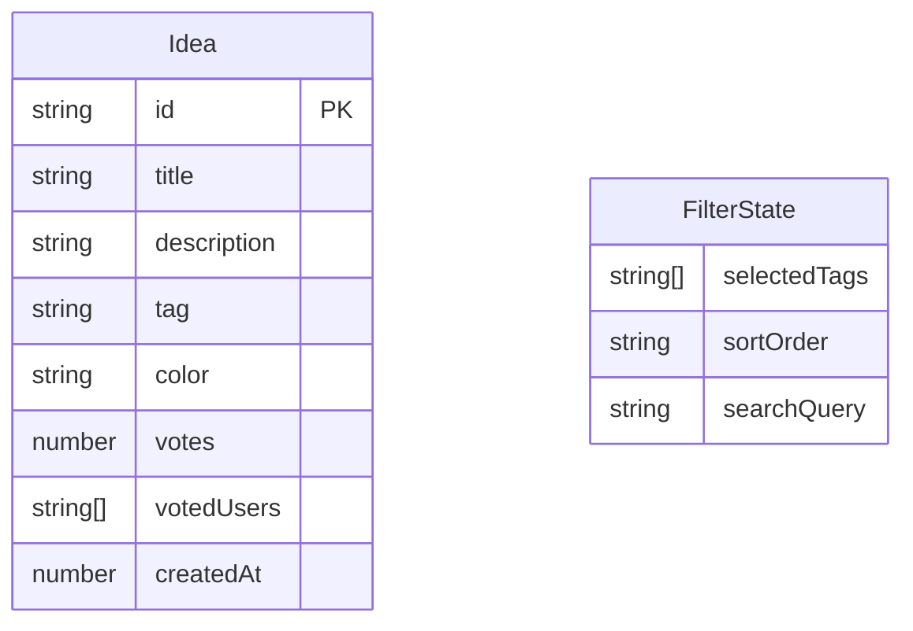

## 1. 架构设计



## 2. 技术说明

- 前端框架：React 18 + TypeScript
- 构建工具：Vite + @vitejs/plugin-react
- 状态管理：Zustand
- 样式方案：CSS Modules（无外部UI库依赖）
- 图标库：react-icons
- ID生成：uuid
- 持久化：localStorage
- 初始化工具：vite-init（react-ts模板）

## 3. 路由定义

| 路由 | 用途 |
|------|------|
| / | 便签墙首页，展示所有灵感便签 |

> 本应用为单页应用，无需多路由，通过组件状态控制模态框和表单的显示/隐藏

## 4. 数据模型

### 4.1 数据模型定义



### 4.2 类型定义

```typescript
interface Idea {
  id: string;
  title: string;
  description: string;
  tag: IdeaTag;
  color: string;
  votes: number;
  votedUserIds: string[];
  createdAt: number;
}

type IdeaTag = 
  | 'UI设计' 
  | '功能创意' 
  | '性能优化' 
  | '交互体验' 
  | '视觉风格' 
  | '技术方案';

interface FilterState {
  selectedTags: IdeaTag[];
  sortOrder: 'asc' | 'desc' | 'none';
  searchQuery: string;
}
```

## 5. 文件结构

```
├── package.json
├── index.html
├── vite.config.ts
├── tsconfig.json
├── src/
│   ├── types.ts
│   ├── App.tsx
│   ├── App.module.css
│   ├── main.tsx
│   ├── stores/
│   │   ├── useIdeaStore.ts
│   │   └── useFilterStore.ts
│   ├── components/
│   │   ├── IdeaCard.tsx
│   │   ├── IdeaCard.module.css
│   │   ├── IdeaForm.tsx
│   │   ├── IdeaForm.module.css
│   │   ├── FilterBar.tsx
│   │   └── FilterBar.module.css
│   └── hooks/
│       └── useAutoSave.ts
```
