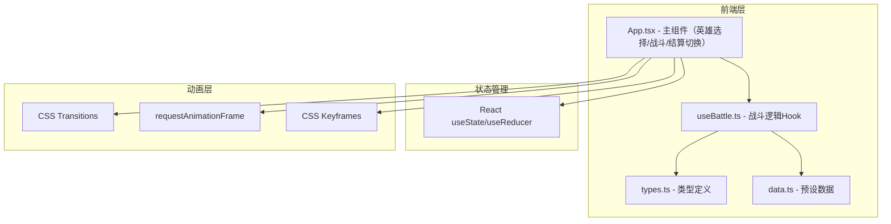

## 1. 架构设计



## 2. 技术说明
- 前端：React 18 + TypeScript（严格模式）+ Vite
- 状态管理：React useState/useReducer（无第三方库）
- 动画：CSS transition + requestAnimationFrame + CSS keyframes
- UI库：无第三方UI库，纯手写CSS
- 构建工具：Vite + @vitejs/plugin-react
- 依赖：react, react-dom, typescript, vite, @vitejs/plugin-react, uuid

## 3. 路由定义
无路由库，通过状态切换页面：
| 状态 | 用途 |
|------|------|
| select | 英雄选择界面 |
| battle | 战斗界面 |
| result | 结算界面 |

## 4. 数据模型

### 4.1 核心类型定义

```typescript
type HeroClass = 'warrior' | 'mage' | 'archer' | 'assassin' | 'paladin' | 'warlock';

interface Hero {
  id: string;
  name: string;
  heroClass: HeroClass;
  hp: number;
  maxHp: number;
  atk: number;
  def: number;
  skill: Skill;
  cooldown: number;
  maxCooldown: number;
  isAlive: boolean;
  unlockCost: number;
  unlocked: boolean;
  skinVariant: number;
}

interface Enemy {
  id: string;
  name: string;
  hp: number;
  maxHp: number;
  atk: number;
  def: number;
  isAlive: boolean;
}

interface Skill {
  name: string;
  damage: number;
  description: string;
  icon: string;
}

interface BattleState {
  heroes: Hero[];
  enemies: Enemy[];
  round: number;
  log: string[];
  isPlayerTurn: boolean;
  isAutoMode: boolean;
  phase: 'select' | 'battle' | 'result';
  score: Score;
  winStreak: number;
  totalScore: number;
}

interface Score {
  grade: 'S' | 'A' | 'B' | 'C';
  remainingHpRatio: number;
  rounds: number;
  points: number;
}
```

### 4.2 文件结构
```
├── package.json
├── index.html
├── vite.config.ts
├── tsconfig.json
└── src/
    ├── types.ts
    ├── data.ts
    ├── useBattle.ts
    └── App.tsx
```

## 5. 战斗逻辑设计

### 5.1 回合流程
1. 回合开始 → 判断所有英雄/敌人冷却状态
2. 玩家阶段：可手动点击英雄释放技能，或AI自动决策
3. AI决策逻辑：优先攻击低血量敌人，技能可用时使用技能
4. 伤害计算：damage = max(1, attacker.atk * skillMultiplier - defender.def * 0.5)
5. 暴击判定：20%概率暴击，伤害1.5倍
6. 敌人回合：自动攻击最低血量英雄
7. 回合结束 → 检查胜负条件 → 冷却减少

### 5.2 评分算法
- S级：剩余血量>80% 且 回合数≤5
- A级：剩余血量>60% 且 回合数≤8
- B级：剩余血量>40%
- C级：其余情况
- 连胜加成：每连胜+10%积分
