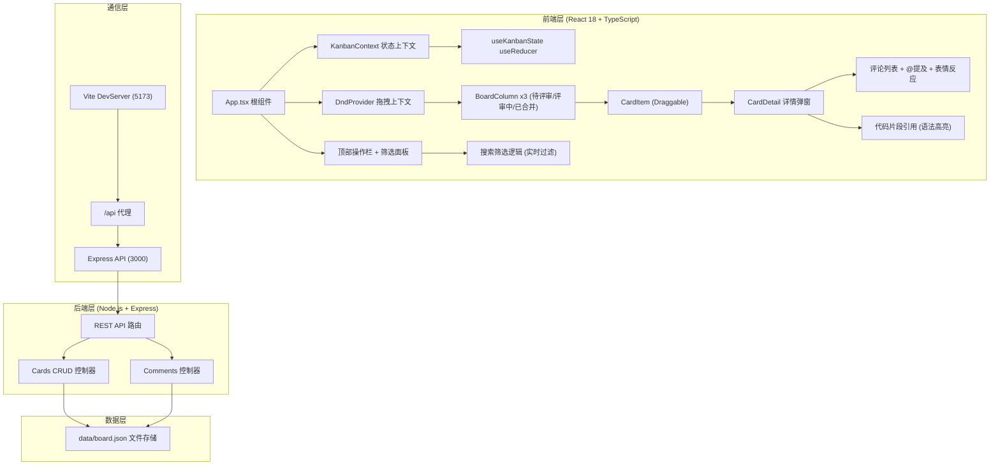
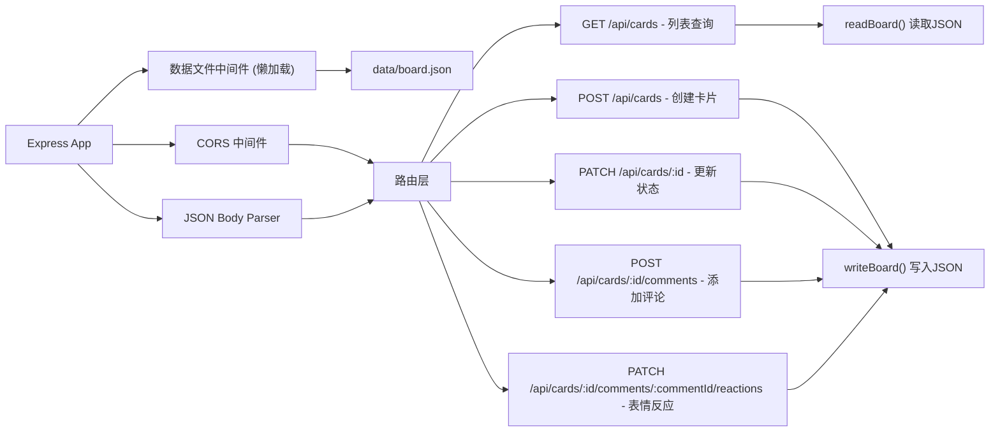
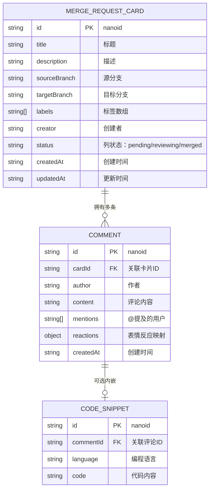

## 1. 架构设计



---

## 2. 技术选型说明

| 层级 | 技术栈 | 版本 | 说明 |
|------|--------|------|------|
| 前端框架 | React | ^18.2.0 | 使用函数组件 + Hooks |
| 开发语言 | TypeScript | ^5.3.0 | strict 严格模式 |
| 构建工具 | Vite | ^5.0.0 | 快速冷启动 + HMR |
| 状态管理 | React Context + useReducer | 内置 | 避免过度依赖外部库 |
| 拖拽库 | react-beautiful-dnd | ^13.1.1 | 高性能拖拽，支持动画 |
| 语法高亮 | react-syntax-highlighter | ^15.5.0 | 支持多语言代码高亮 |
| 后端框架 | Express | ^4.18.2 | 轻量级 HTTP 服务 |
| 跨域处理 | cors | ^2.8.5 | 开发环境跨域支持 |
| ID生成 | uuid + nanoid | latest | 卡片/评论唯一标识 |
| 启动工具 | concurrently | ^8.2.2 | 同时启动前后端 |

---

## 3. 路由定义

由于是单页看板应用，无前端路由切换，所有功能在单页完成。

| 路径 | 说明 |
|------|------|
| `/` | 主看板页面（唯一页面） |

---

## 4. API 接口定义

### 4.1 TypeScript 类型定义

```typescript
// 标签类型
type CardLabel = 'feature' | 'fix' | 'docs' | 'refactor' | 'chore';

// 看板列状态
type ColumnStatus = 'pending' | 'reviewing' | 'merged';

// 表情类型
type EmojiType = '👍' | '❤️' | '😄';

// 代码片段
interface CodeSnippet {
  id: string;
  language: string;
  code: string;
}

// 评论
interface Comment {
  id: string;
  author: string;
  content: string;
  mentions: string[];        // @提及的用户名
  reactions: Record<EmojiType, string[]>;  // { '👍': ['user1','user2'], ... }
  codeSnippet?: CodeSnippet;
  createdAt: string;
}

// 合并请求卡片
interface MergeRequestCard {
  id: string;
  title: string;
  description: string;
  sourceBranch: string;
  targetBranch: string;
  labels: CardLabel[];
  creator: string;
  status: ColumnStatus;
  comments: Comment[];
  createdAt: string;
  updatedAt: string;
}

// 筛选条件
interface FilterCriteria {
  labels: CardLabel[];
  creators: string[];
  keyword: string;
}

// 看板状态
interface KanbanState {
  cards: MergeRequestCard[];
  filters: FilterCriteria;
  toast: ToastMessage | null;
  banner: BannerMessage | null;
}
```

### 4.2 REST API 接口

| 方法 | 路径 | 请求体 | 响应 | 说明 |
|------|------|--------|------|------|
| GET | `/api/cards` | - | `MergeRequestCard[]` | 获取所有卡片 |
| POST | `/api/cards` | `{ title, description, sourceBranch, targetBranch, labels, creator }` | `MergeRequestCard` | 创建新卡片（默认 status=pending） |
| PATCH | `/api/cards/:id` | `{ status? }` | `MergeRequestCard` | 更新卡片状态（拖拽时调用） |
| POST | `/api/cards/:id/comments` | `{ author, content, mentions, codeSnippet? }` | `Comment` | 添加评论 |
| PATCH | `/api/cards/:id/comments/:commentId/reactions` | `{ emoji, user }` | `Comment` | 切换表情反应 |

---

## 5. 服务端架构



服务端设计要点：
- 使用 `fs.promises` 异步读写 JSON 文件
- 文件路径：项目根目录 `data/board.json`
- 启动时自动创建目录和初始数据文件（如果不存在）
- 每次写操作后加 50ms debounce，防止频繁 IO
- ID 生成使用 `nanoid` 前端生成，后端仅校验唯一性

---

## 6. 数据模型

### 6.1 ER 图



### 6.2 初始数据（board.json）

```json
{
  "cards": [
    {
      "id": "mr_001",
      "title": "实现用户登录模块 JWT 认证",
      "description": "添加登录接口，使用 bcrypt 密码哈希 + JWT token 鉴权，token 有效期 24 小时，包含 refresh token 机制。",
      "sourceBranch": "feature/auth-jwt",
      "targetBranch": "main",
      "labels": ["feature"],
      "creator": "张伟",
      "status": "pending",
      "comments": [
        {
          "id": "cmt_001",
          "author": "李娜",
          "content": "@张伟 整体结构不错，建议检查一下 token 刷新逻辑中的并发问题",
          "mentions": ["张伟"],
          "reactions": { "👍": ["王芳"], "❤️": [], "😄": [] },
          "createdAt": "2026-06-17T10:30:00Z"
        }
      ],
      "createdAt": "2026-06-17T09:00:00Z",
      "updatedAt": "2026-06-17T10:30:00Z"
    },
    {
      "id": "mr_002",
      "title": "修复首页商品列表分页 Bug",
      "description": "修复第 2 页后页码显示错误，以及切换页码时滚动条未归零的问题。",
      "sourceBranch": "fix/pagination-scroll",
      "targetBranch": "develop",
      "labels": ["fix"],
      "creator": "王芳",
      "status": "reviewing",
      "comments": [],
      "createdAt": "2026-06-17T11:20:00Z",
      "updatedAt": "2026-06-17T14:00:00Z"
    },
    {
      "id": "mr_003",
      "title": "更新 API 文档 v2.3",
      "description": "新增订单接口文档，补充错误码说明，添加请求示例。",
      "sourceBranch": "docs/api-v2.3",
      "targetBranch": "main",
      "labels": ["docs"],
      "creator": "赵强",
      "status": "merged",
      "comments": [
        {
          "id": "cmt_002",
          "author": "李娜",
          "content": "文档结构清晰，已合并 👍",
          "mentions": [],
          "reactions": { "👍": ["赵强", "张伟"], "❤️": ["王芳"], "😄": [] },
          "createdAt": "2026-06-16T16:00:00Z"
        }
      ],
      "createdAt": "2026-06-16T14:30:00Z",
      "updatedAt": "2026-06-16T16:30:00Z"
    }
  ]
}
```

---

## 7. 前端状态管理设计

### 7.1 useReducer Actions

```typescript
type Action =
  | { type: 'SET_CARDS'; payload: MergeRequestCard[] }
  | { type: 'ADD_CARD'; payload: MergeRequestCard }
  | { type: 'UPDATE_CARD_STATUS'; payload: { id: string; status: ColumnStatus } }
  | { type: 'MOVE_CARD_DRAG'; payload: { id: string; from: ColumnStatus; to: ColumnStatus } }
  | { type: 'ADD_COMMENT'; payload: { cardId: string; comment: Comment } }
  | { type: 'TOGGLE_REACTION'; payload: { cardId: string; commentId: string; emoji: EmojiType; user: string } }
  | { type: 'SET_FILTERS'; payload: Partial<FilterCriteria> }
  | { type: 'RESET_FILTERS' }
  | { type: 'SHOW_TOAST'; payload: ToastMessage }
  | { type: 'HIDE_TOAST' }
  | { type: 'SHOW_BANNER'; payload: BannerMessage }
  | { type: 'HIDE_BANNER' };
```

### 7.2 组件树与数据流

```
App.tsx
├── KanbanProvider (Context + useReducer)
│   ├── DndProvider (react-beautiful-dnd)
│   │   ├── BannerNotification (顶部动画提示)
│   │   ├── TopBar (顶部操作栏)
│   │   │   └── FilterPanel (可折叠筛选面板)
│   │   ├── BoardContainer (flex + overflow-x-auto)
│   │   │   ├── BoardColumn (pending)
│   │   │   │   └── Droppable
│   │   │   │       └── CardItem[] → Draggable → onClick → CardDetail Modal
│   │   │   ├── BoardColumn (reviewing)
│   │   │   │   └── Droppable
│   │   │   │       └── CardItem[]
│   │   │   └── BoardColumn (merged)
│   │   │       └── Droppable
│   │   │           └── CardItem[]
│   │   ├── CreateCardModal (新建MR弹窗)
│   │   └── ToastContainer (右下角 Toast)
```

---

## 8. 性能优化要点

1. **拖拽帧率 ≥ 55fps**
   - 使用 `react-beautiful-dnd` 自带的虚拟列表优化
   - 拖拽中避免触发 re-render 其他列
   - `shouldComponentUpdate` / `React.memo` 包裹 CardItem

2. **搜索筛选 ≤ 100ms**
   - 使用 `useMemo` 缓存筛选结果
   - 关键词搜索使用正则 `i` 模式，限定字段（title/description/creator）
   - 筛选面板输入使用 50ms debounce

3. **动画性能**
   - 仅使用 `transform` 和 `opacity` 属性做动画（触发合成层）
   - 避免在动画中使用 `width/height/top/left`
   - 列表动画使用 CSS `transition` 而非 JS 逐帧
