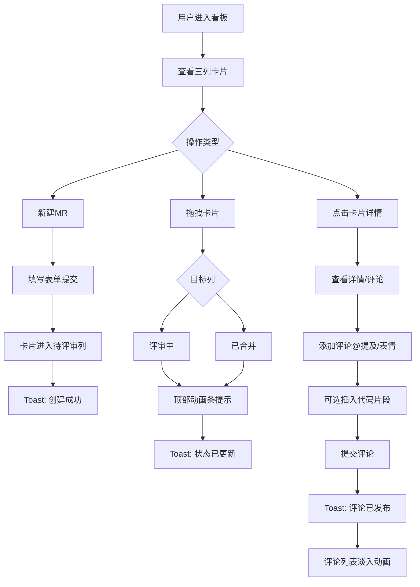

## 1. 产品概述

CodeReview Kanban 是一款面向小型技术团队的轻量级代码评审与合并请求管理看板应用，旨在解决团队中代码审查流程缺乏可视化、评审意见散落在聊天记录或邮件中的问题。

- 核心目标：提供直观的三状态看板，让团队成员清晰掌握每个合并请求的评审进度
- 目标用户：5-20人规模的敏捷开发团队、开发者、代码审查者、技术负责人
- 产品价值：统一代码评审入口、提高评审效率、沉淀评审历史、促进团队知识共享

---

## 2. 核心功能

### 2.1 用户角色
| 角色 | 注册方式 | 核心权限 |
|------|---------|---------|
| 开发者 | 无需注册，本地存储用户身份 | 提交合并请求、添加评论、@提及他人、表情反馈 |
| 评审者 | 无需注册，本地存储用户身份 | 同上 + 拖拽卡片变更状态 |

### 2.2 功能模块
1. **看板主页面**：三列看板布局（待评审/评审中/已合并）、顶部筛选面板、新建合并请求入口
2. **合并请求卡片**：卡片基本信息展示、拖拽移动、悬停效果、点击展开详情
3. **卡片详情弹窗**：完整信息展示、评论列表、评论输入框、@提及、表情反应、代码片段引用
4. **搜索筛选面板**：标签筛选、创建者筛选、状态筛选、关键词搜索、可折叠展开

### 2.3 页面详情
| 页面名称 | 模块名称 | 功能描述 |
|---------|---------|---------|
| 看板主页面 | 顶部操作栏 | 标题展示、筛选面板开关、新建MR按钮 |
| 看板主页面 | 筛选面板 | 标签多选、创建者选择、关键词搜索、状态筛选、实时更新 |
| 看板主页面 | 三列看板 | 待评审列、评审中列、已合并列、水平滚动、虚线分割 |
| 看板主页面 | 动画提示条 | 状态变更时顶部滑入动画提示、2秒后自动消失 |
| 看板主页面 | Toast通知 | 右下角弹出、所有操作反馈、2秒自动消失 |
| 卡片详情弹窗 | 基础信息区 | 标题、源/目标分支、描述、标签、创建者、创建时间 |
| 卡片详情弹窗 | 评论列表 | 评论内容、@提及高亮、表情反应计数、代码片段高亮 |
| 卡片详情弹窗 | 评论输入 | 多行文本、@提及输入、代码片段引用按钮、提交按钮 |
| 卡片详情弹窗 | 代码引用框 | 语言选择、代码粘贴、语法高亮显示 |

---

## 3. 核心流程

### 3.1 合并请求提交流程
用户点击"新建MR"按钮 → 弹出创建表单 → 填写源分支、目标分支、描述、选择标签 → 提交 → 卡片出现在"待评审"列 → Toast提示"创建成功"

### 3.2 看板状态流转流程
开发者提交MR（待评审）→ 评审者拖拽/点击移入"评审中" → 顶部动画条提示 → 评审完成后移入"已合并" → 顶部动画条提示 + Toast通知

### 3.3 评论互动流程
点击卡片打开详情 → 查看历史评论 → 输入评论（支持@提及）→ 添加表情反应 → 可选插入代码片段（选择语言+粘贴代码）→ 提交评论 → Toast提示 + 评论列表淡入动画

---

## 4. 用户界面设计

### 4.1 设计风格
- **主色调**：深灰背景 `#1a1d23`，青绿色强调色 `#10b981`（emerald-500）
- **辅助色**：卡片背景 `rgba(45, 50, 60, 0.85)`（毛玻璃效果），边框 `#374151`
- **按钮风格**：统一圆角 6px，悬停时青绿色背景加深 10%，过渡 200ms ease-out
- **字体**：系统无衬线字体栈 `-apple-system, BlinkMacSystemFont, "Segoe UI", Roboto, sans-serif`
- **布局风格**：卡片式布局，水平滚动看板，桌面端三列，平板两列，手机单列
- **图标/表情**：使用原生 emoji + 简单 SVG 图标（箭头、加号、搜索等）

### 4.2 页面设计概述
| 页面名称 | 模块名称 | UI元素 |
|---------|---------|--------|
| 看板主页面 | 顶部操作栏 | 深灰背景 80px高、标题青绿色粗体、筛选按钮带箭头动画、新建MR按钮青绿背景白色文字 |
| 看板主页面 | 筛选面板 | 从顶部向下展开200ms ease-out、圆角6px浅灰背景、多组筛选控件横向排列 |
| 看板主页面 | 看板列容器 | flex横向排列、overflow-x:auto、列间虚线`2px dashed #374151` |
| 看板主页面 | 看板列标题 | 16px半粗体、左侧彩色状态条（待评审:yellow/评审中:blue/已合并:green） |
| 看板主页面 | 卡片组件 | 毛玻璃`backdrop-filter: blur(8px)`、悬停`translateY(-4px)`+阴影增强、圆角6px |
| 看板主页面 | Toast组件 | 右下角固定、深灰背景白字、圆角6px、从右滑入动画、2秒淡出 |
| 卡片详情弹窗 | 遮罩层 | 黑色60%透明度、点击关闭、fadeIn动画 |
| 卡片详情弹窗 | 弹窗主体 | 居中680px宽、max-height 85vh、overflow-y:auto、毛玻璃+深灰背景 |
| 卡片详情弹窗 | 代码引用框 | 深色代码主题、语法高亮、语言标签、圆角6px边框 |

### 4.3 响应式设计
- **桌面端（≥1024px）**：三列横向排列，每列最小宽度320px，水平滚动
- **平板端（640px-1023px）**：两列并排 + 第三列可折叠收起，点击展开按钮显示
- **手机端（<640px）**：单列垂直堆叠，卡片全宽，筛选面板改为抽屉式从右侧滑入
- **触摸优化**：拖拽区域增加触控反馈（缩放+高亮边框），按钮最小触控区域 44x44px

### 4.4 交互动效规范
| 交互类型 | 动效描述 | 时长 | 缓动函数 |
|---------|---------|------|---------|
| 卡片悬停 | translateY(-4px) + box-shadow 0 12px 24px rgba(16,185,129,0.15) | 200ms | ease-out |
| 筛选面板展开 | height 0→auto + opacity 0→1 | 200ms | ease-out |
| 状态变更提示条 | translateY(-100%)→0 顶部滑入，2秒后反向滑出 | 300ms | ease-out |
| Toast弹出 | translateX(100%)→0 从右侧滑入，2秒后fadeOut | 250ms | ease-out |
| 卡片拖拽中 | opacity 0.75 + 轻微缩放 0.98 + 旋转 1deg | 0ms（即时） | - |
| 评论提交后 | 新评论 opacity 0→1 + translateY(10px)→0 | 300ms | ease-out |
