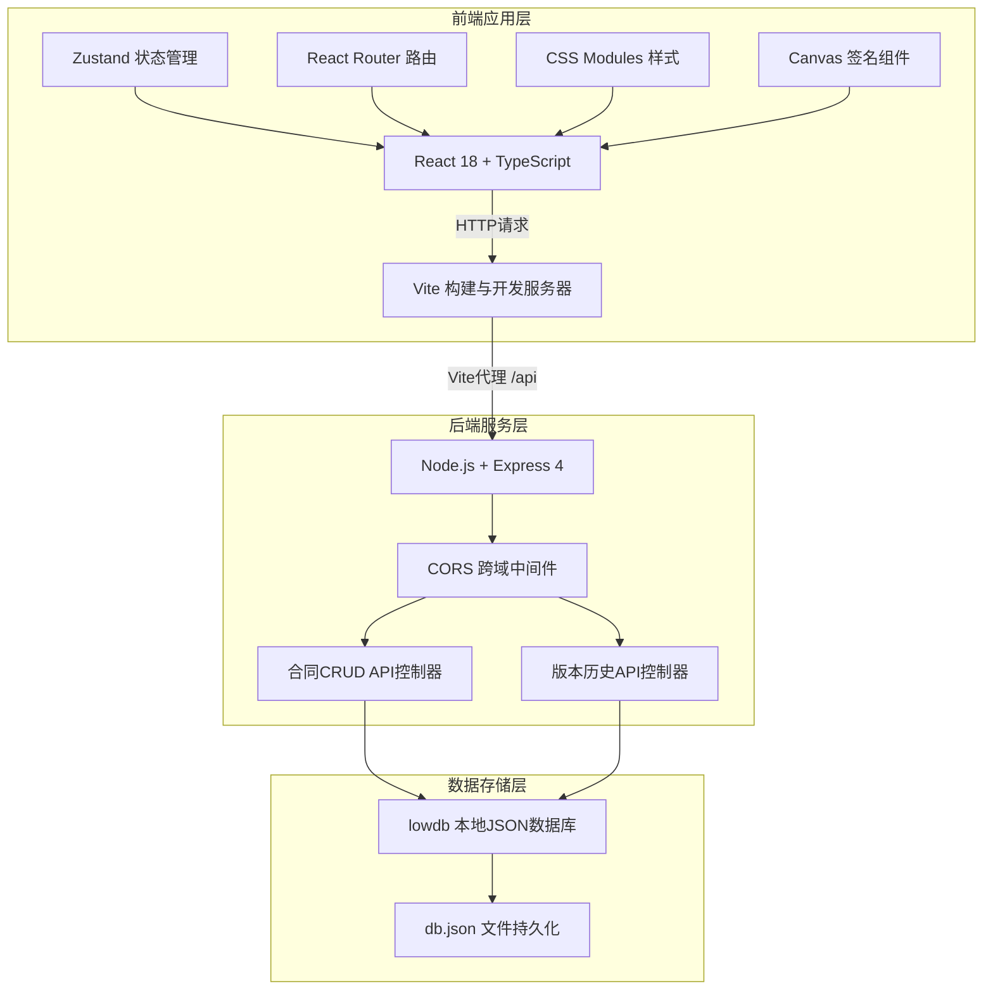
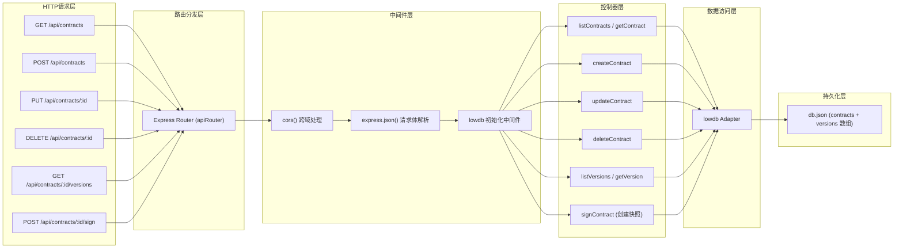
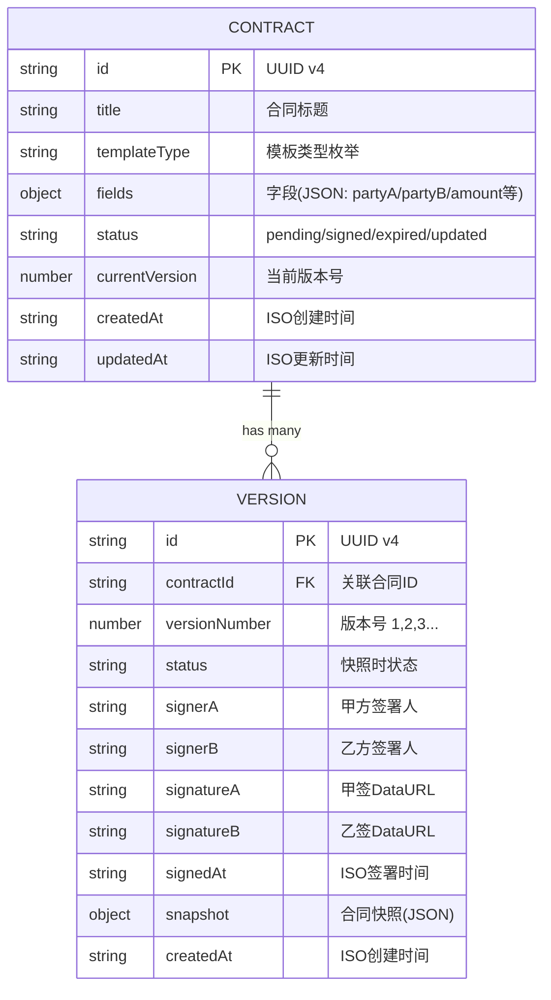

## 1. 架构设计

本应用采用前后端分离的经典三层架构：前端React SPA负责界面展示与交互，后端Express提供RESTful API服务，lowdb本地JSON文件作为持久化存储。



## 2. 技术选型说明

- **前端框架**：React@18 + TypeScript@5 — 类型安全、组件化开发、生态完善
- **构建工具**：Vite@5 — 极速冷启动与HMR，内置TypeScript支持与构建优化
- **状态管理**：Zustand@4 — 轻量无模板代码，API简洁，适合中小型应用
- **路由管理**：React Router@6 — 声明式路由，嵌套路由与动态参数支持
- **样式方案**：CSS Modules — 零配置样式隔离，避免全局污染，无第三方UI库
- **后端框架**：Express@4 — 成熟稳定，中间件生态丰富，轻量易扩展
- **跨域处理**：cors@2 — 标准CORS中间件，支持Vite开发代理
- **数据存储**：lowdb@6 — 基于本地JSON文件的轻量级数据库，适合原型与小型应用
- **ID生成**：uuid@9 — 标准UUID v4生成，保证合同与版本ID全局唯一
- **初始化工具**：Vite官方 react-ts 模板 + 手动补充后端目录

## 3. 路由定义

| 路由路径 | 页面组件 | 用途说明 |
|---------|---------|---------|
| `/` | ContractList | 合同列表页，展示所有合同表格、筛选搜索入口 |
| `/contract/new` | ContractEditor | 新建合同页，模板选择+字段填写+实时预览 |
| `/contract/:id/edit` | ContractEditor | 编辑已有合同，回填数据并可修改字段 |
| `/contract/:id/sign` | SigningPage | 签署合同页，Canvas签名+版本时间轴+快照切换 |
| `*` | ContractList | 404重定向到合同列表页 |

## 4. API接口定义

### 4.1 基础信息
- Base URL: `http://localhost:3001/api`
- 数据格式: `Content-Type: application/json`
- 错误响应: `{ error: string, code?: number }`

### 4.2 TypeScript类型定义

```typescript
type ContractStatus = 'pending' | 'signed' | 'expired' | 'updated';

type TemplateType = 'labor_service' | 'confidentiality' | 'project_entrust' | 'cooperation' | 'labor_dispatch';

interface ContractFields {
  partyA: string;          // 甲方名称
  partyB: string;          // 乙方名称
  projectContent: string;  // 项目内容
  amount: number;          // 合同金额
  startDate: string;       // 开始日期
  endDate?: string;        // 结束日期（可选）
}

interface VersionRecord {
  id: string;
  contractId: string;
  versionNumber: number;
  status: ContractStatus;
  signerA?: string;        // 甲方签署人
  signerB?: string;        // 乙方签署人
  signatureA?: string;     // 甲方签名DataURL
  signatureB?: string;     // 乙方签名DataURL
  signedAt?: string;       // 签署时间 ISO
  snapshot: ContractSnapshot;
  createdAt: string;
}

interface ContractSnapshot {
  templateType: TemplateType;
  fields: ContractFields;
  renderedHtml: string;    // 渲染后的合同HTML快照
}

interface Contract {
  id: string;
  title: string;
  templateType: TemplateType;
  fields: ContractFields;
  status: ContractStatus;
  currentVersion: number;
  createdAt: string;
  updatedAt: string;
}
```

### 4.3 接口列表

| 方法 | 路径 | 请求体 | 响应 | 用途 |
|------|------|--------|------|------|
| GET | `/contracts` | - | `Contract[]` | 获取合同列表，支持 `?status=&q=` 查询参数 |
| GET | `/contracts/:id` | - | `Contract` | 获取单个合同详情 |
| POST | `/contracts` | `{ title, templateType, fields }` | `Contract` | 创建新合同 |
| PUT | `/contracts/:id` | `{ title?, templateType?, fields? }` | `Contract` | 更新合同信息 |
| DELETE | `/contracts/:id` | - | `{ success: true }` | 删除合同及其所有版本 |
| GET | `/contracts/:id/versions` | - | `VersionRecord[]` | 获取合同的版本历史列表 |
| GET | `/contracts/:id/versions/:vid` | - | `VersionRecord` | 获取单个版本详情 |
| POST | `/contracts/:id/sign` | `{ signerA?, signerB?, signatureA?, signatureB? }` | `VersionRecord` | 签署合同并创建新版本快照 |

## 5. 服务端架构图



## 6. 数据模型

### 6.1 实体关系图



### 6.2 lowdb初始数据结构（db.json）

```json
{
  "contracts": [
    {
      "id": "a1b2c3d4-0001-4000-8000-000000000001",
      "title": "XX品牌官网UI设计服务合同",
      "templateType": "labor_service",
      "fields": {
        "partyA": "XX科技有限公司",
        "partyB": "李明（自由设计师）",
        "projectContent": "提供企业官网首页及内页共15个页面的UI设计服务",
        "amount": 28000,
        "startDate": "2026-06-20",
        "endDate": "2026-08-20"
      },
      "status": "signed",
      "currentVersion": 2,
      "createdAt": "2026-06-15T09:00:00.000Z",
      "updatedAt": "2026-06-17T14:30:00.000Z"
    }
  ],
  "versions": [
    {
      "id": "v-0001",
      "contractId": "a1b2c3d4-0001-4000-8000-000000000001",
      "versionNumber": 1,
      "status": "pending",
      "snapshot": {
        "templateType": "labor_service",
        "fields": { "partyA": "...", "partyB": "...", "amount": 25000 },
        "renderedHtml": "<div>...</div>"
      },
      "createdAt": "2026-06-15T09:00:00.000Z"
    },
    {
      "id": "v-0002",
      "contractId": "a1b2c3d4-0001-4000-8000-000000000001",
      "versionNumber": 2,
      "status": "signed",
      "signerA": "张经理",
      "signerB": "李明",
      "signatureA": "data:image/png;base64,iVBORw0KGgoA...",
      "signatureB": "data:image/png;base64,iVBORw0KGgoB...",
      "signedAt": "2026-06-17T14:30:00.000Z",
      "snapshot": {
        "templateType": "labor_service",
        "fields": { "partyA": "...", "partyB": "...", "amount": 28000 },
        "renderedHtml": "<div>...</div>"
      },
      "createdAt": "2026-06-17T14:30:00.000Z"
    }
  ]
}
```

## 7. 项目文件组织结构

```
auto80/
├── package.json                 # 前后端统一依赖与启动脚本
├── index.html                   # Vite入口HTML
├── vite.config.ts               # Vite配置 + /api代理到3001
├── tsconfig.json                # TypeScript严格模式配置
├── db.json                      # lowdb本地数据文件（运行时创建）
├── server/
│   └── index.js                 # Express后端入口（端口3001）
└── src/
    ├── App.tsx                  # 路由+全局布局（导航栏+主内容区）
    ├── main.tsx                 # React入口
    ├── styles/
    │   └── global.css           # 全局样式与CSS变量
    ├── pages/
    │   ├── ContractList.tsx     # 合同列表页（表格/筛选/搜索）
    │   ├── ContractList.module.css
    │   ├── ContractEditor.tsx   # 合同编辑页（模板/表单/预览）
    │   ├── ContractEditor.module.css
    │   ├── SigningPage.tsx      # 签署页（签名/版本轴）
    │   └── SigningPage.module.css
    ├── store/
    │   └── contractStore.ts     # Zustand全局状态
    ├── data/
    │   └── templates.ts         # 5种预设合同模板定义
    └── components/
        ├── SignatureCanvas.tsx  # Canvas签名组件
        ├── SignatureCanvas.module.css
        ├── VersionTimeline.tsx  # 版本时间轴组件
        ├── VersionTimeline.module.css
        ├── StatusBadge.tsx      # 状态标签组件
        ├── StatusBadge.module.css
        ├── Sidebar.tsx          # 左侧导航栏
        └── Sidebar.module.css
```
