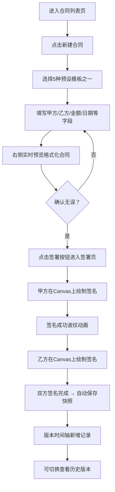

## 1. 产品概述

自由职业者合同管理平台是一款面向设计师、翻译、咨询师等自由职业者的电子合同生成与签署工具，主要解决合同模板重复编写、签署流程烦琐且无法追踪版本变更的痛点问题。

- 核心目标：提供标准化合同模板库、便捷的在线签署体验、完整的版本历史追溯能力
- 目标用户：设计师、翻译、咨询师、开发工程师等自由职业者
- 市场价值：将合同编制时间从数小时缩短至数分钟，实现无纸化签署，提升自由职业者的工作效率和专业形象

## 2. 核心功能

### 2.1 用户角色

| 角色 | 注册方式 | 核心权限 |
|------|---------|---------|
| 自由职业者 | 默认使用（无需注册） | 创建/编辑/删除合同、选择模板、签署合同、查看版本历史、下载合同PDF |

### 2.2 功能模块

1. **合同列表页**：表格展示所有合同、状态颜色编码指示、按状态筛选、关键词搜索、操作按钮（编辑/签署/删除/下载）
2. **合同编辑页**：模板选择器、关键字段表单（带标签卡片布局）、实时合同预览区、保存与签署入口
3. **签署页**：Canvas签名面板（支持鼠标/触摸）、双方签名槽位、版本历史时间轴、合同快照切换预览

### 2.3 页面详情

| 页面名称 | 模块名称 | 功能描述 |
|---------|---------|---------|
| 合同列表页 | 合同表格 | 展示合同标题、甲方/乙方、金额、创建日期、状态标签、操作按钮 |
| 合同列表页 | 筛选与搜索 | 顶部工具栏：按状态下拉筛选、关键词输入框搜索、新建合同按钮 |
| 合同列表页 | 状态指示 | 颜色编码：绿色-已签署、黄色-待签署、红色-已过期 |
| 合同编辑页 | 模板选择 | 5种预设模板卡片（劳务服务、保密协议、项目委托、合作协议、劳务派遣） |
| 合同编辑页 | 字段填写 | 卡片布局输入框：甲方/乙方名称、项目内容、金额、日期等关键字段 |
| 合同编辑页 | 实时预览 | 右侧白色卡片展示格式化合同文本，字段变更即时同步 |
| 签署页 | Canvas签名 | 居中签名区域，浅灰色点状网格背景（20px），支持鼠标和触摸绘制 |
| 签署页 | 版本时间轴 | 左侧250px面板，时间轴形式展示所有版本，含版本号、签署人、签署时间、状态标签 |
| 签署页 | 签名槽位 | 甲方/乙方两个签名区域，签名完成后从中心扩散淡绿色成功波纹动画 |

## 3. 核心流程

用户主要操作流程：选择合同模板 → 填写关键字段 → 实时预览确认 → 进入签署页 → 双方Canvas签名 → 系统自动保存快照 → 在版本历史中查看所有变更记录。

## 4. 用户界面设计

### 4.1 设计风格

- **主色调**：#2C3E50（蓝灰色，深色导航与标题）
- **强调色**：#3498DB（亮蓝色，按钮、链接、选中状态）
- **背景色**：#F5F7FA（浅灰色全局背景）
- **卡片背景**：#FFFFFF（白色，带细阴影和8px圆角）
- **状态色**：绿色#27AE60（已签署）、黄色#F39C12（待签署）、红色#E74C3C（已过期）
- **按钮样式**：圆角8px，悬停时轻微上移（translateY(-1px)）并加深阴影
- **字体方案**：系统无衬线字体栈，正文14px，标题16-24px
- **布局风格**：左侧250px固定导航栏 + 右侧主内容区，桌面优先响应式设计
- **图标风格**：简约线性SVG图标，颜色与文字一致

### 4.2 页面设计概览

| 页面名称 | 模块名称 | UI元素描述 |
|---------|---------|-----------|
| 合同列表页 | 顶部工具栏 | 蓝灰色背景，左侧品牌Logo，右侧状态筛选下拉框、搜索框、蓝色「+ 新建合同」按钮 |
| 合同列表页 | 合同表格 | 白色卡片，表头蓝灰底白字，行交替浅灰背景，状态标签圆角胶囊，操作按钮图标+悬停提示 |
| 合同编辑页 | 模板选择区 | 顶部横向排列5张模板卡片，选中卡边框蓝色加粗，卡片内图标+名称+简短描述 |
| 合同编辑页 | 字段表单区 | 左侧两列卡片式输入框，每组字段带图标标签，输入框聚焦时蓝色边框和阴影 |
| 合同编辑页 | 预览区 | 右侧白色大卡片（A4比例），合同正文排版仿正式文档，关键字段高亮标注 |
| 签署页 | 版本时间轴 | 左侧250px面板，竖线+圆点时间轴，版本条目高度折叠动画（max-height transition） |
| 签署页 | 签名区域 | 居中白色卡片，点状网格背景（20px spacing），Canvas顶部提示文字，清除/确认按钮 |
| 签署页 | 签名成功 | 从中心向外扩散3层淡绿色圆形波纹（scale + opacity动画） |

### 4.3 响应式设计

- **设计原则**：Desktop-first，移动端自适应
- **断点策略**：≥1024px三栏布局，768-1023px左侧导航收缩为汉堡菜单，<768px单栏堆叠布局
- **触摸优化**：移动端按钮最小高度44px，签名Canvas触摸事件优先处理，防止页面滚动干扰
- **汉堡菜单**：<1024px时导航栏和版本面板变为抽屉式，点击遮罩层关闭

### 4.4 动画与微交互

1. **按钮悬停**：transform: translateY(-1px) + box-shadow加深，过渡150ms ease
2. **版本切换**：条目max-height从48px展开到auto，过渡300ms ease，当前选中项左侧蓝色竖条指示
3. **签名成功波纹**：3个同心圆依次从scale(0)到scale(2.5)，opacity从0.6到0，错开150ms，持续600ms
4. **表格行悬停**：背景色从白到#EEF2F7，过渡200ms
5. **页面进入**：内容区从右向左滑入+淡入，过渡250ms ease-out
6. **加载占位**：版本历史列表加载时，5条骨架屏脉冲动画（animate-pulse）
