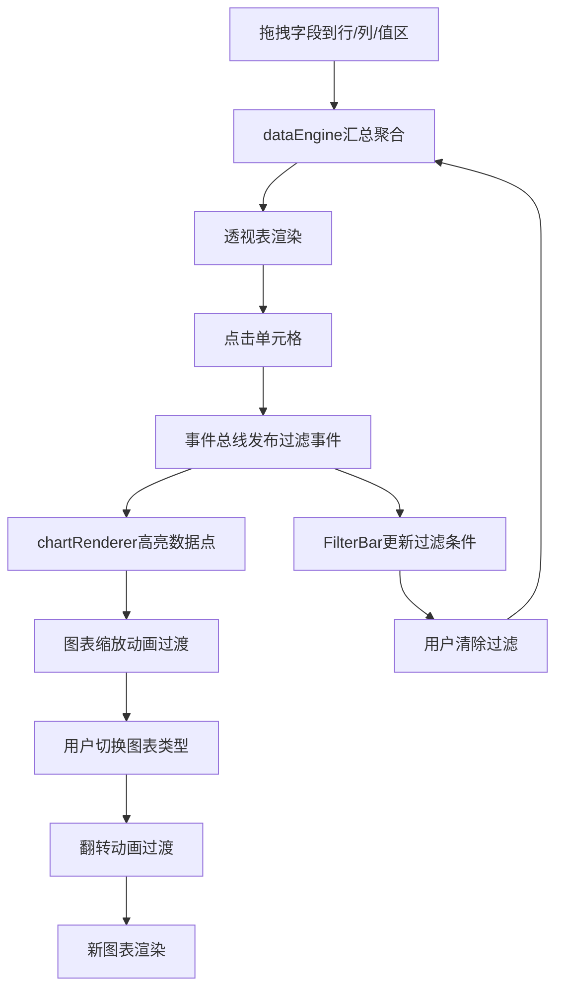

## 1. 产品概述

多维数据透视表与图表联动分析面板——为数据分析师提供交互式多维数据探索工具，支持拖拽配置透视表行列值、图表联动过滤与动态排序，挖掘隐藏趋势。

- 核心目的：替代静态报告，提供直观的联动过滤和动态排序能力
- 目标用户：数据分析师、业务决策者、BI工具使用者

## 2. 核心功能

### 2.1 功能模块

1. **仪表盘页面**：透视表配置区、图表面板、过滤条、字段列表，全部交互集中在此单页

### 2.2 页面详情

| 页面名称 | 模块名称 | 功能描述 |
|----------|----------|----------|
| 仪表盘 | 字段列表 | 左侧窄栏展示维度(地区、年份、品类)和度量(销售额、利润、数量)字段卡片，支持拖拽到行区/列区/值区 |
| 仪表盘 | 透视表区 | 中间区域，按行/列分组聚合度量值，单元格悬停高亮、点击选中触发维度过滤 |
| 仪表盘 | 过滤条 | 显示当前活跃过滤条件，支持单个清除和全部重置 |
| 仪表盘 | 图表面板 | 右侧区域，原生SVG渲染柱状图/折线图/饼图，支持点击交互、框选过滤和类型切换 |
| 仪表盘 | 图表切换 | 三个图标按钮切换柱状图/折线图/饼图，带翻转动画过渡 |
| 仪表盘 | 排序控制 | 按度量值升序/降序排列图表数据，带错开动画 |

## 3. 核心流程

**主流程**：用户从字段列表拖拽维度/度量字段到透视表的行区/列区/值区 → 数据引擎计算聚合结果 → 透视表渲染 → 用户点击单元格 → 事件总线发布过滤事件 → 图表面板接收事件并高亮对应数据点 → 过滤条更新显示活跃条件 → 用户可在过滤条清除条件恢复全部数据。

**图表切换流程**：用户点击图表类型按钮 → 当前图表以0.15秒翻转动画退出 → 新图表以翻转动画进入 → 数据按当前排序规则排列。

## 4. 用户界面设计

### 4.1 设计风格

- 主背景色：#f5f6fa（浅灰）
- 字段卡片：浅蓝绿渐变（#4facfe → #00f2fe）
- 透视表单元格：白色（#ffffff）→ 悬停淡蓝（#e6f0ff）→ 选中深蓝（#2d7bff）文字反白
- 强调色：#2d7bff（深蓝）
- 灰化色：浅灰色用于过滤掉的图表区域
- 圆角半径：8px（统一扁平圆角设计）
- 字体：-apple-system, BlinkMacSystemFont, "Segoe UI"（系统无衬线）
- 按钮风格：扁平圆角图标按钮

### 4.2 页面设计概览

| 页面名称 | 模块名称 | UI元素 |
|----------|----------|--------|
| 仪表盘 | 字段列表 | 宽度220px，字段卡片渐变背景，拖拽时悬浮阴影(box-shadow: 0 8px 30px rgba(0,0,0,0.12)) |
| 仪表盘 | 透视表区 | 占宽60%，白色单元格，0.2s背景色过渡，拖拽占位块半透明+插入动画 |
| 仪表盘 | 图表面板 | 占宽40%，SVG原生渲染，空状态虚线圆环旋转占位提示，0.3s缩放过渡 |
| 仪表盘 | 图表切换 | 三个图标按钮，0.15s翻转动画 |
| 仪表盘 | 过滤条 | 顶部横向排列过滤标签，含清除按钮 |

### 4.3 响应式设计

- 桌面优先（≥1024px）：左-中-右三栏布局
- <1024px：透视表和图表上下堆叠，图表区高度固定300px，字段列表改为横向滚动标签

### 4.4 动画规范

- 拖拽占位：半透明+插入动画
- 单元格交互：0.2s background-color过渡
- 图表过滤：0.3s从中心缩放过渡
- 图表切换：0.15s翻转动画
- 排序错开：0.1s逐个进入
- 空状态圆环：2s旋转一圈
- 所有交互反馈：0.15-0.3s过渡动画
