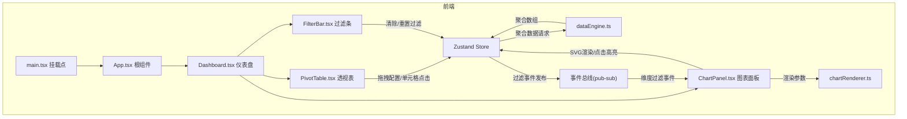
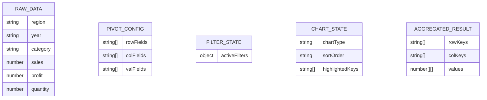

## 1. 架构设计



## 2. 技术说明

- 前端：React@18 + TypeScript + Vite
- 初始化工具：vite-init (react-ts模板)
- 状态管理：Zustand（全局状态 + 事件总线）
- 图表渲染：原生SVG（不依赖第三方图表库）
- 拖拽：react-dnd-html5-backend + dnd-core
- CSS：Bootstrap 5 CDN + 自定义CSS
- 后端：无
- 数据库：无（使用内置模拟数据）

## 3. 路由定义

| 路由 | 用途 |
|------|------|
| / | 仪表盘主页面，包含所有功能模块 |

## 4. 数据模型

### 4.1 数据模型定义



## 5. 文件结构与调用关系

```
├── package.json                    # 依赖管理
├── vite.config.ts                  # Vite构建配置
├── tsconfig.json                   # TypeScript严格模式配置
├── index.html                      # 入口页面(Bootstrap 5 CDN)
├── src/
│   ├── main.tsx                    # → App.tsx 挂载
│   ├── App.tsx                     # → Dashboard.tsx 集成
│   ├── store/
│   │   └── useStore.ts            # Zustand全局状态 + 事件总线
│   ├── modules/
│   │   ├── dataEngine.ts          # 数据引擎(汇总/分组/过滤) ← store调用
│   │   └── chartRenderer.ts       # SVG图表渲染 ← ChartPanel调用
│   ├── pages/
│   │   └── Dashboard.tsx          # 仪表盘页面 ← App调用
│   ├── components/
│   │   ├── PivotTable.tsx         # 透视表 ← Dashboard调用
│   │   ├── FilterBar.tsx          # 过滤条 ← Dashboard调用
│   │   ├── ChartPanel.tsx         # 图表面板 ← Dashboard调用
│   │   └── FieldList.tsx          # 字段列表 ← Dashboard调用
│   └── types/
│       └── index.ts               # 全局类型定义
```

**数据流向**：
1. 用户拖拽 → PivotTable更新store中的pivotConfig → dataEngine重新聚合 → 透视表和图表重新渲染
2. 用户点击单元格 → store发布过滤事件 → chartRenderer高亮 → FilterBar更新
3. 用户切换图表/排序 → store更新chartState → chartRenderer重新渲染（带动画）

## 6. 性能约束

- 透视表500单元格渲染FPS ≥ 55
- 图表过滤后重新渲染 ≤ 200ms（requestAnimationFrame控制动画队列）
- 拖拽帧率 ≥ 50FPS
