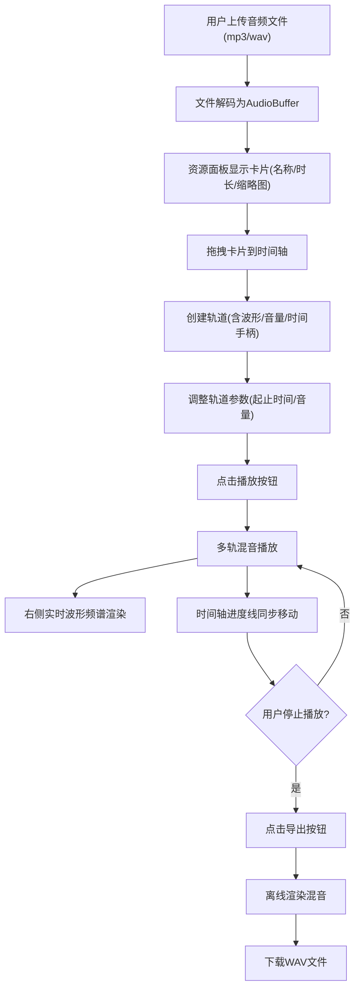

## 1. 产品概述

在线音效混音与可视化编辑器，让用户载入多个音频片段并在时间轴上自由调整音量、混音轨道和播放顺序，同时实时展示波形频谱，支持导出混音后的 WAV 音频文件。
- 目标用户：音频创作者、播客编辑、视频制作者、音乐爱好者
- 核心价值：零安装、浏览器内完成专业级多轨混音与可视化预览

## 2. 核心功能

### 2.1 功能模块

1. **编辑器主页**：音频资源面板、时间轴轨道编辑区、波形频谱可视化面板、播放控制栏

### 2.2 页面详情

| 页面名称 | 模块名称 | 功能描述 |
|---------|---------|---------|
| 编辑器主页 | 顶部导航栏 | 应用标题（Web Audio Engine 字体样式）、播放/停止/导出控制按钮，播放中按钮脉冲光晕状态 |
| 编辑器主页 | 左侧资源面板（280px） | 上传按钮、音频文件卡片列表（文件名、时长、波形缩略图）、拖拽卡片到时间轴添加轨道 |
| 编辑器主页 | 中间时间轴区域 | 多轨道波形显示、起止时间拖拽手柄、音量滑块、删除按钮、水平滚动与缩放、播放进度线、网格辅助线 |
| 编辑器主页 | 右侧波形频谱面板（320px） | Canvas 实时波形（时域）和频谱（频域）绘制，颜色随能量动态变化 |
| 编辑器主页 | 响应式布局 | 宽屏≥1200px三栏并排，窄屏<768px上下折叠布局 |

## 3. 核心流程

用户上传音频文件 → 文件以卡片形式显示在资源面板 → 拖拽卡片到时间轴创建轨道 → 调整轨道起止时间和音量 → 点击播放实时预览混音效果 → 播放进度线同步移动 → 停止后点击导出下载 WAV 文件

## 4. 用户界面设计

### 4.1 设计风格

- **主色调**：深色主题，背景 #1a1a2e，轨道卡片渐变色 #e94560 / #0f3460 / #533483
- **辅助色**：轨道区域交替深浅行、浅灰色网格线、波形低频偏蓝高频偏红
- **按钮风格**：圆角图标样式，点击0.2s按压缩放反馈，播放中脉冲光晕
- **字体**：标题使用科技感字体（如 Orbitron / Rajdhani），正文使用 Source Sans 3
- **布局**：左中右三栏布局，圆角卡片+柔和阴影
- **拖拽效果**：拖拽时卡片放大+半透明副本+虚线指示器

### 4.2 页面设计概览

| 页面名称 | 模块名称 | UI元素 |
|---------|---------|--------|
| 编辑器主页 | 顶部导航栏 | 深色渐变背景、Orbitron标题字体、圆角图标按钮（播放▶/停止■/导出↓）、播放时按钮脉冲光晕动画 |
| 编辑器主页 | 左侧资源面板 | 固定280px宽、上传按钮（圆角+图标）、音频卡片（渐变背景#e94560/#0f3460/#533483、圆角12px、阴影、波形缩略图、文件名、时长）、拖拽半透明副本 |
| 编辑器主页 | 中间时间轴 | 弹性宽度、深蓝→墨黑渐变背景、浅灰网格线、轨道行交替深浅色、波形绘制、起止拖拽手柄（8px宽竖条）、垂直音量滑块、删除按钮×、播放进度线（红色竖线）、缩放滑块 |
| 编辑器主页 | 右侧频谱面板 | 固定320px宽、双Canvas（上方时域波形、下方频域频谱条）、能量动态变色（蓝→红）、30FPS刷新 |

### 4.3 响应式设计

- **桌面优先**：≥1200px 三栏并排显示
- **平板**：768px-1199px 资源面板收窄为图标模式，时间轴和频谱面板并排
- **移动**：<768px 三栏上下折叠，资源面板可折叠，频谱面板在时间轴下方

### 4.4 动效设计

- 卡片点击：0.2s scale(0.95) 按压缩放
- 拖拽卡片：放大1.05 + opacity 0.7 半透明副本 + 虚线指示器
- 播放按钮：脉冲光晕 box-shadow 动画
- 进度线：红色竖线匀速移动
- 频谱条：跟随节奏跳动，高度有弹性缓动
