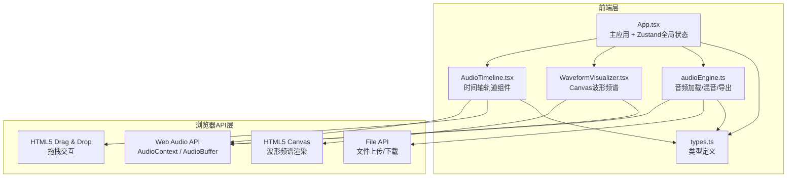
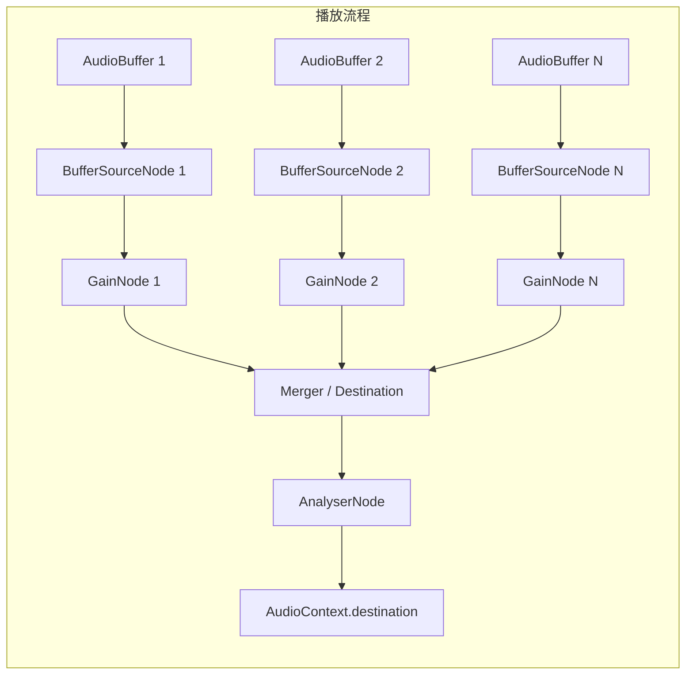

## 1. 架构设计



## 2. 技术说明

- **前端框架**：React 18 + TypeScript（严格模式）
- **构建工具**：Vite + @vitejs/plugin-react
- **状态管理**：Zustand（轻量全局状态，管理音频资源、轨道、播放状态）
- **音频处理**：原生 Web Audio API（AudioContext, AudioBufferSourceNode, GainNode, AnalyserNode, OfflineAudioContext）
- **波形渲染**：HTML5 Canvas 2D（requestAnimationFrame 驱动，30FPS+）
- **拖拽交互**：HTML5 Drag & Drop API + 自定义鼠标事件处理
- **样式方案**：CSS-in-JS（内联样式 + CSS模块），深色主题

## 3. 路由定义

本应用为单页应用，无路由切换，所有功能集成在一个页面内。

| 路由 | 用途 |
|------|------|
| / | 音频混音编辑器主页 |

## 4. 数据模型

### 4.1 核心类型定义

```typescript
interface AudioResource {
  id: string;
  name: string;
  duration: number;
  buffer: AudioBuffer;
  thumbnailData: Float32Array;
  color: string;
}

interface Track {
  id: string;
  resourceId: string;
  name: string;
  startTime: number;
  endTime: number;
  volume: number;
  color: string;
  buffer: AudioBuffer;
}

interface PlaybackState {
  isPlaying: boolean;
  currentTime: number;
  sourceNodes: AudioBufferSourceNode[];
  gainNodes: GainNode[];
}
```

### 4.2 Zustand Store 结构

```typescript
interface AudioStore {
  resources: AudioResource[];
  tracks: Track[];
  playback: PlaybackState;
  zoomLevel: number;
  scrollOffset: number;
  audioContext: AudioContext | null;
  analyserNode: AnalyserNode | null;
  
  // Actions
  addResource: (file: File) => Promise<void>;
  removeResource: (id: string) => void;
  addTrack: (resourceId: string) => void;
  removeTrack: (id: string) => void;
  updateTrackTime: (id: string, startTime: number, endTime: number) => void;
  updateTrackVolume: (id: string, volume: number) => void;
  play: () => void;
  stop: () => void;
  exportWav: () => Promise<void>;
  setZoomLevel: (level: number) => void;
  setScrollOffset: (offset: number) => void;
}
```

## 5. 音频引擎架构



### 5.1 导出流程

使用 OfflineAudioContext 进行离线渲染：
1. 创建 OfflineAudioContext（采样率与源文件一致）
2. 为每条轨道创建 BufferSourceNode + GainNode
3. 设置 startTime 和 volume 参数
4. 调用 startRendering() 渲染完整混音
5. 将 AudioBuffer 编码为 WAV 格式（手动编码 PCM）
6. 创建 Blob 触发下载

## 6. 性能策略

- **时间轴渲染**：Canvas 离屏渲染轨道波形，拖拽/缩放时仅重绘可见区域
- **频谱刷新**：requestAnimationFrame + AnalyserNode.getByteTimeDomainData / getByteFrequencyData，保持30FPS+
- **拖拽流畅度**：使用 CSS transform 代替 top/left 避免回流，节流mousemove事件
- **导出优化**：OfflineAudioContext 离线渲染，4条60秒轨道预计<5秒完成
