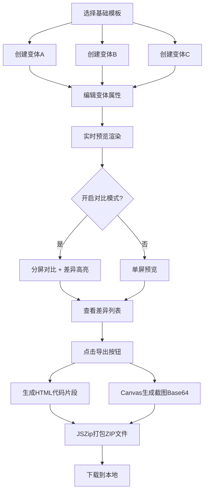

## 1. 产品概述
A/B测试页面变体设计工具，帮助产品经理和运营人员快速设计、预览和导出A/B测试页面方案。解决手动编写多个页面版本、逐一截图对比效率低下的问题，提升测试方案设计效率。

## 2. 核心功能

### 2.1 用户角色
| 角色 | 注册方式 | 核心权限 |
|------|---------|---------|
| 产品经理/运营人员 | 无需注册，直接使用 | 创建变体、预览对比、导出方案 |

### 2.2 功能模块
1. **变体管理面板**：模板选择、变体卡片列表、属性编辑表单
2. **实时预览区**：单屏预览、分屏对比模式、差异高亮标注
3. **差异面板**：差异列表展示、属性变化详情
4. **导出功能**：HTML/CSS代码打包、差异报告JSON生成、Canvas截图

### 2.3 页面详情
| 页面名称 | 模块名称 | 功能描述 |
|---------|---------|---------|
| 主页面 | 模板选择区 | 从3种预设模板（着陆页、注册页、弹窗促销页）中选择基础布局 |
| 主页面 | 变体卡片列表 | 横向展示所有变体方案，支持切换、添加、删除 |
| 主页面 | 属性编辑面板 | 编辑标题文案、按钮颜色、背景图片URL、字体大小等字段 |
| 主页面 | 实时预览区 | 渲染当前选中变体的完整页面效果，支持图片加载动画 |
| 主页面 | 分屏对比模式 | 左右分屏展示A/B两个版本，自动标注差异项 |
| 主页面 | 差异列表面板 | 逐条展示两个版本的属性差异，带动画滑入效果 |
| 主页面 | 导出按钮 | 打包所有变体HTML代码和差异报告为ZIP文件下载 |

## 3. 核心流程

用户选择基础模板 → 创建多个变体方案 → 独立编辑各变体属性 → 实时预览效果 → 开启对比模式查看差异 → 导出版本快照包

## 4. 用户界面设计

### 4.1 设计风格
- 主背景色：#F5F7FA（浅色极简风格）
- 主色调：#3B82F6（蓝色）
- 卡片样式：圆角12px，盒阴影rgba(0,0,0,0.08)，悬停时阴影加深至0.15，0.3秒ease-out过渡
- 字体选择：标题使用"Playfair Display"，正文使用"Inter"
- 布局风格：卡片式布局，桌面端两栏布局（左侧变体列表+右侧预览区），移动端纵向堆叠

### 4.2 页面设计概述
| 页面名称 | 模块名称 | UI元素 |
|---------|---------|--------|
| 主页面 | 变体卡片列表 | 横向滚动卡片，选中卡片蓝色底边指示，0.2秒缩放弹入动画 |
| 主页面 | 属性编辑面板 | 表单输入框、颜色选择器、URL输入框、滑块控件 |
| 主页面 | 预览区 | CSS Grid布局，内联样式动态生成，图片加载渐变旋转spinner，0.4秒淡入 |
| 主页面 | 分屏对比 | 左右两栏布局，差异标注框闪烁动画（红框1秒周期，绿框0.8秒周期） |
| 主页面 | 差异列表 | 逐条0.2秒间隔从右侧滑入，红绿背景区分增删改 |
| 主页面 | 导出按钮 | 悬停缩放触感效果，点击后生成进度反馈 |

### 4.3 响应式
- 桌面端（≥768px）：两栏布局，左侧变体列表+编辑面板，右侧预览区
- 移动端（<768px）：纵向堆叠布局，变体列表在上，预览区在中，编辑面板在下
- 所有交互元素支持触摸操作，按钮最小点击区域44x44px

### 4.4 动画与微交互
- 变体切换：0.2秒缩放弹入动画（transform: scale(1.02)）
- 图片加载：CSS渐变旋转spinner动画，加载完成后0.4秒opacity淡入
- 差异标注：红框animation: blink-red 1s infinite，绿框animation: blink-green 0.8s infinite
- 差异列表：animation: slide-in-right 0.3s ease-out，逐条animation-delay递增
- 按钮点击：transform: scale(0.95) 模拟触感震动
