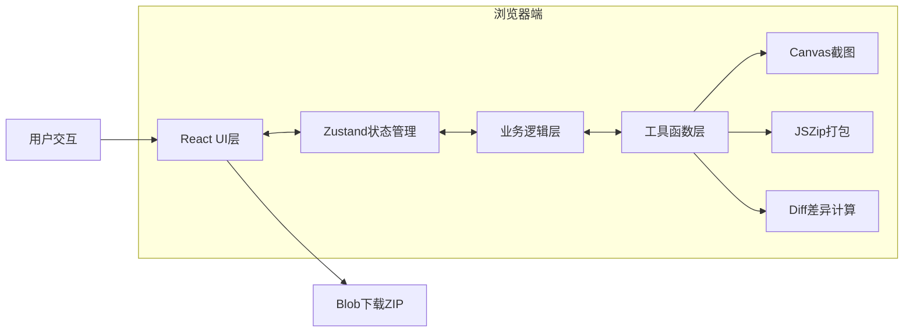

## 1. 架构设计

纯前端单页应用，无后端服务依赖，所有功能在浏览器端完成。



## 2. 技术描述

- 前端框架：React@18 + TypeScript@5
- 构建工具：Vite@5 + @vitejs/plugin-react@4
- 状态管理：Zustand@4
- 文件打包：jszip@3
- CSS方案：原生CSS + CSS变量 + CSS Grid/Flexbox
- 无后端、无数据库，所有数据存储在浏览器内存中

## 3. 目录结构

```
├── package.json          # 项目依赖和脚本
├── index.html            # 入口HTML
├── vite.config.ts        # Vite构建配置
├── tsconfig.json         # TypeScript配置（严格模式）
└── src/
    ├── main.tsx          # React入口
    ├── App.tsx           # 主应用组件
    ├── types.ts          # 类型定义：Variant, TemplateType, DiffResult等
    ├── store.ts          # Zustand状态管理
    ├── Preview.tsx       # 预览组件（单屏/分屏）
    ├── DiffPanel.tsx     # 差异面板组件
    ├── Export.tsx        # 导出功能组件
    ├── VariantCard.tsx   # 变体卡片组件
    ├── EditPanel.tsx     # 属性编辑面板
    ├── TemplateSelector.tsx # 模板选择器
    ├── utils/
    │   ├── diff.ts       # 差异计算工具
    │   ├── htmlGenerator.ts # HTML代码生成
    │   └── screenshot.ts # Canvas截图工具
    └── styles/
        ├── global.css    # 全局样式和动画
        └── variables.css # CSS变量定义
```

## 4. 数据模型

### 4.1 核心类型定义

```typescript
// 模板类型枚举
enum TemplateType {
  LANDING = 'landing',      // 着陆页
  REGISTER = 'register',    // 注册页
  MODAL = 'modal'           // 弹窗促销页
}

// 变体方案类型
interface Variant {
  id: string;
  name: string;             // 变体名称，如"A方案"
  title: string;            // 标题文案
  btnColor: string;         // 按钮颜色
  bgUrl: string;            // 背景图片URL
  fontSize: number;         // 字体大小(px)
  btnText: string;          // 按钮文案
  description: string;      // 描述文案
}

// 差异结果类型
interface DiffResult {
  field: string;            // 字段名
  fieldLabel: string;       // 字段显示名
  oldValue: string | number;
  newValue: string | number;
  type: 'added' | 'removed' | 'modified';
}

// Store状态类型
interface AppState {
  template: TemplateType;
  variants: Variant[];
  selectedVariantId: string | null;
  compareMode: boolean;
  compareVariantIds: [string, string];
  // actions
  setTemplate: (t: TemplateType) => void;
  addVariant: () => void;
  updateVariant: (id: string, data: Partial<Variant>) => void;
  deleteVariant: (id: string) => void;
  selectVariant: (id: string) => void;
  toggleCompareMode: () => void;
  setCompareVariants: (ids: [string, string]) => void;
}
```

## 5. 核心模块说明

### 5.1 状态管理模块 (store.ts)
- 使用Zustand create函数创建全局store
- 管理模板类型、变体列表、选中状态、对比模式
- 提供addVariant、updateVariant、toggleCompare等action方法
- 初始状态包含3个预设变体（A/B/C）

### 5.2 预览渲染模块 (Preview.tsx)
- 根据选中变体数据动态生成内联样式
- 使用CSS Grid布局渲染页面结构
- 支持单屏模式和分屏对比模式切换
- 分屏模式下调用diff模块计算差异并渲染高亮框
- 图片加载状态：CSS spinner动画 → 0.4秒淡入
- 使用React.memo优化渲染性能，确保切换响应<50ms

### 5.3 差异计算模块 (utils/diff.ts)
- 深度对比两个Variant对象的所有可编辑字段
- 返回DiffResult数组，标记字段变更类型
- 支持标题、按钮颜色、背景图、字体大小等字段对比

### 5.4 差异面板模块 (DiffPanel.tsx)
- 接收DiffResult数组渲染差异列表
- 每条差异项从右侧滑入动画（animation-delay递增）
- 红绿背景色区分变更类型
- 显示字段原值和新值对比

### 5.5 导出模块 (Export.tsx)
- 遍历所有变体调用htmlGenerator生成独立HTML字符串
- 使用html2canvas或原生Canvas API截取预览区域生成base64
- 调用JSZip将所有HTML文件和差异报告JSON打包
- 通过Blob + URL.createObjectURL触发浏览器下载
- 差异报告包含：变体元数据、差异记录、截图base64

### 5.6 HTML生成模块 (utils/htmlGenerator.ts)
- 根据Variant数据生成完整的独立HTML文件
- 内联所有CSS样式，确保导出后可独立打开
- 包含完整的DOCTYPE、meta标签和响应式viewport

## 6. 性能优化策略

- 使用React.memo包裹Preview组件，通过浅比较props避免不必要重渲染
- Zustand store使用selector模式订阅特定状态，减少组件重渲染
- 图片加载使用decode()方法预加载，避免布局抖动
- CSS动画使用transform和opacity属性，触发GPU加速
- 列表渲染使用稳定的key（变体id）
- Canvas截图时限制最大尺寸，避免内存溢出

## 7. 动画实现清单

| 动画名称 | 实现方式 | 时长 | 触发时机 |
|---------|---------|------|---------|
| 卡片悬停阴影 | CSS transition | 0.3s ease-out | mouseenter/mouseleave |
| 选中卡片缩放 | CSS transform + transition | 0.2s | 变体切换时 |
| 选中卡片指示条 | CSS border-bottom + transition | 0.2s | 变体切换时 |
| 图片加载spinner | CSS @keyframes rotate + gradient | 无限循环 | 图片加载中 |
| 图片淡入 | CSS opacity transition | 0.4s | 图片加载完成 |
| 差异标注闪烁 | CSS @keyframes blink-red/blink-green | 1s/0.8s 无限 | 分屏对比模式 |
| 差异列表滑入 | CSS @keyframes slide-in-right | 0.3s | 差异列表渲染时 |
| 按钮触感震动 | CSS transform: scale(0.95) | 0.1s | 按钮点击时 |
