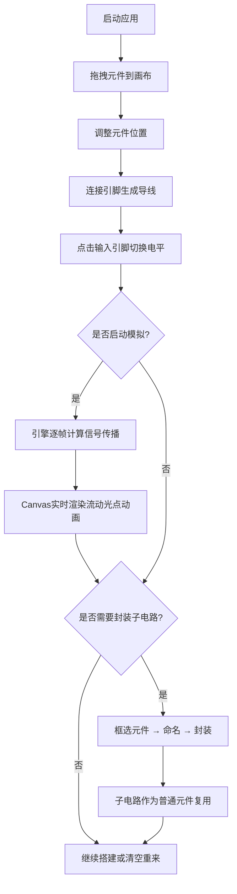

## 1. 产品概述

Logic Sandbox 是一款面向电子工程学习者和数字逻辑爱好者的2D交互式逻辑电路模拟沙盒。
- 核心目的：通过可视化的拖拽搭建和实时信号流动动画，让抽象的逻辑电路原理变得直观可触，解决纯理论学习缺乏物理反馈和动手体验的痛点。
- 目标用户：电子信息类学生、数字电路初学者、编程爱好者、STEM教育工作者。
- 产品价值：提供零门槛、即时反馈的逻辑电路实验平台，让用户在玩中学，快速掌握布尔代数、组合逻辑与时序逻辑的核心概念。

## 2. 核心功能

### 2.1 用户角色

| 角色 | 注册方式 | 核心权限 |
|------|----------|----------|
| 普通用户 | 无需注册，开箱即用 | 完整的电路搭建、模拟、子电路封装、导出功能 |

### 2.2 功能模块

1. **主画布区域**：深灰色网格背景的无限画布，支持拖拽平移、滚轮缩放、元件放置、导线连接、框选操作。
2. **右侧元件面板**：半透明毛玻璃效果的滚动列表，包含所有逻辑门类型的可拖拽卡片，悬停显示功能说明。
3. **顶部工具栏**：撤销、重做、清空画布、开始/停止模拟、帧率显示等核心操作入口。
4. **模拟引擎**：60fps 固定帧率的信号传播计算引擎，支持传播延迟、循环检测、速度调节。
5. **子电路封装系统**：选中多个元件和导线后一键封装为自定义模块，支持嵌套、展开编辑和复用。

### 2.3 页面详情

| 页面名称 | 模块名称 | 功能描述 |
|----------|----------|----------|
| 主页面 | 网格画布 | 20px格子大小的深灰网格背景，支持0.5x-3x缩放与鼠标拖拽平移，选中元件/导线显示亮黄色虚线边框 |
| 主页面 | 元件放置 | 从右侧面板拖拽逻辑门元件（与门、或门、非门、与非门、或非门、异或门、RS触发器等）到画布，元件以不同颜色方块表示，带2-3个引脚小圆点，放置时有轻缩放切入动画 |
| 主页面 | 导线连接 | 点击起始引脚再点击目标引脚生成带直角拐角的蓝色导线，连接成功时节点处有短暂白色闪光，导线有从起点到终点的生长动画 |
| 主页面 | 信号注入 | 点击输入引脚切换高低电平（红色=高电平1，灰色=低电平0），输出引脚实时显示当前电平颜色 |
| 主页面 | 信号流动 | 信号沿导线逐段亮起绿色流动光点（电流动画），传播速度支持慢速/中速/快速三档调节 |
| 主页面 | 子电路封装 | 框选多个元件和导线，点击封装按钮打包为带自定义名称和I/O端口的圆角矩形子电路，双击可展开内部结构继续编辑 |
| 主页面 | 工具栏 | 撤销（Ctrl+Z）、重做（Ctrl+Y）、清空画布、开始/停止模拟按钮，右上角半透明FPS计数器面板 |

## 3. 核心流程

用户启动应用 → 从右侧面板拖拽逻辑门元件到画布 → 调整元件位置（拖拽时显示实时坐标偏移） → 点击引脚连接导线 → 点击输入引脚切换电平 → 点击"开始模拟"观察信号流动与输出变化 →（可选）框选多个元件封装为子电路 → 继续扩展电路或清空画布重新开始。

## 4. 用户界面设计

### 4.1 设计风格

- **主色调**：科幻蓝灰色调（#1a1d24 深灰背景，#2a3140 面板色，#3b82f6 主题蓝，#ef4444 高电平红，#9ca3af 低电平灰，#22c55e 信号流动绿，#eab308 选中高亮黄）
- **按钮风格**：圆角（8px），毛玻璃半透明背景（backdrop-filter: blur(12px)），悬停时微弱阴影上浮（translateY(-1px) + box-shadow），200ms CSS过渡
- **字体**：JetBrains Mono（代码/数字）+ Inter（UI文本），字号层级：12px(辅助信息) / 13px(正文) / 14px(标签) / 18px(标题)
- **布局**：三栏式布局（顶部工具栏48px固定高度 + 左侧主画布自适应 + 右侧280px元件面板固定宽度）
- **图标风格**：react-icons / lucide-react 线性风格图标，16px-18px尺寸

### 4.2 页面设计概览

| 页面名称 | 模块名称 | UI元素 |
|----------|----------|--------|
| 主页面 | 顶部工具栏 | 48px高固定条，毛玻璃半透明，左对齐操作按钮组（撤销/重做/清空/模拟开关），右对齐FPS计数面板，按钮间8px间距，悬停阴影上浮动画 |
| 主页面 | Canvas画布 | 全屏自适应区域，深灰(#1a1d24)背景配20px浅灰(#2a2f3a)网格线，支持拖拽平移（抓手光标）、滚轮缩放（平滑缓动）、框选（虚线矩形） |
| 主页面 | 右侧元件面板 | 280px宽固定条，毛玻璃(backdrop-blur-xl)半透明白色边框，内部可滚动卡片列表，卡片圆角12px，悬停时scale(1.02)+阴影上浮，卡片包含元件颜色预览方块+名称+功能tooltip |
| 主页面 | 元件视觉 | 60x40px圆角矩形方块，不同门类型不同颜色（AND=#3b82f6, OR=#8b5cf6, NOT=#f59e0b, NAND=#ef4444, NOR=#14b8a6, XOR=#ec4899, RS=#06b6d4），引脚为6px直径小圆点（输入在左，输出在右），选中时外围2px亮黄虚线边框 |
| 主页面 | 导线视觉 | 2px宽蓝色(#60a5fa)折线（自动直角拐角），信号流动时沿线逐段点亮绿色(#22c55e)光点（直径4px，间距12px），连接成功时节点处8px白色闪光扩散动画 |
| 主页面 | 子电路视觉 | 80x60px圆角(12px)矩形，边框渐变色，顶部显示自定义名称，左右两侧暴露I/O端口引脚 |

### 4.3 响应式

桌面端优先设计（最小支持1280x720分辨率），右侧面板在窗口宽度<1024px时自动折叠为抽屉式。

### 4.4 性能指标

- 200+元件全连线模拟时，Canvas渲染帧率不低于45FPS
- 单次撤销/重做操作响应时间<50ms
- 信号传播计算单帧耗时<10ms
