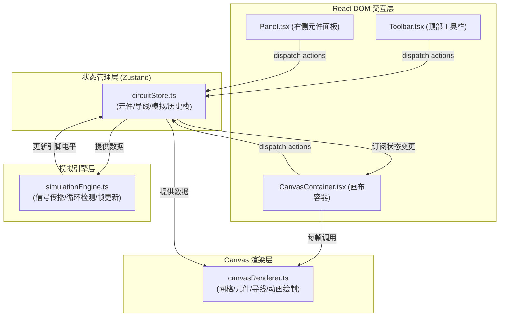
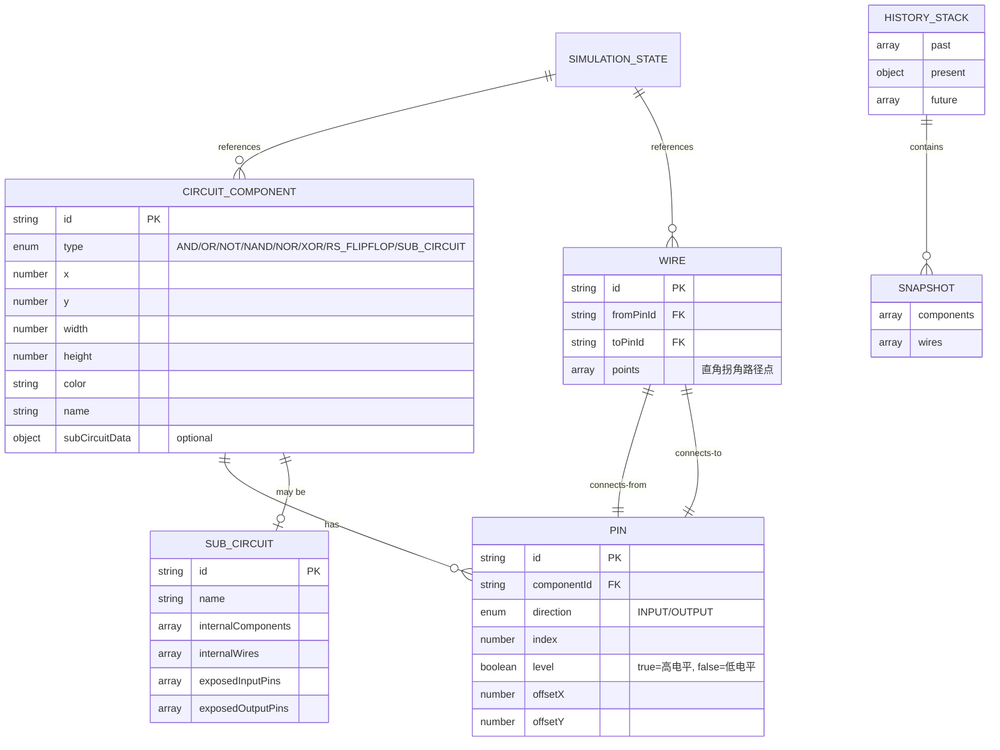

## 1. 架构设计

纯前端单页应用，采用分层架构：UI层（React DOM）负责交互面板，渲染层（Canvas 2D）负责电路可视化，状态层（Zustand）管理全局数据，引擎层（独立Module）负责逻辑模拟计算。



## 2. 技术描述

- **前端框架**：React 18 + TypeScript 5（严格模式）
- **构建工具**：Vite 5 + @vitejs/plugin-react
- **状态管理**：Zustand 4（含 history middleware 实现撤销重做）
- **渲染方案**：原生 HTML5 Canvas 2D（元件、导线、信号流动动画均在Canvas绘制，避免大量DOM节点导致的性能问题）
- **UI面板**：React DOM + 内联样式（CSS变量统一主题）
- **图标库**：react-icons / lucide-react
- **唯一ID**：uuid
- **后端**：无（纯前端本地运行，数据保存在内存中）
- **数据库**：无

## 3. 路由定义

| 路由 | 用途 |
|------|------|
| / | 主应用页面（电路编辑器） |

## 4. 数据模型

### 4.1 核心类型定义



### 4.2 文件结构

```
e:\solo\SoloAutoDemo\tasks\auto87\
├── package.json
├── index.html
├── vite.config.ts
├── tsconfig.json
└── src/
    ├── main.tsx              # React入口
    ├── App.tsx               # 根组件（布局组装）
    ├── types.ts              # 所有类型定义、枚举
    ├── circuitStore.ts       # Zustand全局状态+actions
    ├── simulationEngine.ts   # 独立的模拟引擎
    ├── canvasRenderer.ts     # Canvas 2D渲染器
    ├── styles.css            # 全局样式+CSS变量
    └── Components/
        ├── Toolbar.tsx       # 顶部工具栏
        ├── Panel.tsx         # 右侧元件面板
        ├── Canvas.tsx        # Canvas画布组件
        └── SubCircuitDialog.tsx # 子电路命名弹窗
```

## 5. 关键技术实现说明

### 5.1 模拟引擎
- 固定时间步长（60fps），使用 `requestAnimationFrame` 驱动
- 拓扑排序计算元件更新顺序，避免依赖问题
- BFS广度优先搜索从输入引脚出发计算信号传播路径
- 循环检测：DFS标记访问状态（0=未访问/1=访问中/2=已完成），发现回边则标记为循环并跳过
- 信号传播延迟：按路径长度逐帧点亮导线上的流动光点，支持3档速度系数

### 5.2 Canvas渲染
- 离屏Canvas缓存静态网格背景，减少每帧重绘开销
- 脏矩形渲染：只重绘状态变化的元件和导线区域
- 流动光点动画：根据模拟引擎返回的信号传播进度，沿导线路径线性插值计算光点位置
- 坐标变换矩阵统一处理画布的平移和缩放

### 5.3 撤销重做
- Zustand + 自定义history middleware，每次可撤销操作前对components和wires做深拷贝
- 历史栈上限50步，超出自动丢弃最早记录
- 瞬态操作（如拖拽中的坐标更新）不入栈，只有拖拽结束时才记录快照

### 5.4 子电路封装
- 封装时计算选中元件集合的边界框，提取跨边界的连接作为I/O端口
- 子电路内部元件和导线被序列化存储，双击展开时深拷贝恢复到临时编辑画布
- 子电路端口引脚映射到内部对应元件的引脚，模拟时递归计算内部逻辑
