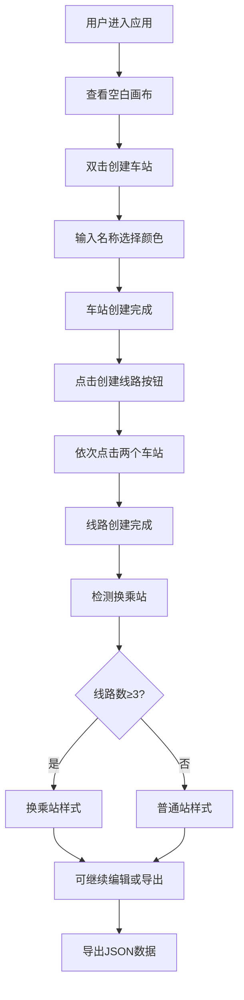

## 1. 产品概述

城市轨道交通线路图交互编辑器，专为城市规划师、交通设计师和爱好者设计的矢量地图编辑工具。支持用户自由创建和编辑地铁线路图，包含车站、线路、换乘站等核心元素，并提供可缩放和平移的矢量地图渲染。

- 解决传统线路图绘制工具操作复杂、缺乏交互性的问题
- 目标用户：城市规划人员、交通系统设计师、地铁爱好者
- 产品价值：提供直观、高效的轨道交通线路图设计体验，支持实时预览和数据导出

## 2. 核心功能

### 2.1 用户角色
| 角色 | 注册方式 | 核心权限 |
|------|----------|----------|
| 普通用户 | 无需注册，本地使用 | 创建、编辑、删除车站和线路，导出数据 |

### 2.2 功能模块
1. **地图画布**：SVG矢量渲染，支持缩放、平移、网格背景
2. **车站管理**：创建、删除、命名、颜色选择、换乘站自动识别
3. **线路管理**：创建、删除、颜色/宽度调节、转弯控制点拖拽
4. **历史记录**：无限步撤销/重做，平滑过渡动画
5. **数据导出**：JSON格式导出，一键复制到剪贴板
6. **自动布局**：力导向布局算法，自动分散重叠车站

### 2.3 页面详情
| 页面名称 | 模块名称 | 功能描述 |
|---------|---------|----------|
| 主编辑页 | 地图画布 | SVG渲染线路和车站，支持滚轮缩放、拖拽平移、双击创建车站 |
| 主编辑页 | 左侧工具栏 | 创建车站、创建线路、删除模式、撤销重做、导出按钮 |
| 主编辑页 | 线路调节面板 | 动态生成HSL颜色滑块和宽度滑块 |
| 主编辑页 | 底部状态栏 | 操作提示信息，滑入淡出动画 |
| 主编辑页 | 导出模态框 | 毛玻璃效果，展示JSON内容，一键复制 |

## 3. 核心流程

### 3.1 车站创建流程
用户双击SVG画布空白处 → 弹出输入框（默认自动命名"车站A"）→ 确认名称 → 弹出颜色选择器（8种预设颜色）→ 选择颜色 → 车站以缩放动画出现在画布上 → 状态栏显示"车站创建成功"

### 3.2 线路创建流程
用户点击"创建线路"按钮 → 按钮高亮，进入线路创建模式 → 依次点击两个已存在的车站 → 两点间绘制4px粗灰线 → 线段中间出现菱形转弯控制点 → ToolPanel中动态生成颜色和宽度调节滑块 → 状态栏显示"线路创建成功"

### 3.3 换乘站识别流程
车站被连接 → 系统检测该车站关联的线路数量 → 若≥3条线路 → 自动转换为换乘站样式（白色圆环+换乘图标）→ 选中时显示呼吸光晕动画

## 4. 用户界面设计

### 4.1 设计风格
- **主色调**：深色主题，背景#1a1a2e，次要背景#16213e
- **文字色**：#e0e0e0，使用14px sans-serif字体
- **按钮风格**：毛玻璃半透明效果（backdrop-filter: blur(10px)），悬停时背景亮起并向右平移2px
- **动效风格**：所有操作配有0.2-0.3秒CSS过渡动画，缩放、呼吸、滑入淡出等效果
- **图标风格**：使用lucide-react图标库，简洁线性风格

### 4.2 页面设计概述
| 页面名称 | 模块名称 | UI元素 |
|---------|---------|--------|
| 主编辑页 | 地图画布 | SVG容器，浅灰色十字网格背景，间距40px，透明度0.2 |
| 主编辑页 | 左侧工具栏 | 固定宽度200px，毛玻璃背景，垂直排列按钮，图标+文字 |
| 主编辑页 | 车站元素 | 6px半径彩色实心圆，右侧14px文字标签，换乘站9px半径+白色圆环 |
| 主编辑页 | 线路元素 | 4-8px粗线，中间4px菱形控制点，支持二次贝塞尔曲线 |
| 主编辑页 | 底部状态栏 | 固定高度30px，深色半透明，文字从底部滑入 |
| 主编辑页 | 导出模态框 | 毛玻璃效果，居中显示，代码块+复制按钮 |

### 4.3 响应式设计
- **桌面端**（≥768px）：左侧固定工具栏200px，SVG占剩余区域
- **移动端**（<768px）：工具栏折叠为底部横条，按钮只显示图标
- **触摸优化**：增大点击区域，支持触摸缩放和平移

### 4.4 视觉细节
- **网格自适应**：缩放时网格间距按2的幂次方变化（40/80/160/320...）
- **车站标签**：缩放时标签大小自适应，保持可读性
- **换乘光晕**：选中换乘站时，外环在透明和半透明白色间呼吸动画
- **平滑过渡**：撤销重做时地图内容平滑移动，非瞬间跳变
