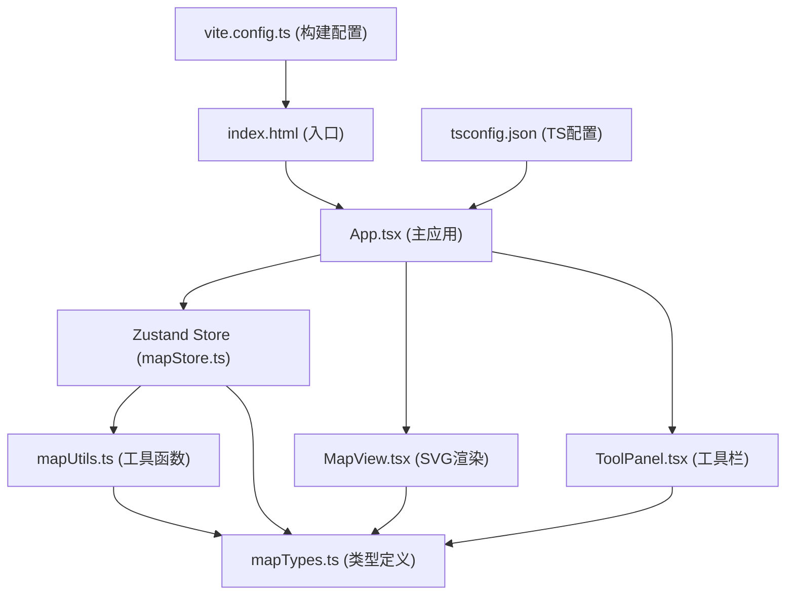
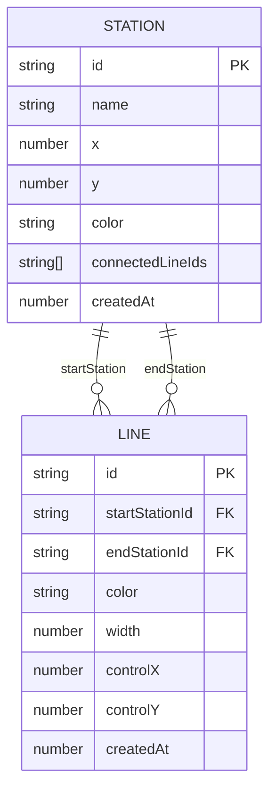

## 1. 架构设计



## 2. 技术描述

- **前端框架**：React 18 + TypeScript 5
- **构建工具**：Vite 5 + @vitejs/plugin-react
- **状态管理**：Zustand 4
- **渲染引擎**：SVG 原生矢量渲染
- **图标库**：lucide-react
- **唯一ID**：uuid
- **无后端**：纯前端应用，数据存储在内存中，支持JSON导出

## 3. 项目结构

```
auto91/
├── index.html                    # 入口HTML，全屏暗色背景
├── package.json                  # 依赖配置
├── vite.config.ts                # Vite React插件配置
├── tsconfig.json                 # TypeScript严格模式配置
└── src/
    ├── main.tsx                  # React入口
    ├── App.tsx                   # 主应用组件，整合所有模块
    ├── types/
    │   └── mapTypes.ts           # Station、Line、Position等类型定义
    ├── utils/
    │   └── mapUtils.ts           # 碰撞检测、几何计算、命名生成
    ├── stores/
    │   └── mapStore.ts           # Zustand状态管理，历史记录栈
    └── components/
        ├── MapView.tsx           # SVG地图渲染，缩放平移交互
        └── ToolPanel.tsx         # 侧边工具栏，操作模式切换
```

## 4. 核心数据模型

### 4.1 类型定义
```typescript
// Position - 坐标点
interface Position {
  x: number;
  y: number;
}

// Station - 车站
interface Station {
  id: string;
  name: string;
  position: Position;
  color: string;
  connectedLineIds: string[];
  createdAt: number;
}

// Line - 线路
interface Line {
  id: string;
  startStationId: string;
  endStationId: string;
  color: string;
  width: number;
  controlPoint: Position;  // 转弯控制点
  createdAt: number;
}

// Selection - 选中对象
interface Selection {
  type: 'station' | 'line' | null;
  id: string | null;
}

// HistoryState - 历史记录状态
interface HistoryState {
  stations: Station[];
  lines: Line[];
}

// MapStore - 完整状态
interface MapStore {
  stations: Station[];
  lines: Line[];
  selection: Selection;
  history: HistoryState[];
  historyIndex: number;
  operationMode: 'select' | 'createStation' | 'createLine' | 'delete';
  lineCreationState: {
    firstStationId: string | null;
  };
  statusMessage: string | null;
  // Actions
  addStation: (station: Omit<Station, 'id' | 'connectedLineIds' | 'createdAt'>) => void;
  removeStation: (id: string) => void;
  addLine: (line: Omit<Line, 'id' | 'controlPoint' | 'createdAt'>) => void;
  removeLine: (id: string) => void;
  updateLineControlPoint: (lineId: string, point: Position) => void;
  updateLineStyle: (lineId: string, style: { color?: string; width?: number }) => void;
  setSelection: (selection: Selection) => void;
  setOperationMode: (mode: MapStore['operationMode']) => void;
  setLineCreationFirstStation: (id: string | null) => void;
  setStatusMessage: (msg: string | null) => void;
  undo: () => void;
  redo: () => void;
  canUndo: () => boolean;
  canRedo: () => boolean;
  exportData: () => string;
  runForceLayout: () => void;
}
```



## 5. 状态管理设计

### 5.1 数据流
1. App组件从Zustand store读取状态
2. App将数据分发给MapView（渲染）和ToolPanel（操作）
3. 用户操作触发ToolPanel或MapView的事件
4. 事件调用store中的action更新状态
5. 状态变化自动触发组件重渲染

### 5.2 历史记录机制
- 使用两个栈实现：`history[]`存储所有状态，`historyIndex`指向当前状态
- 每次操作前将当前状态压入history，重置redo栈
- undo：historyIndex--，恢复前一状态
- redo：historyIndex++，恢复后一状态
- 支持的历史操作：添加/删除车站、添加/删除线路、修改控制点、修改线路样式

### 5.3 状态更新原则
- 所有状态修改必须通过store action
- 每次修改后自动保存历史记录
- 力导向布局动画使用临时本地状态，不进入历史记录

## 6. 核心算法

### 6.1 力导向布局算法
- **迭代次数**：200步，总耗时≤100ms
- **电荷斥力**：车站间相互排斥，距离越近斥力越大
- **弹簧引力**：连接的车站间存在引力，保持合适距离
- **冷却机制**：每步迭代减小位移系数，逐渐收敛
- **动画呈现**：使用requestAnimationFrame平滑过渡1秒

### 6.2 碰撞检测
- **点到线段距离**：用于判断点击是否命中线路
- **线段交点计算**：用于检测线路交叉
- **车站命中检测**：圆形碰撞检测，半径6px

### 6.3 网格自适应
- 基础间距40px
- 缩放时按2的幂次方调整：40 → 80 → 160 → 320...
- 使用CSS transition实现平滑过渡

## 7. 性能优化策略

1. **SVG渲染优化**
   - 使用CSS transform进行平移缩放，避免重绘
   - 车站和线路使用独立g元素分组
   - 网格使用pattern复用，减少DOM节点

2. **状态更新优化**
   - Zustand自动进行浅比较
   - 使用useShallow选择性订阅
   - 力导向计算使用Web Worker（可选，如需更优性能）

3. **动画优化**
   - 使用CSS transition/animation而非JS动画
   - transform和opacity属性触发GPU加速
   - 避免在动画中修改layout属性

4. **内存管理**
   - 历史记录限制最大步数（可选，如100步）
   - 及时清理临时状态和事件监听器

## 8. 配置文件

### 8.1 package.json依赖
```json
{
  "dependencies": {
    "react": "^18.2.0",
    "react-dom": "^18.2.0",
    "zustand": "^4.5.0",
    "uuid": "^9.0.1",
    "lucide-react": "^0.344.0"
  },
  "devDependencies": {
    "@types/react": "^18.2.55",
    "@types/react-dom": "^18.2.19",
    "@types/uuid": "^9.0.8",
    "@vitejs/plugin-react": "^4.2.1",
    "typescript": "^5.3.3",
    "vite": "^5.1.0"
  }
}
```

### 8.2 tsconfig.json关键配置
```json
{
  "compilerOptions": {
    "strict": true,
    "noImplicitAny": true,
    "strictNullChecks": true,
    "jsx": "react-jsx",
    "module": "ESNext",
    "target": "ES2020"
  }
}
```
