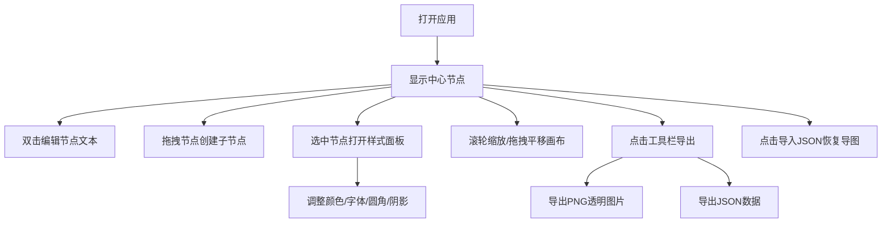

## 1. 产品概述

创意思维导图（脑图）在线应用，帮助个人和小团队高效收集、整理和分享创意想法，解决纸质手绘导图难以修改、分享和版本回退的痛点。

- 核心目标：提供流畅直观的思维导图创作体验，支持无限画布、灵活的节点编辑和美观的视觉呈现
- 目标用户：创意工作者、产品经理、学生、小型团队协作场景
- 产品价值：将传统手绘思维导图数字化，提升创意整理效率和协作便利性

## 2. 核心功能

### 2.1 用户角色

| 角色 | 注册方式 | 核心权限 |
|------|----------|----------|
| 普通用户 | 无需注册，直接使用 | 创建编辑导图、导入导出、保存本地 |

### 2.2 功能模块

1. **画布编辑器**：无限画布、缩放平移、网格背景、节点和连接线渲染
2. **节点管理**：节点创建、编辑文本、拖拽创建子节点、节点选中
3. **样式面板**：节点颜色、字体大小、圆角、阴影调节、全局间距调整
4. **导入导出**：JSON格式导入导出、PNG图片透明背景导出
5. **工具栏**：新建、保存、导出、导入操作入口

### 2.3 页面详情

| 页面名称 | 模块名称 | 功能描述 |
|----------|----------|----------|
| 主编辑页 | 顶部工具栏 | 新建/保存/导出/导入按钮，悬停放大高亮效果，保存成功绿色对勾 |
| 主编辑页 | 无限画布 | 可缩放平移，网格背景，节点和贝塞尔曲线连接线 |
| 主编辑页 | 右侧样式面板 | 毛玻璃效果，节点颜色/字体/圆角/阴影/间距调节 |
| 主编辑页 | 节点交互 | 双击创建/编辑，拖拽分叉子节点，弹性虚线预览 |

## 3. 核心流程

用户打开应用后看到中心主题节点，可以双击编辑文本，从节点拖拽创建子节点，通过右侧面板调整样式，最后导出为PNG或JSON格式。

## 4. 用户界面设计

### 4.1 设计风格

- **主色调**：深色主题背景 `#1a1a2e`，顶部工具栏 `#16213e`
- **节点配色**：马卡龙色系10种柔和色板（浅蓝、粉、绿、黄、紫等）
- **文字颜色**：节点文字为白色，保证在深色背景和彩色节点上的可读性
- **节点样式**：中心节点圆形，子节点椭圆，支持圆角调节（0-20px）
- **阴影**：半透明黑色 `rgba(0,0,0,0.3)`，强度可调（0-10px）
- **面板效果**：右侧面板毛玻璃效果（半透明背景 + blur模糊）
- **动效风格**：弹性平滑动画，节点展开/收起200ms内完成
- **图标风格**：简约线性图标，悬停时微放大高亮

### 4.2 页面设计概览

| 页面名称 | 模块名称 | UI元素 |
|----------|----------|--------|
| 主编辑页 | 顶部工具栏 | 深色条50px高度，4个操作按钮（新建/保存/导出/导入），悬停放大高亮 |
| 主编辑页 | 画布区域 | 深色背景 `#1a1a2e`，浅灰网格（透明度0.1），无限延伸 |
| 主编辑页 | 节点元素 | 圆形/椭圆形节点，马卡龙色系，白色文字，半透明阴影 |
| 主编辑页 | 连接线 | 贝塞尔曲线，自然弯曲，平滑动画 |
| 主编辑页 | 右侧面板 | 毛玻璃效果，颜色色板10格，滑块控件3个 |
| 主编辑页 | 缩放缩略 | 缩放<0.5x时节点显示为彩色圆点，悬停放大显示文本 |

### 4.3 响应式

- 桌面端优先设计，适配1920px及以上宽度
- 画布区域自适应窗口大小
- 右侧面板固定宽度，随窗口高度自适应
- 工具栏固定顶部，全宽显示

### 4.4 性能要求

- 500个节点同时存在时，拖拽和缩放帧率≥45fps
- 节点批量展开/收起动画≤200ms
- 导出PNG支持高分辨率
- 缩放范围：0.2x ~ 3x，带阻尼动画
