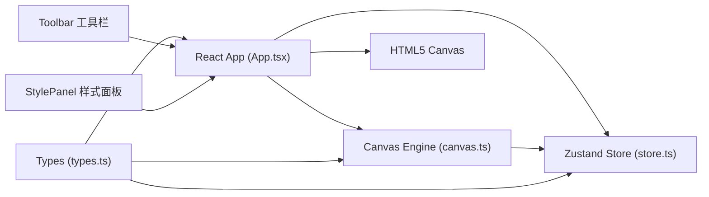
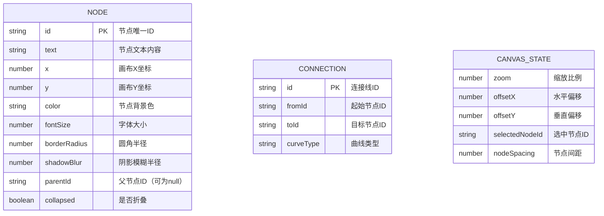

## 1. 架构设计

纯前端单页应用，采用React组件化架构，Canvas负责图形渲染，Zustand管理全局状态，Vite作为构建工具。



## 2. 技术描述

- **前端框架**：React@18 + TypeScript
- **状态管理**：Zustand
- **图形渲染**：原生 HTML5 Canvas 2D API
- **构建工具**：Vite
- **唯一ID生成**：uuid
- **无后端**：纯前端应用，数据存储在本地内存/导出文件

### 技术选型理由
- **Canvas渲染**：500节点性能要求，Canvas比SVG/DOM更适合大规模图形渲染
- **Zustand**：轻量级状态管理，API简洁，性能优秀，适合中型应用
- **TypeScript**：类型安全，减少运行时错误，提升代码可维护性

## 3. 路由定义

| 路由 | 用途 |
|------|------|
| / | 主编辑页面（单页应用，无路由切换） |

## 4. 文件结构

```
├── package.json          # 依赖配置
├── index.html            # 入口HTML
├── vite.config.ts        # Vite构建配置
├── tsconfig.json         # TypeScript配置
└── src/
    ├── App.tsx           # React应用入口，画布+工具栏+样式面板
    ├── store.ts          # Zustand状态管理
    ├── canvas.ts         # Canvas渲染引擎
    └── types.ts          # 类型定义
```

## 5. 数据模型

### 5.1 数据模型定义



### 5.2 TypeScript 类型定义

```typescript
// 节点接口
interface MindMapNode {
  id: string;
  text: string;
  x: number;
  y: number;
  color: string;
  fontSize: number;
  borderRadius: number;
  shadowBlur: number;
  parentId: string | null;
  collapsed: boolean;
  width: number;
  height: number;
}

// 画布状态
interface CanvasState {
  zoom: number;
  offsetX: number;
  offsetY: number;
  selectedNodeId: string | null;
  nodeSpacing: number;
}

// 导出数据格式
interface MindMapData {
  nodes: MindMapNode[];
  zoom: number;
  offsetX: number;
  offsetY: number;
  nodeSpacing: number;
  version: string;
}
```

## 6. 核心模块说明

### 6.1 Canvas 渲染引擎 (canvas.ts)
- 负责所有图形绘制：网格、节点、连接线、文本
- 实现动画循环（requestAnimationFrame）
- 处理画布坐标转换（屏幕坐标 ↔ 画布坐标）
- 实现缩放、平移变换
- 节点碰撞检测（点击命中测试）
- 贝塞尔曲线绘制（quadraticCurveTo）

### 6.2 状态管理 (store.ts)
- 节点数据 CRUD 操作
- 画布视口状态（zoom, offsetX, offsetY）
- 选中状态管理
- 样式属性更新
- 导入导出数据序列化

### 6.3 交互处理
- 双击画布创建中心节点
- 双击节点进入文本编辑
- 拖拽节点创建子节点（带弹性虚线预览）
- 滚轮缩放（带阻尼）
- 拖拽平移画布
- 右侧面板样式调节

### 6.4 性能优化
- 仅重绘变化区域（脏矩形优化）
- 缩小时简化节点渲染（圆点模式）
- 文本尺寸缓存，避免重复测量
- 动画帧合并，避免重复计算
