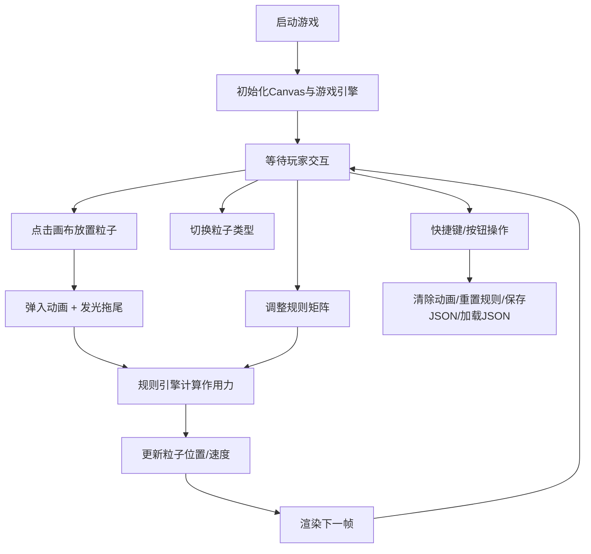

## 1. 产品概述

粒子生命沙盘是一款基于HTML5 Canvas的交互式生命模拟游戏，玩家通过在二维网格上放置不同类型的彩色粒子，设定粒子间的吸引、排斥、跟随等行为规则，观察粒子在规则驱动下自发形成的复杂自组织图案和动态演化过程。

- 主要用途：生命模拟、复杂系统可视化、算法艺术创作、教育演示
- 目标用户：科学爱好者、艺术创作者、学生、编程学习者
- 产品价值：通过直观的交互方式展示涌现性行为，将复杂的多主体系统概念可视化

## 2. 核心特性

### 2.1 特征模块

1. **主游戏画布**：全屏Canvas渲染区域，粒子运动与自组织图案的实时展示
2. **粒子放置与类型选择**：顶部工具栏提供6种粒子类型（红/蓝/绿/黄/紫/青），点击画布放置粒子
3. **行为规则面板**：右侧可折叠的3×3规则矩阵面板，设定每种粒子对其他粒子的作用力类型
4. **实时统计监控**：左上角显示粒子总数、FPS、平均速度，低帧率红色警告
5. **场景管理**：清除/重置/保存/加载配置功能

### 2.2 页面详情

| 页面名称 | 模块名称 | 功能描述 |
|-----------|-------------|---------------------|
| 主游戏页 | 粒子渲染引擎 | Canvas绑定高性能渲染循环，支持5000粒子流畅动画，自动性能降级 |
| 主游戏页 | 工具栏 | 6个颜色类型选择按钮、清除按钮、重置按钮、保存/加载按钮 |
| 主游戏页 | 规则面板 | 3×3下拉菜单网格，主体粒子×目标粒子的作用力规则（吸引/排斥/跟随/无视） |
| 主游戏页 | 统计面板 | 粒子总数、FPS计数器、平均速度，性能模式提示，低帧率警告 |
| 主游戏页 | 配置管理 | JSON序列化保存到剪贴板，文本输入框加载配置 |

## 3. 核心流程

玩家打开游戏后，默认以"跟随者"类型（青色）为当前选择类型。通过点击画布放置粒子，粒子会以弹入动画出现。玩家切换类型后继续放置不同颜色的粒子。展开规则面板，调整每种粒子对其他粒子的作用力方式（吸引/排斥/跟随/无视），立即观察群体行为变化。通过快捷键C清除粒子、R重置规则，或通过按钮保存/加载整个场景配置。

## 4. 用户界面设计

### 4.1 设计风格

- **主色调**：深色科技背景 `#0a0a1a`，霓虹蓝 `#00d4ff` 作为主色，亮紫 `#a855f7` 作为高亮色
- **粒子色彩**：红 `#ff4d4d`、蓝 `#4d79ff`、绿 `#4dff88`、黄 `#ffdd4d`、紫 `#c84dff`、青 `#4dffff`
- **工具栏**：半透明毛玻璃效果（`rgba(255,255,255,0.08)` + `backdrop-filter: blur(8px)`）
- **按钮风格**：圆角8px，0.3s ease-out过渡，hover时发光（box-shadow）
- **字体**：等宽字体 MonoSpace / Consolas 用于数字统计，现代无衬线用于UI标签
- **动画**：粒子弹入缩放动画、拖尾发光淡出、UI元素滑入滑出、配置清除扩散动画

### 4.2 页面设计概览

| 页面名称 | 模块名称 | UI元素 |
|-----------|-------------|-------------|
| 主游戏页 | Canvas画布 | 全屏背景 `#0a0a1a`，粒子彩色圆点，发光拖尾效果 |
| 主游戏页 | 顶部工具栏 | 6个圆形颜色按钮 + 4个功能按钮，毛玻璃背景，固定顶部 |
| 主游戏页 | 规则面板 | 右侧固定，可折叠/展开，3×3网格下拉菜单 |
| 主游戏页 | 统计面板 | 左上角半透明卡片，3行统计数据 + 性能模式/警告标签 |

### 4.3 响应式设计

- Desktop优先设计
- 移动设备（宽度<768px）：工具栏转为底部导航栏，规则面板转为左侧抽屉式，按钮尺寸适配触摸
- 触摸设备：支持长按放置连续粒子，双指捏合缩放画布（可选）

### 4.4 性能策略

- 使用空间网格划分减少粒子对距离计算的O(n²)开销
- 粒子数>2000进入性能模式：简化渲染为像素点，禁用拖尾
- 粒子数>5000自动禁用"跟随"复杂行为
- FPS<30显示红色警告标签
- RAF循环中使用时间差插值，保证运动速度独立于帧率
