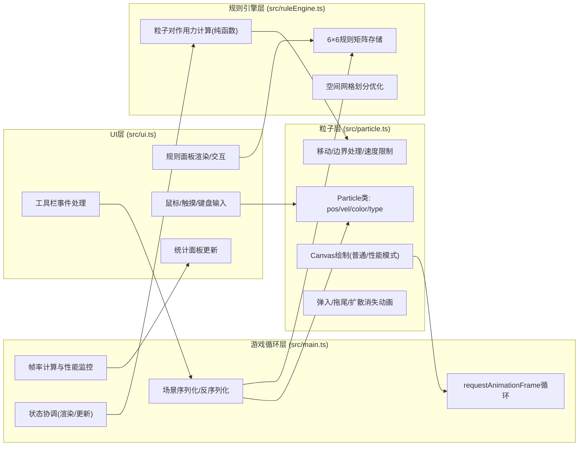

## 1. 架构设计



## 2. 技术说明

- **前端**：原生TypeScript + HTML5 Canvas 2D + Vite@5
- **构建工具**：Vite@5 + TypeScript@5（严格模式）
- **第三方依赖**：零运行时依赖，仅开发时依赖typescript和vite
- **状态管理**：模块内部闭包状态，无外部状态库

## 3. 模块职责定义

### 3.1 src/particle.ts

```typescript
export type ParticleType = 'red' | 'blue' | 'green' | 'yellow' | 'purple' | 'cyan';
export type RuleAction = 'attract' | 'repel' | 'follow' | 'ignore';

export interface ParticleState {
    id: number;
    type: ParticleType;
    x: number;
    y: number;
    vx: number;
    vy: number;
    bornAt: number;       // 弹入动画计时
    dying: boolean;       // 是否在清除动画中
    dieAt?: number;       // 清除动画起始时间
}

export class Particle {
    // 构造、移动(update with forces)、绘制(draw with ctx & perfMode)
    update(dt: number, forceX: number, forceY: number, bounds: {w:number,h:number}): void;
    draw(ctx: CanvasRenderingContext2D, perfMode: boolean, now: number, showTrail: boolean): void;
    startDying(now: number): void;
    isDead(now: number): boolean;
}

export const PARTICLE_COLORS: Record<ParticleType, string>;
export const PARTICLE_TYPES: ParticleType[]; // 有序数组，对应规则矩阵索引
```

### 3.2 src/ruleEngine.ts

```typescript
export type Rule = 'attract' | 'repel' | 'follow' | 'ignore';
export type RuleMatrix = Rule[][];  // 6x6: matrix[主体类型索引][目标类型索引]

export function createDefaultRuleMatrix(): RuleMatrix; // 全部'ignore'

// 核心纯函数：计算所有粒子的受力（空间网格优化）
export function computeForces(
    particles: Particle[],
    ruleMatrix: RuleMatrix,
    bounds: {w:number,h:number},
    maxParticlesForFollow: number
): Array<{fx: number, fy: number}>;

export function typeToIndex(t: ParticleType): number;
export function indexToType(i: number): ParticleType;
```

### 3.3 src/ui.ts

```typescript
export interface UIData {
    canvas: HTMLCanvasElement;
    toolbar: HTMLElement;
    rulePanel: HTMLElement;
    statsPanel: HTMLElement;
}

export interface UIHandlers {
    onPlaceParticle: (x:number, y:number, type: ParticleType) => void;
    onRuleChange: (subject: number, target: number, rule: Rule) => void;
    onClearAll: () => void;
    onResetRules: () => void;
    onSaveConfig: () => string;
    onLoadConfig: (json: string) => boolean;
}

export function initUI(handlers: UIHandlers): UIData;
export function updateStats(particleCount: number, fps: number, avgSpeed: number, perfMode: boolean, fpsLow: boolean): void;
export function renderRuleMatrix(matrix: RuleMatrix): void;
export function getCurrentType(): ParticleType;
```

### 3.4 src/main.ts

```typescript
// 游戏主循环，协调所有模块
// - Canvas初始化/DPR适配/窗口resize
// - 全局状态: particles[], ruleMatrix, performance flags
// - RAF循环: fps计时 -> 计算受力 -> 更新粒子 -> 过滤死亡粒子 -> 绘制
// - 序列化/反序列化: serializeScene() / loadScene(json)
// - 性能模式切换逻辑
```

## 4. 数据模型（序列化）

```typescript
interface SceneConfig {
    version: 1;
    rules: RuleMatrix;              // 6x6 string matrix
    particles: Array<{
        type: ParticleType;
        x: number;
        y: number;
        vx: number;
        vy: number;
    }>;
}
```

## 5. 关键算法与性能优化

### 5.1 空间网格划分 (Spatial Hashing)
- 将画布划分为 `cellSize = 作用半径(约80px)` 的网格
- 每帧将粒子放入网格桶，计算受力时仅遍历相邻9个桶
- 复杂度从O(n²)降至O(n)（粒子均匀分布时）

### 5.2 力计算规则
- 吸引(attract)：距离越远力越大，超过最大距离衰减
- 排斥(repel)：距离越近力越大，硬球半径内强排斥
- 跟随(follow)：取目标粒子速度方向加权叠加
- 无视(ignore)：零作用力

### 5.3 渲染性能
- 粒子拖尾使用低透明度圆形叠加 + ctx.globalCompositeOperation='lighter'
- 性能模式下跳过shadowBlur和拖尾，使用单像素/小圆点 `ctx.fillRect`
- DPR自适应，高DPI屏幕不超过2x

## 6. 文件清单

| 路径 | 说明 |
|-------|------|
| package.json | typescript + vite，dev脚本 |
| vite.config.js | Vite配置（server.port, base） |
| tsconfig.json | strict:true, target:ES2020, module:ESNext |
| index.html | 全屏Canvas + UI容器（div#app / #toolbar / #rule-panel / #stats） |
| src/main.ts | 主游戏循环、全局状态、场景IO |
| src/ruleEngine.ts | 规则矩阵、空间网格、力计算纯函数 |
| src/particle.ts | Particle类定义、颜色映射、移动、绘制 |
| src/ui.ts | DOM构建、事件绑定、规则面板交互、统计更新 |
