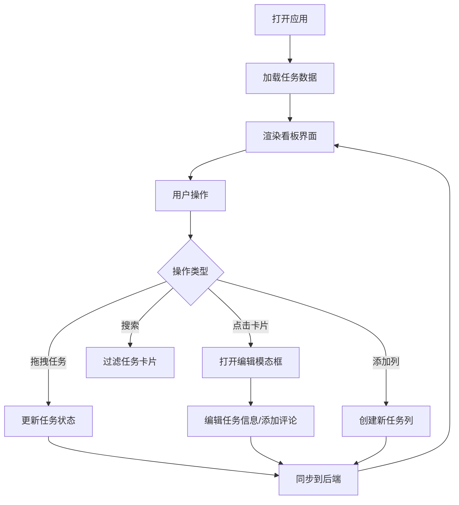

## 1. 产品概述

在线团队协作看板系统，帮助团队成员实时管理和跟踪项目任务进度。通过可视化的看板界面，团队可以直观地了解任务状态，提升协作效率。

- **主要目的**：提供直观、高效的任务管理工具，支持团队协作和进度追踪
- **解决的问题**：传统任务管理工具操作复杂、缺乏实时同步、可视化程度低
- **目标用户**：项目团队、产品开发团队、敏捷开发团队
- **产品价值**：提升团队协作效率，实时掌握项目进度，降低沟通成本

## 2. 核心功能

### 2.1 用户角色

| 角色 | 注册方式 | 核心权限 |
|------|----------|----------|
| 团队成员 | 默认用户 | 查看、创建、编辑、移动任务，添加评论，创建新列 |

### 2.2 功能模块

1. **看板主页面**：任务列展示、任务卡片列表、拖拽操作、全局搜索
2. **任务卡片组件**：显示任务信息、拖拽交互、点击编辑
3. **任务编辑模态框**：编辑任务标题、描述、负责人、截止日期
4. **评论系统**：查看评论列表、添加新评论
5. **列管理**：添加新列、列标题展示

### 2.3 页面详情

| 页面名称 | 模块名称 | 功能描述 |
|-----------|-------------|---------------------|
| 看板主页面 | 顶部导航栏 | 展示系统标题、搜索框、添加列按钮 |
| 看板主页面 | 看板区域 | 横向滚动展示任务列，支持拖拽操作 |
| 看板主页面 | 任务列 | 固定宽度280px，包含列标题和任务卡片列表 |
| 看板主页面 | 任务卡片 | 显示任务摘要，支持拖拽移动，点击弹出编辑模态框 |
| 任务编辑模态框 | 表单区域 | 编辑任务标题、描述、负责人、截止日期 |
| 任务编辑模态框 | 评论区域 | 展示评论列表（倒序排列），添加新评论 |

## 3. 核心流程

用户打开看板应用，系统从后端加载任务数据并渲染看板。用户可以通过拖拽将任务从一列移动到另一列，系统实时同步到后端。点击任务卡片可弹出编辑模态框，修改任务信息或添加评论。使用搜索框可以过滤显示包含关键词的任务卡片。

## 4. 用户界面设计

### 4.1 设计风格

- **主色调**：深灰背景 #1a1a2e，卡片深蓝 #16213e，强调色金色 #e8b84b
- **按钮风格**：圆角设计，hover 时缩放至 1.05 倍，金色边框/背景
- **字体**：采用现代无衬线字体，层级分明
- **布局风格**：顶部固定导航栏，看板区域横向滚动，卡片式布局
- **图标风格**：简约线性图标，使用 lucide-react 图标库

### 4.2 页面设计概述

| 页面名称 | 模块名称 | UI 元素 |
|-----------|-------------|-------------|
| 看板主页面 | 顶部导航栏 | 深色背景，金色标题文字，搜索框，添加按钮 |
| 看板主页面 | 任务列 | 固定宽度 280px，列标题加粗，卡片列表垂直排列 |
| 看板主页面 | 任务卡片 | 深蓝色背景，圆角 8px，间距 8px，淡入淡出动画 0.3s |
| 任务编辑模态框 | 表单区域 | 深色背景，金色边框输入框，标签文字清晰 |
| 任务编辑模态框 | 评论区域 | 评论列表倒序排列，时间戳显示，评论输入框 |

### 4.3 响应式设计

- **桌面端**：列宽度固定 280px，横向滚动布局
- **移动端**：列宽度 100%，垂直排列，优化触摸交互
- **触摸优化**：增大点击区域，支持触摸拖拽

### 4.4 动效设计

- **卡片进入/删除**：淡入淡出动画 0.3 秒
- **按钮/输入框 hover**：缩放至 1.05 倍
- **拖拽反馈**：拖拽时卡片半透明，放置位置高亮
- **模态框**：弹出时缩放+淡入效果

