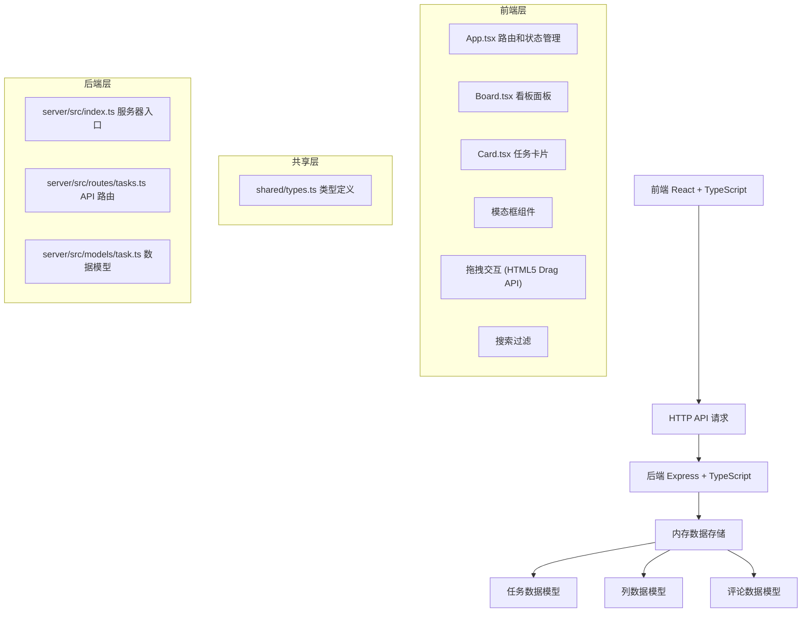
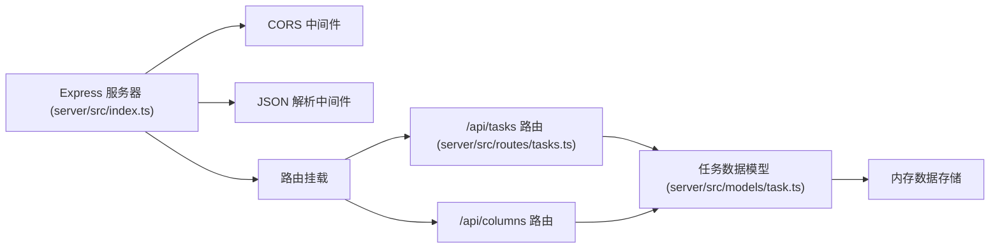
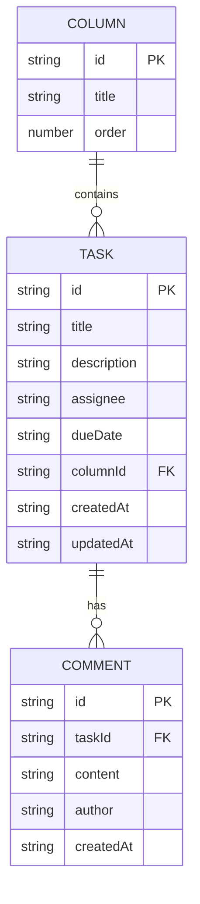

## 1. 架构设计



## 2. 技术描述

- **前端**：React 18 + TypeScript + Vite
- **后端**：Express 4 + TypeScript
- **状态管理**：Zustand
- **样式**：Tailwind CSS 3
- **图标**：lucide-react
- **并发启动**：concurrently
- **数据存储**：内存存储（开发环境）
- **初始化工具**：vite-init

## 3. 路由定义

| 路由 | 方法 | 用途 |
|-------|------|---------|
| /api/tasks | GET | 获取所有任务 |
| /api/tasks | POST | 创建新任务 |
| /api/tasks/:id | PUT | 更新任务（包括移动列） |
| /api/tasks/:id | DELETE | 删除任务 |
| /api/tasks/:id/comments | POST | 添加评论 |
| /api/columns | GET | 获取所有列 |
| /api/columns | POST | 创建新列 |

## 4. API 定义

### 共享类型定义 (shared/types.ts)

```typescript
interface User {
  id: string;
  name: string;
  avatar?: string;
}

interface Comment {
  id: string;
  taskId: string;
  content: string;
  author: string;
  createdAt: string;
}

interface Task {
  id: string;
  title: string;
  description: string;
  assignee: string;
  dueDate: string;
  columnId: string;
  comments: Comment[];
  createdAt: string;
  updatedAt: string;
}

interface Column {
  id: string;
  title: string;
  order: number;
}
```

### 请求/响应格式

**GET /api/tasks**
- 响应：`Task[]`

**POST /api/tasks**
- 请求体：`{ title: string; description: string; assignee: string; dueDate: string; columnId: string }`
- 响应：`Task`

**PUT /api/tasks/:id**
- 请求体：`Partial<Task>`
- 响应：`Task`

**POST /api/tasks/:id/comments**
- 请求体：`{ content: string; author: string }`
- 响应：`Comment`

**GET /api/columns**
- 响应：`Column[]`

**POST /api/columns**
- 请求体：`{ title: string }`
- 响应：`Column`

## 5. 服务器架构图



## 6. 数据模型

### 6.1 数据模型定义



### 6.2 初始化数据

系统启动时初始化以下默认数据：

**列数据**：
- 待办 (todo)
- 进行中 (in-progress)
- 已完成 (done)

**示例任务数据**：
- 若干示例任务分布在不同列中，包含标题、描述、负责人、截止日期和评论

## 7. 性能优化策略

1. **拖拽性能**：使用 HTML5 原生 Drag and Drop API，避免复杂的计算，确保响应时间 < 100ms
2. **搜索性能**：前端缓存任务数据，使用简单的字符串包含匹配，1000 张卡片以内无感知延迟
3. **状态管理**：使用 Zustand 进行细粒度状态更新，避免不必要的重渲染
4. **列表渲染**：使用稳定的 key 属性，确保 React 高效更新

## 8. 项目文件结构

```
package.json
index.html
tsconfig.json
vite.config.js
shared/
  └── types.ts
client/src/
  ├── App.tsx
  ├── store/
  │   └── useBoardStore.ts
  ├── components/
  │   ├── Board.tsx
  │   ├── Column.tsx
  │   ├── Card.tsx
  │   ├── CardModal.tsx
  │   ├── CommentList.tsx
  │   └── AddColumnModal.tsx
  └── main.tsx
server/src/
  ├── index.ts
  ├── routes/
  │   └── tasks.ts
  └── models/
      └── task.ts
```
