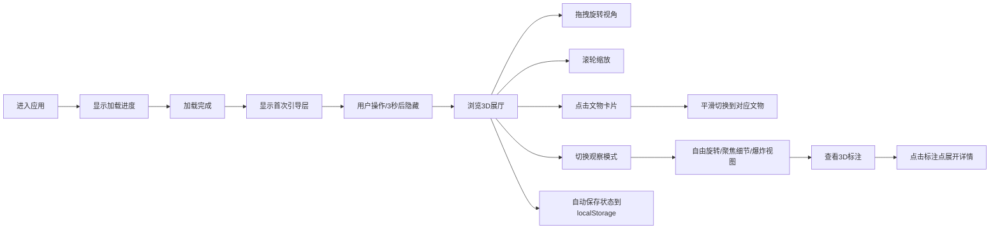

## 1. 产品概述

文物数字展柜是一个沉浸式3D交互可视化应用，为历史文物提供多角度、多层次的数字化展示方式。策展方可以通过该平台让用户在虚拟展厅中自由探索文物，查看细节注释，实现文物的数字化保护与传播。

- 主要用途：为博物馆、文化机构提供文物的3D数字化展示解决方案
- 解决问题：突破实体展览的空间与时间限制，让用户可以随时随地近距离观察文物细节
- 目标用户：文化爱好者、博物馆访客、教育工作者及学生
- 产品价值：推动文化遗产数字化转型，提升文物展示的互动性和教育价值

## 2. 核心功能

### 2.1 用户角色
| 角色 | 注册方式 | 核心权限 |
|------|----------|----------|
| 普通用户 | 无需注册，直接访问 | 浏览文物、切换视角、查看标注信息 |

### 2.2 功能模块
1. **3D虚拟展厅**：星空粒子背景、动态灯光系统、环形光晕效果
2. **文物列表**：6件不同形态文物卡片展示，支持点击切换
3. **多模式观察**：自由旋转、聚焦细节、爆炸视图三种观察模式
4. **3D标注系统**：空间悬浮标注点，支持悬停高亮和详情展开
5. **交互引导**：首次加载指引层，提示用户操作方式
6. **状态持久化**：localStorage保存用户选择和浏览历史

### 2.3 页面详情
| 页面名称 | 模块名称 | 功能描述 |
|----------|----------|----------|
| 主展厅 | 3D渲染引擎 | Three.js场景渲染、相机控制、粒子系统、灯光效果 |
| 主展厅 | 文物列表卡片 | 左侧半透明玻璃质感卡片，6件文物展示，选中高亮动画 |
| 主展厅 | 观察模式切换 | 右下角模式切换按钮，弹性过渡动画 |
| 主展厅 | 3D标注系统 | 空间悬浮标注点，箭头指示，悬停高亮，点击展开详情 |
| 主展厅 | 信息面板 | 文物名称、年代、出土地、尺寸数据及标注列表 |
| 主展厅 | 加载进度条 | 资源加载进度显示 |
| 主展厅 | 首次引导层 | 半透明指引层，3秒无操作自动隐藏 |

## 3. 核心流程

用户进入应用后，首先看到加载进度条，加载完成后显示首次引导层。用户可以通过拖拽旋转视角、滚轮缩放、点击左侧文物卡片切换展品。点击右下角按钮可切换观察模式，在聚焦模式下可查看3D空间标注，点击标注点展开详细信息。用户的选择和浏览历史自动保存。

## 4. 用户界面设计

### 4.1 设计风格
- **主色调**：深灰蓝色 `#1a2332` 作为背景主色
- **高亮色**：金色 `#cba86a` 用于选中状态和强调
- **点缀色**：淡紫色 `#b39ddb` 用于交互反馈
- **UI材质**：半透明毛玻璃效果 `backdrop-filter: blur(12px)`
- **圆角**：所有UI元素采用圆角边框
- **阴影**：柔和的投影效果增强层次感
- **字体**：现代无衬线字体，数字和字母使用等宽字体增强科技感

### 4.2 页面设计概述
| 页面名称 | 模块名称 | UI元素 |
|----------|----------|--------|
| 主展厅 | 文物列表卡片 | 左侧等距网格布局，半透明玻璃质感，选中高亮，微光脉冲动画，1024px以下自动折叠为两列 |
| 主展厅 | 观察模式按钮 | 右下角圆形按钮组，弹性过渡动画，hover缩放1.05倍，背景色渐变0.2秒 |
| 主展厅 | 3D标注点 | 带箭头的悬浮球体，悬停时箭头高亮放大，点击触发详情卡片 |
| 主展厅 | 信息面板 | 右侧滑入，毛玻璃效果，0.4秒移动+淡入淡出组合动画 |
| 主展厅 | 详情卡片 | 点击标注后弹出，毛玻璃效果，0.3秒淡入动画 |
| 主展厅 | 加载进度条 | 顶部线性进度条，配合百分比数字 |
| 主展厅 | 首次引导层 | 半透明遮罩，交互动画提示操作方式 |

### 4.3 响应式设计
- **设计原则**：桌面优先，移动自适应
- **断点设计**：1024px以下文物列表折叠为两列
- **触控优化**：支持触摸拖拽和双指缩放操作
- **布局适配**：在平板和手机上保持正常操作体验

### 4.4 3D场景设计指引
- **环境氛围**：渐变星空背景，缓慢旋转的粒子流（≤5000粒子）
- **灯光系统**：主光 + 背光 + 环境光三点布光，聚焦时其他文物透明度降至20%并添加雾效
- **环形光晕**：文物下方环形光晕，色相在蓝紫金三色间平稳过渡
- **相机设置**：三种预设视角（全景、聚焦文物、爆炸视图），缓动过渡动画
- **文物模型**：6件不同形态文物（青铜鼎、瓷瓶、玉璧等），每件约1万顶点
- **交互动画**：文物切换平滑过渡，相机缓动，爆炸视图零件悬浮带编号
- **性能指标**：1920x1080分辨率下稳定50FPS以上，模型总加载时间≤2秒
